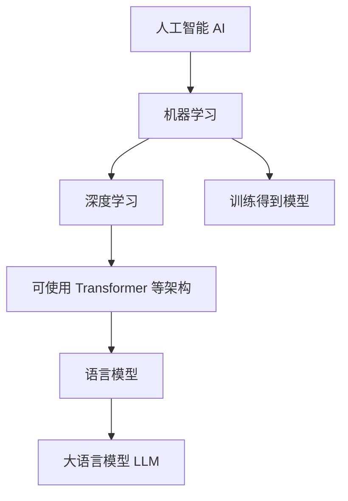
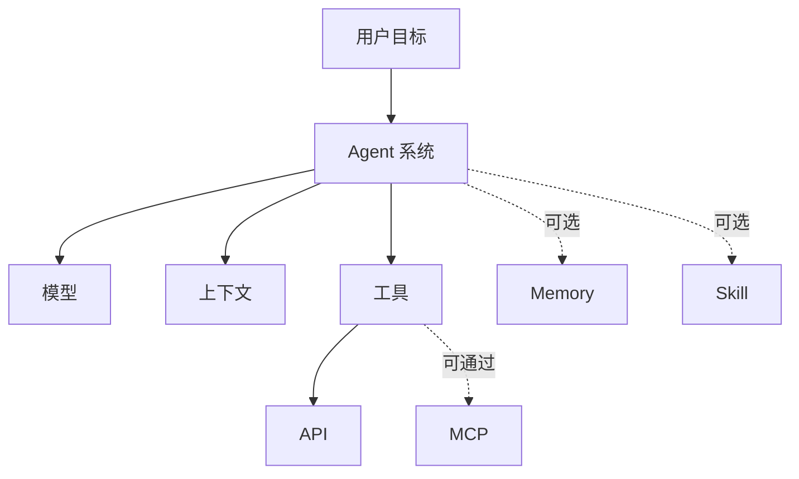
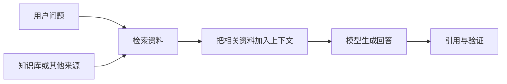
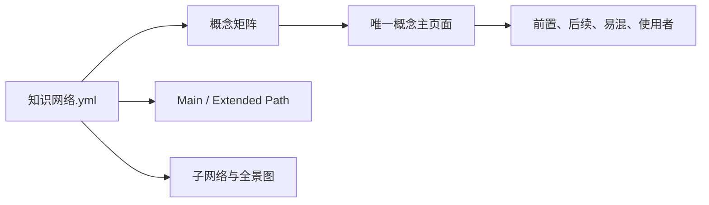

# LLM-101

完全不懂 AI？从这里开始。

`LLM-101` 是一套面向中文零基础读者的 AI / 大语言模型教程。它不要求数学或编程背景，也不把一百多个名词扔给你自己拼。

我们从真实小白会问的问题出发，沿着连续追问，一步一步建立完整心智模型。

> 当前正在进行 V3 全量重构。已有 33 篇文章达到当前标准，其余 18 篇旧正文继续按每批最多 3 篇重写。

## 你可以怎样使用这个项目？

### 我是完全小白

按主学习路线开始。第一站：[AI 到底是什么？](./docs/01-AI与大模型/01-AI到底是什么.md)

主路线只保留“跳过后会明显影响后续理解”的概念，目标控制在 25～35 篇。

### 我已经知道几个概念

打开 [知识网络](./知识网络.md)，从“模型”“Token”“Agent”或“RAG”等任意节点开始探索。

### 我脑子里刚好有一个问题

打开 [真实问题矩阵](./真实问题矩阵.md)。这里的问题来自用户原始聊天或可追溯的公开讨论，并与概念和答案页面双向连接。例如：

- 参数量就是训练数据吗？
- 数据是喂给模型的，那模型在被喂之前从哪来？
- Agent 和模型到底差在哪？
- Skill、Tool、MCP、Agent 是什么关系？

### 我想系统学一个专题

- [AI 与大模型](./docs/01-AI与大模型/)
- [Token 与上下文](./docs/02-聊天Token与上下文/)
- [模型原理与训练](./docs/03-模型原理与训练/)
- [模型能力](./docs/04-模型能力/)
- [幻觉与模型局限](./docs/05-幻觉与模型局限/)
- [工具与函数调用](./docs/06-工具与Function-Calling/)
- [Agent](./docs/07-Agent/)
- [RAG 与知识库](./docs/08-RAG与知识库/)
- [MCP](./docs/09-MCP/)
- [Skill](./docs/10-Skill/)
- [Coding Agent](./docs/11-Coding-Agent/)
- [Memory](./docs/12-Memory/)

## 主学习路线

主学习路线是阅读顺序，不是写作顺序。V3 当前规划如下：

```text
AI
 ↓
机器学习与深度学习
 ↓
模型 → 语言模型 → 大语言模型 → GPT → ChatGPT 产品
 ↓
参数 → Prompt → Token → 上下文
 ↓
模型生命周期 → 模型架构 → Transformer → 训练与推理
 ↓
泛化 → 推理能力 → 幻觉与验证
 ↓
API → Tool → Agent
 ↓
RAG → MCP → Skill → Coding Agent
 ↓
聊天记录与 Memory
 ↓
AI 全景图
```

已经按当前质量基线完成：

1. [AI 到底是什么？](./docs/01-AI与大模型/01-AI到底是什么.md)
2. [AI、机器学习和深度学习是什么关系？](./docs/01-AI与大模型/02-AI机器学习和深度学习是什么关系.md)
3. [模型到底是什么？](./docs/01-AI与大模型/03-模型到底是什么.md)
4. [大语言模型到底是什么？](./docs/01-AI与大模型/04-什么是大语言模型.md)
5. [GPT 和 ChatGPT 有什么区别？](./docs/01-AI与大模型/05-GPT和ChatGPT有什么区别.md)
6. [参数到底是什么？](./docs/03-模型原理与训练/06-参数到底是什么.md)
7. [Prompt 到底是什么？](./docs/02-聊天Token与上下文/01-Prompt到底是什么.md)
8. [Token 到底是什么？](./docs/02-聊天Token与上下文/04-Token到底是什么.md)
9. [上下文和上下文窗口是什么？](./docs/02-聊天Token与上下文/07-上下文和上下文窗口是什么.md)
10. [一个大模型到底是怎么诞生的？](./docs/03-模型原理与训练/01-一个大模型到底是怎么诞生的.md)
11. [模型架构是什么？](./docs/03-模型原理与训练/02-模型架构是什么.md)
12. [Transformer 到底是什么？](./docs/03-模型原理与训练/03-Transformer到底是什么.md)
13. [训练和推理有什么区别？](./docs/03-模型原理与训练/18-训练和推理有什么区别.md)
14. [为什么预测下一个 Token 能学到能力？](./docs/03-模型原理与训练/10-为什么预测下一个Token能学到能力.md)
15. [泛化是什么？](./docs/04-模型能力/01-泛化是什么.md)
16. [推理能力是什么？](./docs/04-模型能力/03-推理能力是什么.md)
17. [幻觉是什么？](./docs/05-幻觉与模型局限/01-幻觉是什么.md)
18. [为什么 LLM 不是数据库？](./docs/05-幻觉与模型局限/02-为什么LLM不是数据库.md)
19. [怎么验证 AI 的回答？](./docs/05-幻觉与模型局限/04-怎么验证AI的回答.md)
20. [API 到底是什么？](./docs/06-工具与Function-Calling/01-API到底是什么.md)
21. [AI 工具到底是什么？](./docs/06-工具与Function-Calling/02-AI工具到底是什么.md)
22. [Agent 到底是什么？](./docs/07-Agent/01-Agent到底是什么.md)
23. [RAG 到底是什么？](./docs/08-RAG与知识库/01-RAG到底是什么.md)
24. [知识库是什么？](./docs/08-RAG与知识库/02-知识库是什么.md)

已经完成的扩展节点：

- [Attention 到底是什么？](./docs/03-模型原理与训练/05-Attention到底是什么.md)
- [参数量和训练数据有什么区别？](./docs/03-模型原理与训练/07-参数量和训练数据有什么区别.md)
- [Function Calling 是什么？](./docs/06-工具与Function-Calling/03-Function-Calling是什么.md)
- [模型和 Agent 有什么区别？](./docs/07-Agent/02-模型和Agent有什么区别.md)
- [Agent Loop 是什么？](./docs/07-Agent/03-Agent-Loop是什么.md)
- [Workflow 和 Agent 有什么区别？](./docs/07-Agent/05-Workflow和Agent有什么区别.md)
- [Embedding 是什么？](./docs/08-RAG与知识库/03-Embedding是什么.md)
- [向量数据库是什么？](./docs/08-RAG与知识库/05-向量数据库是什么.md)
- [检索是什么？](./docs/08-RAG与知识库/08-检索是什么.md)

后续文章不再设置人工停点，按“研究 → 重写 → 真实问题与知识网络更新 → 15 项审查 → 自动检查 → 提交推送”的批次循环持续推进。

## 扩展学习路线

扩展路线负责解释主线中可以先略过、但系统学习时值得深入的内容，例如：

- Tokenizer、上下文窗口、Attention；
- Loss、Gradient、SFT、RLHF、DPO；
- Embedding、向量数据库、Rerank；
- MCP 客户端/服务端、Resource、Prompt；
- Agent Loop、Project Context、Prompt 与 Skill 的区别。

完整规划见 [内容地图](./内容地图.md)。

## 先看懂四张关系图

一棵树不能准确表达所有 AI 概念。下面四张图分别回答四个问题。

### 1. AI、机器学习、模型和 LLM 是什么关系？



机器学习是实现 AI 的一种重要路线，但不是唯一路线。不是所有机器学习都属于深度学习，也不是所有模型都是语言模型。

### 2. 一个典型 Agent 应用由什么组成？



Agent 不是一种模型。它是围绕目标组织模型、上下文、工具和状态的系统。

### 3. RAG 回答问题时发生了什么？



RAG 不会把知识永久写进模型参数，也不能自动保证答案正确。

### 4. 知识网络怎样连接正文？



关系数据与文章正文分开维护，文件改名也不会改变概念 ID。

## 这个项目怎样保证质量？

每篇 V3 文章都要经过：

- Accuracy Review
- Beginner Review
- Beginner Depth Review
- Chinese Language Review
- Real Question Review
- Question Coverage Review
- Knowledge Graph Review
- Cross-link Review
- Layout Review
- AI Writing Smell Review
- Architecture Review
- Terminology Review
- Duplication Review
- Source Review
- Link Review

关键事实优先使用原始论文、官方规范、官方文档和权威教材。聊天记录只提供小白问题与追问顺序，不作为事实来源。

## 项目管理入口

- [项目进度](./项目进度.md)
- [内容地图](./内容地图.md)
- [知识网络](./知识网络.md)
- [真实问题矩阵](./真实问题矩阵.md)
- [真实问题库](./真实问题库.yml)
- [排版规范](./排版规范.md)
- [术语表](./术语表.md)
- [文章模板](./文章模板.md)
- [目录结构](./目录结构.md)
- [小白问题库](./FAQ/小白问题库.md)

## 自动检查

```bash
python3 scripts/build_knowledge_graph.py
python3 scripts/check_links.py
python3 scripts/check_concepts.py
python3 scripts/build_question_matrix.py
python3 scripts/check_questions.py
git diff --check
```

只有自动检查和 15 项 Review 全部通过后，文章才能标记为 `Done`。项目终审还会使用 `python3 scripts/check_questions.py --strict`，确保所有高价值问题都已回答。

---

`LLM-101` 的目标不是让你背会术语，而是让你能把这些概念用自己的话讲清楚，并知道它们为什么会连接在一起。
