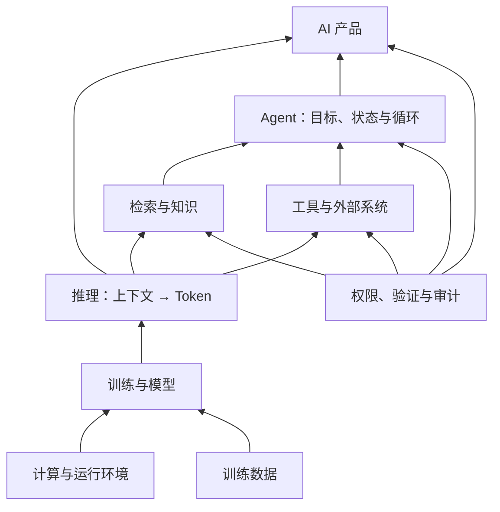

# AI 概念全景图

> 这张图只回答一个问题：**刚接触 AI 时，常见概念分别位于哪一层，又应该从哪里开始读？**

AI 不是从“模型”一路包含到“产品”的单棵树。同一个产品会调用模型、检索和工具；训练得到的模型又会在产品运行时被使用。下面按“从基础技术到用户任务”分层，帮助定位，不表示越上层越先进。

读图时先看两条界线：训练负责得到参数，推理负责在当前上下文中生成；模型只能提出内容或行动，检索、工具、Agent 和产品运行时负责连接现实数据与操作。权限与验证不是最上面的一层装饰，而是贯穿所有会读取数据或产生副作用的环节。

## 每一层去哪里读

| 位置 | 先解决的问题 | 唯一主页面 |
|---|---|---|
| AI 与机器学习 | AI、机器学习、模型是什么关系 | [AI 到底是什么](../01-AI与大模型/01-AI到底是什么.md) |
| 模型与训练 | 参数从哪里来，训练改变什么 | [一个大模型到底怎么诞生](../03-模型原理与训练/01-一个大模型到底是怎么诞生的.md) |
| 推理与上下文 | 模型当前能看见什么、怎样生成 | [上下文和上下文窗口](../02-聊天Token与上下文/07-上下文和上下文窗口是什么.md) |
| 检索与知识 | 怎样从外部资料寻找证据 | [RAG 到底是什么](../08-RAG与知识库/01-RAG到底是什么.md) |
| 工具 | 模型怎样请求现实能力 | [AI 工具到底是什么](../06-工具与Function-Calling/02-AI工具到底是什么.md) |
| Agent | 多步行动怎样形成循环 | [Agent 到底是什么](../07-Agent/01-Agent到底是什么.md) |
| 产品协作 | Embedded、Copilot、Agent 怎样区分 | [从 AI Embedded、Copilot 到 Agent](../07-Agent/07-从AI-Embedded和Copilot到Agent.md) |
| 权限与验证 | 为什么联网和工具不等于可靠 | [怎么验证 AI 的回答](../05-幻觉与模型局限/04-怎么验证AI的回答.md) |

第一次学习不需要横向扫完所有层。按 [README 主路线](../../README.md#主学习路线) 阅读；遇到一个词时，再从[知识网络](../../知识网络.md)沿关系跳转。
