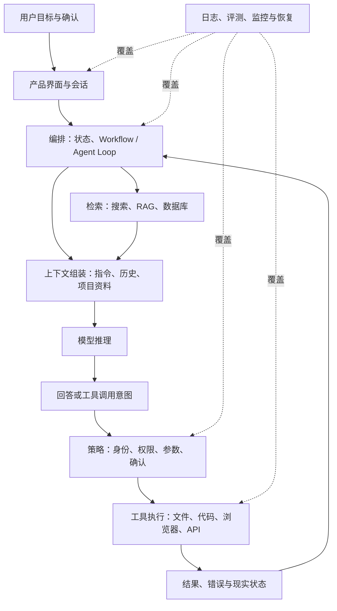

# AI 应用栈

> 这张图只回答一个问题：**用户交给 AI 产品一个任务后，从界面到模型、知识和工具，实际经过哪些系统边界？**

所谓“应用栈”不是每个产品必须购买的组件清单。它是一张责任图：回答出错或动作失败时，可以沿层次找到该检查模型、上下文、检索、工具、权限还是产品状态。

读图时最重要的是模型上下两侧。上游决定模型本轮看见什么；下游把模型输出当成不可信建议，经过权限和确认后才真实执行。工具结果返回循环，并不自动证明最终目标完成。

## 每层的责任与失败方式

| 层 | 主要责任 | 常见失败 | 主页面 |
|---|---|---|---|
| 产品与会话 | 收集目标、展示状态、让用户接管 | 把“计划中”误显示为“已完成” | [聊天记录是什么](../12-Memory/01-聊天记录是什么.md) |
| 编排 | 保存目标、步骤、停止条件和恢复点 | 无限循环、重复副作用、状态丢失 | [Agent Loop 是什么](../07-Agent/03-Agent-Loop是什么.md) |
| 上下文 | 选择当前指令、证据与历史 | 关键约束被挤掉、旧信息误导 | [上下文工程是什么](../11-Coding-Agent/09-上下文工程是什么.md) |
| 模型 | 根据上下文生成 Token 或调用意图 | 幻觉、误解目标、选错工具 | [大语言模型是什么](../01-AI与大模型/04-什么是大语言模型.md) |
| 检索与数据 | 找到可授权、可追溯的外部证据 | 漏检、旧版本、越权结果 | [检索是什么](../08-RAG与知识库/08-检索是什么.md) |
| 策略与权限 | 强制身份、资源、动作与确认边界 | 只靠 Prompt，未在程序层拒绝 | [代码执行和 Computer Use 风险](../06-工具与Function-Calling/05-代码执行和Computer-Use有什么风险.md) |
| 工具执行 | 调用 API、文件、数据库和运行环境 | 超时、部分完成、状态未知 | [AI 工具到底是什么](../06-工具与Function-Calling/02-AI工具到底是什么.md) |
| 验证与审计 | 核对结果、保留证据、支持恢复 | 只记录模型回复，没有真实执行状态 | [怎么验证 AI 的回答](../05-幻觉与模型局限/04-怎么验证AI的回答.md) |

## 用这张图排查一次失败

如果“AI 没找到合同”，先问检索是否返回了正确文件，再看上下文是否包含相关段落，最后才判断模型是否误读。若“AI 说邮件已发送但对方没收到”，要查策略是否批准、工具是否返回业务 ID、外部邮箱是否确认，而不是继续优化措辞。

构建产品时也不必一次拥有每一层。纯聊天产品可以没有工具；固定 Workflow 不必使用开放 Agent；小资料集可以直接进入上下文而不建 RAG。省略某层时，要明确它原本承担的责任由谁完成。

继续沿[AI 概念全景图](./01-AI概念全景图.md)定位概念，或回到[主学习路线](../../README.md#主学习路线)。
