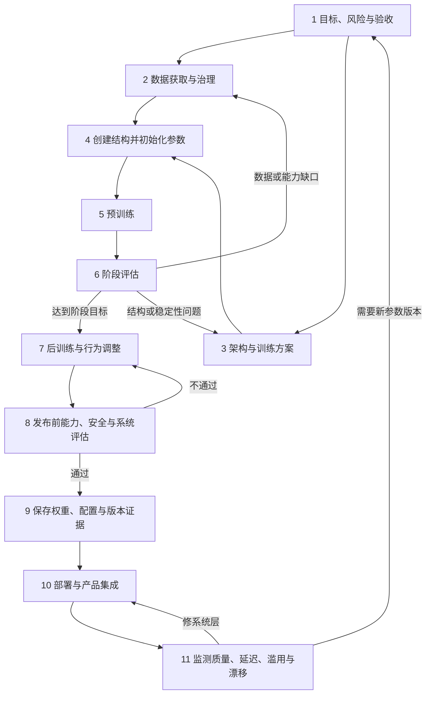

# 模型生命周期图

> 复习资产：从目标、数据和初始化，一直追到部署、监测与下一版模型。

“数据喂给模型之前，模型从哪里来？”这个原始聊天问题不能只用“先训练、再上线”回答。模型开发有多个可回退阶段：目标决定评估，架构决定参数形状，训练改变参数，文件保存一个版本，产品再把版本放进真实环境。

## 一张图看完整回路

箭头不是固定厂商流程。数据实验、模型实验和安全评估常并行进行；某些产品使用已有模型，生命周期会从部署与系统集成开始。图的核心是每个版本都要留下“输入、选择、评估与产物”，并允许证据推动回退。

## 节点索引

| 阶段 | 这一层改变什么 | 深入阅读 |
|---|---|---|
| 目标与验收 | 确定用户、任务、不可接受失败和评估方式 | [一个大模型怎样诞生](../03-模型原理与训练/01-一个大模型到底是怎么诞生的.md) |
| 数据治理 | 决定哪些样本提供训练信号以及怎样控制来源、隐私和污染 | [参数量和训练数据](../03-模型原理与训练/07-参数量和训练数据有什么区别.md) |
| 架构与初始化 | 创建计算结构、参数形状与可训练数值起点 | [模型架构](../03-模型原理与训练/02-模型架构是什么.md) · [参数初始化](../03-模型原理与训练/04-为什么参数不能全部初始化成一样.md) |
| 预训练与后训练 | 根据不同目标更新参数，形成基础能力与交互行为 | [训练和推理](../03-模型原理与训练/18-训练和推理有什么区别.md) · [RLHF 与 DPO](../03-模型原理与训练/11-RLHF和DPO是什么.md) |
| 评估 | 检查能力、泛化、安全、系统表现与数据污染 | [怎么验证 AI 的回答](../05-幻觉与模型局限/04-怎么验证AI的回答.md) |
| 保存与版本 | 固化权重、配置、Tokenizer、格式和来源证据 | [safetensors 和 GGUF](../03-模型原理与训练/09-safetensors和GGUF是什么.md) |
| 部署与监测 | 在目标硬件和产品中运行推理，观察质量、成本与风险 | [GPU、显存和推理瓶颈](../03-模型原理与训练/19-GPU显存和推理瓶颈.md) |

## 三条最容易漏掉的边界

初始化时模型实例已经能执行计算，却还没有学到目标规律；预训练完成表示得到一个参数版本，不等于已经成为安全好用的聊天产品；上线监测发现问题，也不一定要重新训练——检索、权限、界面或工具层都可能是正确修复位置。

训练数据不会在部署后自动继续进入参数。要得到新参数版本，仍需收集和治理数据、重新执行训练或微调、评估并发布。聊天记录、RAG 文档和模型参数属于不同生命周期。

评估也不是最后一场毕业考试。阶段评估能尽早发现数据、架构与优化问题；发布评估检查完整系统；上线监测确认真实分布中的表现。三者使用的证据和失败代价不同。

## 用图回答原始问题

**被数据“喂”之前有什么？** 先有人定义目标和架构，程序创建参数张量并初始化，得到能算但尚未学会目标规律的模型实例。

**什么时候才算模型完成？** 没有唯一时刻。应说明是初始化模型、基础模型、后训练版本、发布候选、已部署服务还是完整产品。

**线上用户反馈会立即训练模型吗？** 通常不会。反馈可以进入监测与后续数据管线，只有经过治理、训练、评估和发布才形成新参数版本。

继续对照：[训练与推理对照图](./05-训练与推理对照图.md) · [AI 应用栈](./02-AI应用栈.md) · [知识网络](../../知识网络.md)

## 资料与核验

- [NIST：AI Risk Management Framework](https://www.nist.gov/itl/ai-risk-management-framework)
- [Bommasani et al.：On the Opportunities and Risks of Foundation Models](https://arxiv.org/abs/2108.07258)
- [Goodfellow, Bengio & Courville：Deep Learning](https://www.deeplearningbook.org/)
