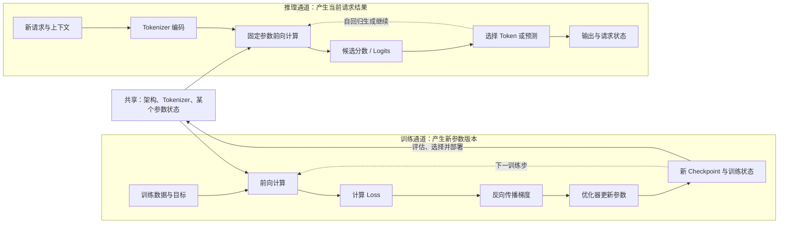

# 训练与推理对照图

> 复习资产：两边都会前向计算，只有训练沿着误差回路更新参数。

“成型模型也在做乘加，只是参数稳定了，对吗？”这个原始追问已经很接近分界。训练和推理共享架构与某个参数状态，却有不同输入、目标、临时状态与停止条件。

## 两条通道从哪里分开

两条回路看起来都在重复，但重复对象不同。训练对许多 Batch 重复“预测—误差—更新”，让参数逐步变化；生成式推理对同一个请求重复“计算—选 Token—接回输入”，参数保持不变，请求状态和 KV Cache 继续增长。

## 对照表

| 维度 | 训练 | 推理 |
|---|---|---|
| 直接目标 | 得到在目标分布上更合适的参数 | 用当前参数处理这次输入 |
| 典型输入 | 训练样本、目标或偏好信号 | Prompt、上下文、工具结果或新数据 |
| 参数 | 通过优化器更新 | 通常固定，只读取 |
| 额外计算 | Loss、梯度、反向传播、优化器步骤 | 解码、缓存、批处理与服务调度 |
| 主要临时状态 | 激活、梯度、优化器状态 | 激活、KV Cache、请求与采样状态 |
| 产物 | Checkpoint、权重和训练记录 | 分类、分数、Token 序列或工具请求 |
| 失败判断 | 训练不稳定、过拟合、评估退化、数据问题 | 错答、超时、内存不足、输出不满足任务 |

表中的“通常”很重要。在线学习等系统会在服务期间安排参数更新，但更新步骤仍属于训练；RAG、长上下文和 Memory 在普通请求中改变输入，不等于修改底座权重。

## 一次训练步发生什么

训练样本经过前向计算产生预测，Loss 按预先定义的目标衡量差异，反向传播计算每个可训练参数对 Loss 的影响，优化器再应用更新。下一步使用的已是略有变化的参数。

训练占用不只是一份权重。梯度、优化器状态和为了反向传播保存的激活会带来额外显存与通信压力；分布式训练还要在设备之间同步或切分这些状态。

Loss 降低只表示在当前训练目标和数据下优化取得进展，不自动证明真实能力、安全或泛化通过。Checkpoint 仍要独立评估、选择并保存兼容配置。

## 一次生成请求发生什么

服务加载已选参数版本，Tokenizer 把当前输入编码成 Token，模型前向计算候选分数，再按解码规则选择结果。自回归生成会把新 Token 接回序列，利用缓存继续下一步。

Temperature、Top-p 等设置影响选择分布，不会在本轮修改模型知识。聊天中给示例、上传文件或加入检索结果改变的是上下文；会话结束后，底座参数不会因为“聊过一次”自动学习。

推理也不是零成本。权重、KV Cache、并发请求、上下文长度、硬件内核和服务调度都会影响延迟与内存。模型文件更小不保证真实请求更快。

## 三个高频误判

**模型记住聊天内容，就是训练了吗？** 不一定。产品可能保存记录并在以后重新放进上下文，参数没有变化。

**推理模型在回答时“训练自己”吗？** 名称中的 Reasoning 不等于 Training。它仍可在固定参数下使用更多推理时计算、工具或搜索策略。

**把 LoRA、量化或 RAG 接上去属于哪边？** 训练 LoRA 适配器属于训练；加载适配器和量化权重运行属于推理部署；RAG 检索并组装上下文通常属于推理时系统。

继续对照：[LLM 最小原理闭环](./07-LLM最小原理闭环.md) · [模型生命周期图](./04-模型生命周期图.md) · [参数到底是什么](../03-模型原理与训练/06-参数到底是什么.md) · [知识网络](../../知识网络.md)

## 资料与核验

- [PyTorch：Autograd mechanics](https://docs.pytorch.org/docs/stable/notes/autograd.html)
- [Goodfellow, Bengio & Courville：Optimization for Training Deep Models](https://www.deeplearningbook.org/contents/optimization.html)
- [Hugging Face Transformers：Cache strategies](https://huggingface.co/docs/transformers/kv_cache)
