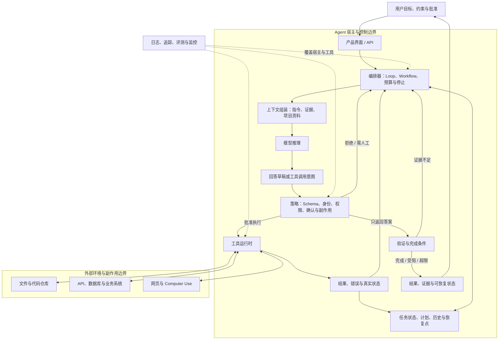

# Agent 架构图

> 复习资产：模型提出下一步，宿主校验并执行，环境结果再进入循环。

“模型加上工具和自主规划后，为什么就能连续做事？”这条原始问题最容易被简化成 `Agent = LLM + Tools`。公式漏掉了真正把一次生成变成可控系统的宿主：状态、编排、权限、停止、验证和恢复都在这里发生。

## 三个边界放在一张图里

第一条边界在模型外：模型生成回答或工具调用意图，宿主才决定它是否合法、是否需要批准。第二条边界在工具外：工具返回 Observation，只证明某次执行的结果，不自动证明用户目标完成。第三条边界在产品外：文件、数据库、网页和业务系统拥有自己的权限与真实状态。

## 节点职责索引

| 节点 | 主要职责 | 典型失败 | 主页面 |
|---|---|---|---|
| 产品与用户 | 收集目标、展示状态、承载批准和接管 | 界面状态与真实任务状态不同步 | [AI 应用栈](./02-AI应用栈.md) |
| 编排器 | 安排循环、Workflow、重试、预算、取消和停止 | 无限循环、重复副作用、无法取消 | [Agent Loop](../07-Agent/03-Agent-Loop是什么.md) |
| 状态 | 保存目标、计划、工具结果、恢复点与未决事项 | 上下文压缩后忘记关键约束 | [Agent 规划与恢复](../07-Agent/04-Agent如何规划和恢复.md) |
| 上下文组装 | 选择本轮真正给模型的指令与证据 | 噪声挤掉关键信息、来源权威性混乱 | [上下文工程](../11-Coding-Agent/09-上下文工程是什么.md) |
| 模型 | 解释当前状态，生成答案或下一动作建议 | 幻觉、误选工具、参数不符合 Schema | [模型和 Agent](../07-Agent/02-模型和Agent有什么区别.md) |
| 策略与权限 | 校验身份、参数、资源、确认和副作用 | 只靠 Prompt 限权、批准范围过大 | [代码执行和 Computer Use 风险](../06-工具与Function-Calling/05-代码执行和Computer-Use有什么风险.md) |
| 工具运行时 | 真正读文件、调用 API、运行命令或操作界面 | 超时、部分完成、状态未知 | [AI 工具](../06-工具与Function-Calling/02-AI工具到底是什么.md) |
| 验证 | 用业务回执、测试或独立证据判断完成 | 把模型总结当成执行证据 | [怎么验证 AI 的回答](../05-幻觉与模型局限/04-怎么验证AI的回答.md) |

## 一次工具循环怎样读

假设用户要求“修复测试”。编排器先组装仓库规则、失败日志和相关代码；模型提出运行一条测试；策略检查命令、目录和权限；工具运行时真正启动进程；退出码和错误成为 Observation；状态更新后，模型才选择打开文件、修改或停止。

如果模型只输出 `{"tool":"shell","command":"pytest"}`，但宿主没有执行，现实世界没有发生任何变化。若进程返回 0，也只证明那次测试在那个环境通过，不证明所有需求完成。验证层还要检查 diff、相关测试与用户验收条件。

固定步骤可以交给 Workflow，开放判断留给 Agent。把审批、发布和不可逆动作写成确定程序分支，通常比让模型每轮自由决定更可靠。

## 图里没有画成魔法的部分

Memory 不是必需的独立器官：它可能表现为数据库、会话记录或被选回上下文的状态。RAG 也不是每个 Agent 必备：只有任务需要从大资料集检索时才加入。MCP 标准化一部分工具与资源连接，不负责完整的 Loop、权限或完成判断。

多 Agent 只是把某些决策和状态分给多个执行者，外层仍需要任务依赖、权限、共享状态和停止条件。子 Agent 数量增加不会自动提高正确率。

## 回答原始问题

**模型接上工具为什么能连续做事？** 因为宿主把工具 Observation 保存并送回下一轮，模型可以根据新状态重新选择动作；不是因为模型一次就预测了整个未来。

**工具调用请求就是工具执行吗？** 不是。请求要经过 Schema、权限和确认，外部运行时成功执行后才产生结果。

**Agent 什么时候停止？** 完成条件有独立证据，或失败、预算、时间、权限和人工接管条件被触发时。停止不能只靠模型“觉得差不多”。

继续对照：[AI 应用栈](./02-AI应用栈.md) · [思维树、思维链和 ReAct](../04-模型能力/06-思维树思维链和ReAct有什么区别.md) · [知识网络](../../知识网络.md)

## 资料与核验

- [OpenAI：A practical guide to building agents](https://cdn.openai.com/business-guides-and-resources/a-practical-guide-to-building-agents.pdf)
- [Anthropic：Building effective agents](https://www.anthropic.com/research/building-effective-agents)
- [Yao et al.：ReAct](https://arxiv.org/abs/2210.03629)
