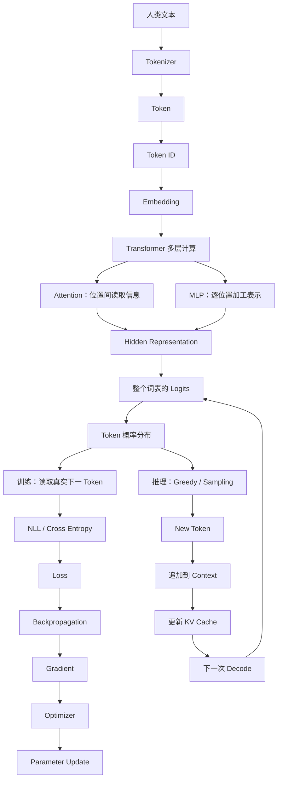

# LLM 最小原理闭环

> 如果你只读一个专题，就沿这 5 个真实问题走完：一段文字怎样进入模型，参数怎样学会预测，回答又怎样逐 Token 出现。

这张图讨论的是现代主流自回归大语言模型的共同主干，不代表所有语言模型、图像模型和产品系统都完全相同。RAG、Tool、Agent、Memory 与聊天界面是在这条模型机制外继续增加的系统层。

## 先用一张图看完整过程



读图时先抓住分叉点：到 Probability 为止，训练与生成都会用模型做前向计算。训练已经知道数据中的正确下一 Token，所以计算 Loss 并更新参数；推理不知道未来答案，只能选择一个 Token、接回上下文再算下一步。

## 五个问题，按依赖顺序读

### 1. 模型不认识文字，那“你好”到底是怎么变成数字的？

先读：[模型不认识文字，那“你好”到底是怎么变成数字的](../02-聊天Token与上下文/04-Token到底是什么.md)

这一步解决 Text、Tokenizer、BPE / Unigram、Vocabulary、Token、Token ID 与 Embedding 的边界。读完应能解释：电脑能保存 Unicode 文字，为什么模型仍需要自己的 Tokenizer；Token ID 为什么不是有语义大小关系的数字；神经网络又怎样通过 Embedding Lookup 得到向量。

### 2. ChatGPT 看起来什么都会，底层只是在预测下一个 Token 吗？

再读：[ChatGPT 看起来什么都会，底层只是在预测下一个 Token 吗](../03-模型原理与训练/10-为什么预测下一个Token能学到能力.md)

这一步解决 Autoregressive、Next-token Prediction、Vocabulary、Logits、Softmax 与 Probability。读完应能解释：模型为什么不是一次生成整句；训练与聊天都计算下一 Token 分数，却为什么一个更新参数、一个继续生成；“预测下一个 Token”又为什么不能扩大成所有语言模型的唯一本质。

### 3. 一句话里的词，模型是怎么互相“看见”的？

接着读：[一句话里的词，模型是怎么互相“看见”的](../03-模型原理与训练/05-Attention到底是什么.md)

这一步解决 Query、Key、Value、Self-Attention、Causal Mask、Multi-Head Attention 与 MLP。读完应能解释：Attention 为什么像 Token 之间的信息读取；Q/K/V 怎样由训练学到；为什么 Transformer 不等于 Attention，以及多层怎样不断改变每个位置的表示。

### 4. 没人给大模型批作业，它怎么知道自己预测错了？

然后读：[没人给大模型批作业，它怎么知道自己预测错了](../03-模型原理与训练/12-没人给大模型批作业它怎么知道预测错了.md)

这一步解决正确 Token 的来源、NLL、Cross Entropy、Teacher Forcing、Loss、Backpropagation、Gradient 与 Optimizer。读完应能解释：原始文本怎样自动提供训练目标；一句话为什么产生许多训练位置；Loss 又怎样最终变成参数张量的一次小更新。

### 5. 为什么 ChatGPT 的字是一个一个蹦出来的？

最后读：[为什么 ChatGPT 的字是一个一个蹦出来的](../03-模型原理与训练/14-为什么ChatGPT的字是一个一个蹦出来的.md)

这一步解决 Prompt、Prefill、KV Cache、Decode、Temperature、Top-k、Top-p、EOS 与性能指标。读完应能解释：为什么已知输入能并行 Prefill，未知输出必须逐 Token Decode；采样设置为什么不改变模型知识；KV Cache 保存什么，以及输出怎样知道何时停止。

## 用“中国的首都是”做一次复述

```text
“中国的首都是”
  ↓ Tokenizer
Token IDs
  ↓ Embedding Lookup
初始向量
  ↓ 多层 Transformer：Attention + MLP
最后输入位置的 Hidden Representation
  ↓ 输出投影
整个词表的 Logits
  ↓ Softmax / 生成策略
选出“北京”对应的 Token
  ↓ 追加 Context 并更新 KV Cache
再次 Decode，直到 EOS 或其他停止条件
```

如果这是训练样本，流程会在 Probability 后走另一条路：数据中真实存在的下一 Token 是目标，训练程序计算它的 `-log(p)`，汇总为 Loss，经反向传播得到梯度，再由优化器更新参数。训练完成后保存的是参数、配置、Tokenizer 与必要元数据，不是每道练习题的答案表。

## 读完后做 16 个自测

1. “你好”为什么还要 Tokenize？
2. Token 为什么要映射成 Token ID？
3. Token ID 怎样进入神经网络？
4. Transformer 怎样让不同 Token 交换信息？
5. Attention 与 Transformer 为什么不是同义词？
6. 模型为什么为整个 Vocabulary 产生 Logits？
7. Softmax 后的 Probability 在训练和推理中分别做什么？
8. 正确下一 Token 是谁提供的？
9. NLL 与 one-hot 目标下的 Cross Entropy 是什么关系？
10. Loss 怎样经过 Backpropagation 变成 Gradient？
11. Optimizer 怎样使用 Gradient 更新 Parameter？
12. 用户发出 Prompt 后 Prefill 做什么？
13. Decode 为什么不能一次并行生成完整回答？
14. Temperature 与 Top-p 改的是参数还是选择策略？
15. KV Cache 为什么能减少重复计算，又为什么越来越占显存？
16. EOS、输出上限与 Context Window 怎样共同决定停止？

有一项说不清，就回到对应问题页，而不是继续背更多术语。能从文字一路复述到参数更新和最终答案，才算第一次把 LLM 的最小机制真正连起来。

继续探索：[训练与推理对照图](./05-训练与推理对照图.md) · [知识网络](../../知识网络.md) · [真实问题矩阵](../../真实问题矩阵.md)
