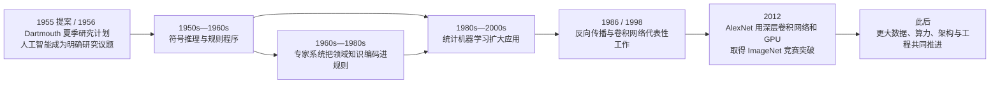

# 从规则系统到深度学习：AI 为什么从“写规则”走向“从数据学习”？

> 历史专题 1 / 3：**规则系统与专家系统** → **机器学习** → **深度学习与 GPU**
>
> 本页只建立历史位置，不替代概念主页面。继续学习：[AI、机器学习和深度学习是什么关系](../docs/01-AI与大模型/02-AI机器学习和深度学习是什么关系.md)

如果今天的 AI 可以从大量数据中学习，为什么早期研究者还要一条条写规则？一个常见误解是：早期的人没有想到机器学习，后来神经网络一出现，规则系统便彻底退出了历史。

真实情况更像多条路线长期并行。研究者一直在尝试让机器表现出推理、感知与学习能力，只是在不同年代，能获得的数据、计算资源、算法和工程工具不同。规则系统、统计学习、神经网络也不是前后互斥的三代产品；今天的软件仍会把规则、学习模型和人工审核放在同一个系统里。

## 先看这条历史线在说什么



这不是“每到一个年份，旧方法立刻消失”的交接表。箭头表示研究与工程重心的变化：后来的方法吸收了早期问题，也继续与规则和搜索组合。

## 1955—1956：先有一个研究议题，不等于先有一套成熟方法

John McCarthy、Marvin Minsky、Nathaniel Rochester 与 Claude Shannon 在 1955 年提交的 Dartmouth 夏季研究计划提案中使用了“artificial intelligence”这一名称，计划在 1956 年夏天讨论怎样让机器使用语言、形成抽象概念、解决人类当时能解决的问题并改进自身。

这份原始提案适合作为一个可核验的历史坐标，却不能被写成“AI 在某一天突然诞生”。在它之前，计算、控制论、神经元模型、逻辑与自动机已经有长期积累；会议之后，各条研究路线也没有获得统一定义。更准确的说法是：Dartmouth 计划帮助“人工智能”成为一个明确命名的研究议题和共同身份。

当时的计算机内存小、速度慢，可供机器直接学习的大规模数字数据也很少。对研究者而言，用符号表示问题、让程序按规则搜索答案，是一种自然且能被当时机器执行的路线。

## 规则系统：把人知道的判断过程写给机器

规则系统可以先用一个极小例子理解：

```text
如果 动物有羽毛，并且 动物会下蛋
那么 候选类别 = 鸟
```

程序把事实与规则放入推理过程，寻找哪些规则的条件已经满足，再推出新事实或动作。复杂系统还会处理规则优先级、冲突、搜索顺序和停止条件。

这种方法的优势很直接：规则来源可以检查，某一步为何发生通常也能追踪；在边界明确、变化缓慢的任务中，它可以稳定执行。困难同样明显：真实世界有例外、模糊信息和组合爆炸。知识若靠人逐条录入，获取和维护本身会成为瓶颈。

“Rule-based AI”因此描述的是一种知识表示与求解方式，不等于整个早期 AI。同期也有神经网络、概率方法、进化计算和搜索等研究。把几十年的 AI 史压成“以前只有 if-else”会丢掉这些并行路线。

## 专家系统：规则不只多了，还被组织成领域知识

专家系统把特定领域专家的判断知识编码到知识库中，再由推理机应用这些规则。DENDRAL 在 1960 年代开始探索根据质谱等信息推断有机分子结构；MYCIN 在 1970 年代研究怎样为某类感染提供诊断与用药建议。它们常被用来说明：程序不必在所有方面都像人，只要在一个狭窄领域中组织足够专门的知识，也可能产生有价值的判断。

可以把典型结构分成三部分：

| 部分 | 负责什么 | 不负责什么 |
|---|---|---|
| 知识库 | 保存领域事实、规则或启发式知识 | 不自动保证知识完整、最新 |
| 推理机 | 匹配条件、选择规则、推出结论 | 不等于真正执行医疗或业务动作 |
| 解释与交互 | 询问信息，展示推理依据 | 解释可追踪不等于结论一定正确 |

专家系统暴露了著名的“知识获取瓶颈”：专家常能做出判断，却不一定能把所有隐性经验完整说成规则；即使写出来，环境变化后也要持续维护。规则数量增加还会带来冲突和验证成本。

今天的业务规则引擎不应因为用了 `if` 就被自动称为专家系统；反过来，现代 AI 产品也没有抛弃规则。权限门禁、合规限制、工作流状态和高风险确认经常必须由确定性规则控制，而不能交给模型自由猜测。

## “机器学习时代”不是一个开关

[机器学习](../docs/01-AI与大模型/02-AI机器学习和深度学习是什么关系.md)把重点转向：不把所有判断规则直接写完，而是给出数据、目标和学习方法，让算法调整模型以改善任务表现。

这条路线也远早于今天的大模型。Arthur Samuel 在 1959 年关于西洋跳棋程序的论文中讨论了让计算机从经验改进表现；感知机、最近邻、决策树和神经网络等工作跨越多个年代。1980 年代到 2000 年代，数字数据增加、统计方法成熟、硬件和软件工具改善，机器学习才逐步在语音、文本分类、推荐、视觉等领域形成更广泛的工程影响。

因此本页使用“Machine Learning Era”只是描述研究与应用重心，不能理解成一个公认起止日。它也不是“机器自己决定学什么”：开发者仍要定义任务，准备数据，选择表示、损失和评估方法。训练只是让[参数](../docs/03-模型原理与训练/06-参数到底是什么.md)从数据中调整，不会自动产生正确目标。

## 深度学习：不是突然发明神经网络，而是旧路线获得新条件

神经网络的历史早于“深度学习”这个当代标签。1986 年，Rumelhart、Hinton 与 Williams 的论文系统展示了反向传播误差信号来学习内部表示；1998 年，LeCun 等人的工作展示了用梯度方法训练卷积网络识别手写文档。

这些工作说明，模型可以由多层可训练变换逐步形成表示，而不是让人提前写完每个特征规则。但较深网络长期受到数据规模、计算成本、优化困难和软硬件生态限制。2000 年代后，数据、初始化与训练方法、加速硬件和开放工具逐步改善，“深度学习”才成为更具实践影响的路线。

“Deep Learning Era”同样不是说所有机器学习都变成深度学习。表格、排序、小数据预测、可解释的业务模型等任务仍可能使用线性模型、树模型或规则。选择方法要看问题与证据，不应只看年代标签。

## 2012 AlexNet：GPU 为什么成为关键坐标

2012 年的 AlexNet 论文报告了一个深层卷积神经网络在 ImageNet LSVRC-2012 图像分类任务上的结果。论文明确记录：模型训练使用两块 NVIDIA GTX 580 3GB GPU，持续约五到六天；竞赛 top-5 测试错误率为 15.3%，显著低于第二名的 26.2%。

这个节点重要，不是因为“2012 年才第一次有人把 GPU 用于神经网络”，也不是因为一篇论文单独创造了深度学习。它提供了一个清晰、可复核的展示：大数据集、深层卷积架构、训练技巧和 GPU 并行计算组合起来，可以在重要基准上带来明显突破。

GPU 适合并行执行大量矩阵与向量计算，神经网络训练恰好需要反复进行这类操作。但硬件不是独立魔法：

```text
任务与数据
  + 可训练架构
  + 损失与优化方法
  + 并行硬件
  + 高效软件实现
  + 可重复评估
= 一个可验证的训练结果
```

如果数据错误、目标定义有偏差或评估泄漏，再多 GPU 也只会更快地得到一个不可靠结果。[GPU、显存和推理瓶颈](../docs/03-模型原理与训练/19-GPU显存和推理瓶颈.md)会进一步解释硬件怎样影响训练与服务成本。

## 三条路线今天怎样共存

想象一个银行的交易风险系统：学习模型根据历史数据给出风险分数；规则系统阻止违反法律或账户策略的动作；人工审核处理证据不足的高风险情况。它不是从规则“升级”为模型后就删掉规则，而是把不同职责分开。

| 路线 | 擅长 | 主要风险 |
|---|---|---|
| 人工规则 | 明确边界、权限、可追踪流程 | 覆盖不全，维护成本随例外增长 |
| 统计机器学习 | 从结构化数据估计模式与概率 | 依赖特征、数据分布和评估设计 |
| 深度学习 | 从大规模复杂数据学习多层表示 | 数据与算力成本高，内部机制更难审查 |

这也回答了开头的问题：早期规则路线符合当时可用的问题表示与计算条件；机器学习和深度学习不是简单推翻它，而是在数据、算法和算力条件变化后扩大了“让机器从经验调整模型”的能力。

## 读历史时要防止四种过度简化

**把命名写成发明时刻。** 1955 年提案使用“人工智能”一词，不表示此前没有相关思想。

**把代表性成果写成全领域起点。** AlexNet 是 2012 年可核验的关键成果，不是 GPU 或神经网络的绝对首次。

**把时代写成清场。** 规则、统计模型和深度网络今天仍并存。

**把硬件写成唯一原因。** GPU、数据、算法、软件与评估共同作用，缺一项都可能改变结果。

## 从这里继续

- 看概念边界：[AI、机器学习和深度学习是什么关系](../docs/01-AI与大模型/02-AI机器学习和深度学习是什么关系.md)
- 看模型怎样形成：[一个大模型到底是怎么诞生的](../docs/03-模型原理与训练/01-一个大模型到底是怎么诞生的.md)
- 看训练怎样扩展：[分布式训练是什么](../docs/03-模型原理与训练/20-分布式训练是什么.md)
- 下一段历史：[从 Transformer 到 Chat 模型](./02-从Transformer到Chat模型.md)
- 返回入口：[README](../README.md) · [知识网络](../知识网络.md)

## 原始资料与核验边界

- [McCarthy et al.: A Proposal for the Dartmouth Summer Research Project on Artificial Intelligence](https://www-formal.stanford.edu/jmc/history/dartmouth/dartmouth.html)
- [Newell & Simon: The Logic Theory Machine](https://www.rand.org/pubs/papers/P868.html)
- [Buchanan & Shortliffe: Rule-Based Expert Systems — The MYCIN Experiments](https://people.dbmi.columbia.edu/~ehs7001/Buchanan-Shortliffe-1984/)
- [Samuel: Some Studies in Machine Learning Using the Game of Checkers](https://doi.org/10.1147/rd.33.0210)
- [Rumelhart, Hinton & Williams: Learning representations by back-propagating errors](https://doi.org/10.1038/323533a0)
- [LeCun et al.: Gradient-Based Learning Applied to Document Recognition](https://doi.org/10.1109/5.726791)
- [Krizhevsky, Sutskever & Hinton: ImageNet Classification with Deep Convolutional Neural Networks](https://papers.nips.cc/paper/4824-imagenet-classification-with-deep-convolutional-neural-networks)

本页只把原始提案、论文或项目档案能够支持的年份与结果写成事实。“时代”是教学分段，不是学界统一规定的边界；对“首个”“首次”存在口径争议的地方，不作绝对排名。
