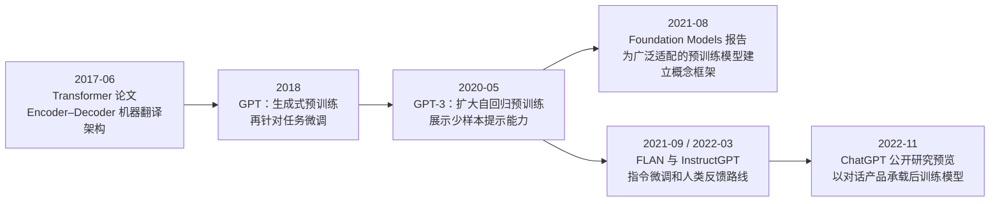

# 从 Transformer 到 Chat 模型：论文架构怎样走进聊天窗口？

> 历史专题 2 / 3：**Transformer** → **GPT 与基础模型** → **指令模型与 Chat 模型**
>
> 本页解释演进关系，不重复架构细节。主页面：[Transformer 到底是什么](../docs/03-模型原理与训练/03-Transformer到底是什么.md)

“Transformer、GPT、基础模型、Instruct 模型、ChatGPT”经常被排在一张时间线上，于是很容易被误读成同一个东西不断改名。其实它们分属不同层次：Transformer 是架构路线，GPT 是模型家族，Foundation Model 是描述训练与适配方式的研究概念，Instruction / Chat 则涉及后训练目标和产品交互。

这段历史真正值得理解的，不是哪家公司排第一，而是三次职责变化：先有适合大规模序列建模的架构；再有大规模预训练后适配多任务的模型；最后通过指令数据、偏好对齐与对话界面，让模型更像一个可交互的助手。

## 一张图先把层次分开



图中日期来自对应论文首次提交或官方发布记录。箭头表示技术脉络，不表示后一个节点只由前一个节点产生，也不表示同一时期没有 BERT、T5 等其他重要路线。

## 2017：Transformer 最初不是“聊天机器人架构”

Vaswani 等人的 *Attention Is All You Need* 于 2017 年 6 月提交。论文提出一种用于序列转换的 Encoder–Decoder 架构，用 Attention 替代此前常见的循环或卷积序列处理，并在机器翻译任务上报告结果。

原始问题是怎样把一个序列转换成另一个序列，而不是怎样造出 ChatGPT。Transformer 的关键历史意义在于，它让序列位置通过 Attention 交换信息，训练时又更适合并行计算，随后成为语言、视觉、语音与多模态模型可继续改造的架构基础。

这里必须分清：

- 论文里的 Transformer 是架构设计；
- 采用 Transformer 的一次训练结果才是具体模型；
- 在模型周围增加对话状态、工具、权限与界面，才会形成产品。

所以“ChatGPT 使用 Transformer”不能反推“2017 年已经有 ChatGPT”，也不能把 Attention、Transformer、GPT 与聊天界面当成同义词。

## 2018：GPT 把生成式预训练与任务适配连起来

OpenAI 2018 年的 *Improving Language Understanding by Generative Pre-Training* 使用 Decoder-only Transformer，先在未标注文本上通过语言建模进行生成式预训练，再用少量结构调整针对具体监督任务微调。

它对应一个重要转向：每个任务不必都从随机参数开始训练一套模型。模型先从大量文本中形成可迁移表示，再为分类、问答等任务适配。GPT 中的三个字母也因此有明确含义：Generative Pre-trained Transformer。

但 2018 年 GPT 不是后来所有“基础模型”的唯一源头。同期还有基于不同目标和结构的预训练路线。历史线选择 GPT，是因为它直接连接本项目要解释的自回归大语言模型，不是要把其他路线删掉。

## 2020：GPT-3 展示“用提示适配任务”的规模效应

GPT-3 论文于 2020 年 5 月提交，研究了扩大自回归语言模型规模后，在不更新参数或只给少量示例时完成不同任务的能力。论文把 zero-shot、one-shot 和 few-shot 条件放入文本上下文中评估，显示同一个预训练模型可以仅通过自然语言描述和示例切换任务。

这并不表示“模型从此不需要微调”，也不表示规模会自动修复偏见、幻觉和成本问题。论文同时记录了明显限制。历史意义在于：Prompt 不再只是一段待续写文本，还可以成为描述任务、提供例子和约束输出的临时接口。

从系统角度看，GPT-3 仍是模型。它不会因为能理解 Prompt，就自动拥有可靠权限、实时资料或[工具](../docs/06-工具与Function-Calling/02-AI工具到底是什么.md)。这些职责需要产品和宿主系统继续补齐。

## 2021：“Foundation Model”是一个概念框架，不是 GPT 的新名字

Stanford CRFM 的研究报告 *On the Opportunities and Risks of Foundation Models* 于 2021 年 8 月提交。报告用 Foundation Model 描述在广泛数据上训练、随后可适配大量下游任务的模型，并系统讨论能力、同质化、涌现与社会影响。

“基础模型”强调的是训练与下游适配位置，不限定只能生成文本，不限定必须使用某一个 Transformer 变体，也不等于某家公司的模型品牌。GPT 可以落在这类模型中，但二者不是互换名称。

这个词也提醒我们：一个基础模型可以成为许多应用的共同底座。上游数据或模型缺陷可能被下游放大，版本变化也会同时影响多个产品。规模带来的通用性，与集中依赖带来的风险，是同一结构的两面。

## 2021—2022：从“会续写”到“更愿意按指令做事”

基础语言模型的预训练目标通常要求预测文本中的下一个 Token。互联网文本里既有答案，也有争吵、广告、代码、引用与无关续写。仅靠这个目标，模型不一定知道用户此刻希望它诚实回答、拒绝危险请求，还是继续模仿一段文本。

指令微调通过“指令—输入—期望输出”形式的数据，让模型学习跨任务地响应自然语言任务描述。FLAN 论文于 2021 年 9 月提交，研究了在多种按指令表达的数据集上微调语言模型后，对未见任务的泛化。

InstructGPT 论文于 2022 年 3 月提交，记录了另一条更完整的对齐流程：先收集示范进行监督微调，再收集人类对多个输出的排序训练奖励模型，最后用强化学习继续优化策略。它不是“人类逐句修改模型参数”，也不能保证模型永不犯错；它把“人更偏好怎样的回答”转成训练信号。

可以把三个阶段粗略区分为：

| 阶段 | 主要训练信号 | 得到的倾向 |
|---|---|---|
| 预训练 | 文本中的下一个 Token | 学习语言分布、知识模式与续写能力 |
| 指令微调 | 指令与示范答案 | 更能识别任务并按要求输出 |
| 偏好对齐 | 人类排序或偏好数据 | 更贴近特定有用性、安全和风格目标 |

真实系统会采用不同数据与算法，不一定严格复现同一流程。进一步理解可阅读 [RLHF 和 DPO 是什么](../docs/03-模型原理与训练/11-RLHF和DPO是什么.md)。

## 2022-11：ChatGPT 是产品发布节点，不是架构发明节点

OpenAI 于 2022 年 11 月 30 日发布 ChatGPT 研究预览，官方介绍将其描述为能以对话方式交互的模型，并说明它是 InstructGPT 同路线的相邻模型，使用人类反馈强化学习训练。

对话形式让用户可以追问、让模型承认错误、挑战错误前提并拒绝部分不当请求。产品还要负责组织消息角色、保存一定范围的聊天状态、应用安全策略并把请求发送给模型。这些产品职责不能仅从模型论文推导。

因此：

```text
Transformer       决定一类神经网络怎样计算
GPT 模型          是采用特定架构与训练路线得到的模型家族
Instruction Model 经过指令或偏好数据继续适配
Chat Model        针对多轮消息结构与对话行为优化
Chat 产品         再加入界面、账户、状态、安全和其他系统能力
```

一个模型可以同时属于 GPT 家族、基础模型、指令模型和 Chat 模型，因为这些标签回答的是不同问题，不是互斥物种。

## 为什么“聊天能力”不只是加一个聊天框

聊天产品至少要解决三类模型之外的问题。

第一是**消息结构**。系统指令、用户消息、助手历史和工具结果需要以可区分的角色进入上下文。[System Prompt](../docs/02-聊天Token与上下文/02-System-Prompt是什么.md)可以影响行为，却不创造模型本来没有的权限。

第二是**多轮状态**。模型一次推理只看到本次传入的 Token。产品要选择哪些历史重新放进[上下文](../docs/02-聊天Token与上下文/07-上下文和上下文窗口是什么.md)，怎样截断或总结，是否另建长期记忆。

第三是**运行边界**。联网、读文件、调用 API 和执行代码不是“会聊天”自然附送的能力，需要工具、权限、审计和失败恢复。下一篇历史线会解释这些系统能力怎样逐步进入模型应用。

## 回答三个常见历史误解

**Transformer 一出来就已经是 LLM 吗？** 不是。2017 年论文提出的是序列转换架构；具体 LLM 还需要模型配置、大规模数据、训练目标、算力和后训练。

**GPT-3 就是基础模型这个概念的起点吗？** GPT-3 是重要实例；“Foundation Model”作为系统概念由 2021 年报告明确提出并展开。不能把实例和概念命名混为一谈。

**ChatGPT 是 GPT 加了网页吗？** 不是。界面只是可见部分，背后还有指令与偏好后训练、消息结构、多轮上下文、安全策略和服务系统。它仍不自动等于拥有工具的 Agent。

## 从这里继续

- 回看前史：[从规则系统到深度学习](./01-从规则系统到深度学习.md)
- 深入架构：[Transformer 到底是什么](../docs/03-模型原理与训练/03-Transformer到底是什么.md)
- 区分模型与产品：[GPT 和 ChatGPT 有什么区别](../docs/01-AI与大模型/05-GPT和ChatGPT有什么区别.md)
- 看生成机制：[为什么预测下一个 Token 能学到能力](../docs/03-模型原理与训练/10-为什么预测下一个Token能学到能力.md)
- 下一段历史：[从 RAG、工具调用到 Coding Agent](./03-从RAG工具调用到Coding-Agent.md)

## 原始资料与核验边界

- [Vaswani et al.: Attention Is All You Need](https://arxiv.org/abs/1706.03762)（首次提交：2017-06-12）
- [Radford et al.: Improving Language Understanding by Generative Pre-Training](https://cdn.openai.com/research-covers/language-unsupervised/language_understanding_paper.pdf)
- [Brown et al.: Language Models are Few-Shot Learners](https://arxiv.org/abs/2005.14165)（首次提交：2020-05-28）
- [Bommasani et al.: On the Opportunities and Risks of Foundation Models](https://arxiv.org/abs/2108.07258)（首次提交：2021-08-16）
- [Wei et al.: Finetuned Language Models Are Zero-Shot Learners](https://arxiv.org/abs/2109.01652)（首次提交：2021-09-03）
- [Ouyang et al.: Training language models to follow instructions with human feedback](https://arxiv.org/abs/2203.02155)（首次提交：2022-03-04）
- [OpenAI: Introducing ChatGPT](https://openai.com/index/chatgpt/)（官方发布：2022-11-30）

论文日期按 arXiv 首次提交记录；产品日期按官方发布记录。不同组织此前已有对话系统与指令学习研究，本页不对“首个聊天模型”或“首次指令微调”作排名。
