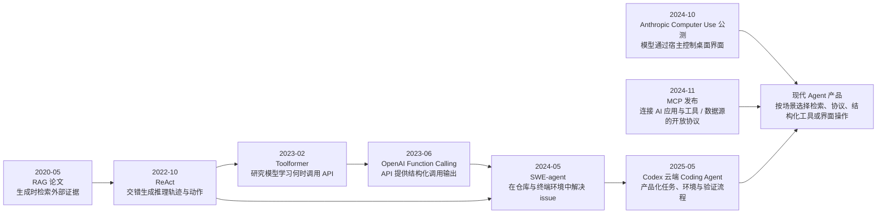

# 从 RAG、工具调用到 Coding Agent：模型怎样走出聊天框？

> 历史专题 3 / 3：**RAG** → **Tool Calling 与 Agent** → **MCP** → **Coding Agent / Computer Use**
>
> 本页解释技术节点怎样组合，不把论文原型等同于成熟产品。概念主页面：[Agent 到底是什么](../docs/07-Agent/01-Agent到底是什么.md)

大语言模型会生成文字，但它的参数不是实时数据库，也不能仅凭一段文本真的搜索网页、提交表单或修改仓库。今天的 Agent 产品看起来能连续工作，是因为模型外面逐步加入了检索、结构化工具调用、循环控制、权限、协议和验证环境。

这段历史最容易被产品名称遮住。RAG、Function Calling、Agent、MCP、Computer Use 与 Coding Agent 不是依次替代的六代模型；它们解决的是不同系统接口问题，常在同一个产品中同时存在。

## 先把六个职责放回时间线



箭头是教学关系，不是专利谱系。MCP、Computer Use 和 Coding Agent 在图末汇合，表示现代产品可以按场景组合这些能力，不表示 Codex 发布时依赖前两者。Agent 研究远早于大语言模型；代码自动化、信息检索与图形界面代理也都有更长历史。本页只追踪现代 LLM 应用中几个有原始论文或官方记录的公开节点。

## 2020：RAG 让生成时的外部资料成为系统组成

*Retrieval-Augmented Generation for Knowledge-Intensive NLP Tasks* 于 2020 年 5 月提交。论文把预训练的生成模型与外部稠密向量索引结合：系统先根据输入检索相关文档，再让生成过程以这些文档为条件回答知识密集型问题。

它解决的是“模型参数之外，怎样在推理时引入可更新资料”。这与训练模型不同：

```text
用户问题 → 检索查询 → 外部资料 → 加入生成条件 → 模型回答
```

RAG 不会自动让模型拥有真实世界动作，也不保证引用正确。检索可能漏掉关键文档，文档可能过期，生成也可能歪曲证据。系统还要处理权限、切分、排序、引用与答案核验。完整边界见 [RAG 到底是什么](../docs/08-RAG与知识库/01-RAG到底是什么.md)。

历史上，检索增强语言模型并非从一篇论文凭空出现；信息检索与开放域问答已有长期积累。这里用 RAG 论文作为今天术语和系统结构的明确坐标，不宣称它是所有“检索后生成”思想的绝对首次。

## 2022 ReAct：把“想一步”和“做一步”放进循环

ReAct 论文于 2022 年 10 月提交，研究让语言模型交错生成 reasoning traces 与 task-specific actions。动作交给外部环境后，环境返回 observation，模型再据此继续。这形成了后来 LLM Agent 常见的教学循环：

```text
目标
 ↓
模型根据当前上下文提出下一步
 ↓
宿主执行动作
 ↓
环境返回观察结果
 ↓
模型继续，直到满足停止条件
```

关键不在模型文字里出现了“Action”，而在宿主系统真的识别动作、执行工具并把结果送回来。模型只负责产生候选调用或下一步建议；权限、超时、重试、预算和停止规则必须由[Agent 系统](../docs/07-Agent/03-Agent-Loop是什么.md)控制。

Agent 也不是 2022 年才出现的概念。软件 Agent、机器人与多智能体研究早已有自己的定义和历史。ReAct 是现代 LLM Agent 设计中可核验的代表性节点，不是“世界第一个 Agent”。

## 2023：Toolformer 与 Function Calling 解决不同问题

Toolformer 论文于 2023 年 2 月提交，研究语言模型怎样以自监督方式学习决定调用哪些 API、何时调用以及使用什么参数。它是训练方法研究，重点是让模型在文本生成中学习插入工具调用。

OpenAI 于 2023 年 6 月发布 API 的 Function Calling 能力，让开发者向模型描述函数，模型可以生成符合给定结构的函数参数。这个产品接口解决“模型怎样把调用意图交给程序”的问题。

二者经常被混成“模型自己使用工具”，但真实系统至少有四步：

| 步骤 | 责任方 | 失败例子 |
|---|---|---|
| 描述工具 | 开发者或协议层 | Schema 含糊、权限范围过大 |
| 选择并填写调用 | 模型 | 选错工具、参数缺失或虚构 |
| 校验与执行 | 宿主应用 | 未确认就产生副作用、超时 |
| 返回并验证结果 | 工具与应用 | 工具成功但业务目标未完成 |

Function Calling 不会替开发者执行函数。模型返回结构化意图后，应用仍要校验参数、检查权限、真正调用外部代码，并决定哪些结果可以放回上下文。详细区分见 [Function Calling 是什么](../docs/06-工具与Function-Calling/03-Function-Calling是什么.md)。

## 2024：Coding Agent 把循环放进真实软件环境

SWE-agent 论文在 2024 年 5 月公开，研究让语言模型在定制的 Agent–Computer Interface 中使用命令、查看与编辑代码，以解决真实软件仓库问题。它强调了一个经常被聊天演示忽略的事实：即使底层模型相同，Agent 能看到什么命令、输出怎样呈现、编辑动作怎样设计，也会显著影响结果。

一个 Coding Agent 通常要组合：

- 仓库、规则文件和任务描述形成的[项目上下文](../docs/11-Coding-Agent/08-项目上下文是什么.md)；
- 搜索、读写文件、终端和 Git 等工具；
- 探索、修改、运行测试、读取失败、继续修复的循环；
- 沙箱、人工确认与操作系统权限；
- diff、测试、退出码和提交状态构成的验证证据。

所以 Coding Agent 不是“更会写代码的聊天模型”这么简单。它是模型、软件环境、工具接口、控制循环与验证机制的组合。论文基准通过也不等于产品能在所有仓库、依赖和权限环境中可靠工作。

## 2024：Computer Use 把工具表面扩展到屏幕、鼠标和键盘

Anthropic 于 2024 年 10 月发布 Computer Use 公测，官方描述模型可通过查看屏幕、移动光标、点击按钮和输入文本来使用计算机。宿主应用需要截取屏幕，把模型请求转换成鼠标键盘动作，再把新界面状态返回模型。

它与 API 工具调用的差别在于：API 提供稳定结构，图形界面主要通过像素与视觉布局表达状态。界面会变化，按钮可能被遮挡，模型也可能误读页面。Computer Use 因而需要更严格的隔离、确认、域名限制、敏感数据保护和动作后验证。[代码执行和 Computer Use 有什么风险](../docs/06-工具与Function-Calling/05-代码执行和Computer-Use有什么风险.md)专门解释这些边界。

“看到屏幕”也不等于拥有电脑权限。真正的点击由宿主进程执行，操作系统和产品策略仍可以阻止动作。模型在回答里说“已经点了”不能作为完成证据。

## 2024-11：MCP 标准化连接，不负责替 Agent 思考

Anthropic 于 2024 年 11 月发布 Model Context Protocol（MCP），将其描述为连接 AI 助手与数据所在系统的开放标准。MCP 使用 Client–Server 结构，让应用以统一方式发现并调用 Tools、读取 Resources 或使用 Prompts。

它解决的是连接层碎片化：如果每个 AI 应用都为每个数据源写一套专用集成，组合数量会快速增长。协议让客户端与服务端围绕共同消息和能力模型协作。

但 [MCP 不等于 Agent](../docs/09-MCP/06-MCP和Agent有什么区别.md)。MCP Server 暴露一个工具，不表示模型知道何时该用；一次协议调用成功，也不表示任务已经完成。目标分解、循环、权限、确认、记忆和验收仍由 Agent 应用负责。

同样，MCP 不是 API 的替代品。Server 内部可能调用既有 API、数据库或本地程序；MCP 统一的是 AI 应用如何发现和使用这些能力的外层接口。

## 2025：Coding Agent 进入任务与产品工作流

OpenAI 于 2025 年 5 月发布 Codex 云端软件工程 Agent 研究预览，官方记录它可以在隔离云环境中并行处理编写功能、回答代码库问题、修复 bug 和提出 Pull Request 等任务，并通过测试输出和终端日志提供证据。

这个节点和 2021 年同名 Codex 代码模型必须区分。2021 年 Codex 是面向代码生成的模型发布；2025 年 Codex 是把模型放进任务、仓库环境、工具、日志和审查流程中的 Agent 产品。名称延续不表示系统层次相同。

到这里可以看到，Agent 产品不是由某一篇论文一次发明：

```text
模型能力
 + 检索或外部上下文
 + 结构化工具接口
 + 可观察、可停止的循环
 + 真实运行环境
 + 权限与人工确认
 + 可重复验证证据
= 能承担任务的 Agent 系统
```

缺少最后三项，模型即使能给出漂亮计划，也可能无法安全、可靠地完成真实工作。

## 把几个经常混淆的“首次”拆开

**RAG 论文不是检索技术的起点。** 它是把检索器与生成模型结合并形成当代术语的重要论文坐标。

**Function Calling 不是模型第一次接触 API。** Toolformer 等研究与更早的工具增强系统已有不同路线；官方 API 发布记录说明的是一个具体产品接口。

**ReAct 不是 Agent 的诞生。** 它是 LLM 推理轨迹与环境动作交错的一种代表方法。

**MCP 不是工具调用的发明。** 它尝试把应用与工具、数据源之间的连接协议标准化。

**Coding Agent 不等于 Computer Use。** 前者面向软件工程任务，常优先使用结构化文件与终端工具；后者用图形界面作为通用动作表面。二者可以组合，但风险和验证方式不同。

## 回到开头：模型究竟怎样“走出聊天框”

模型自己没有手，也没有数据库连接。它先生成检索请求或结构化工具调用，由宿主验证并执行；环境返回的新信息进入下一轮上下文，Agent 控制器决定继续、停止还是请求人工确认。MCP 可以让这些连接更统一，Coding Agent 和 Computer Use 则把循环放进具体工作环境。

外部动作越真实，系统越不能只相信模型自述。最终状态、权限、日志、测试和人工审核才是完成证据。

## 从这里继续

- 回看模型演进：[从 Transformer 到 Chat 模型](./02-从Transformer到Chat模型.md)
- 拆开系统：[Agent 架构图](../docs/13-AI全景图/06-Agent架构图.md)
- 理解检索：[RAG 到底是什么](../docs/08-RAG与知识库/01-RAG到底是什么.md)
- 理解连接：[MCP 到底是什么](../docs/09-MCP/01-MCP到底是什么.md)
- 理解开发场景：[Coding Agent 是什么](../docs/11-Coding-Agent/04-Coding-Agent是什么.md)
- 看经核验的产品案例：[Codex](../docs/11-Coding-Agent/10-Codex产品案例.md) · [Claude Code](../docs/11-Coding-Agent/11-Claude-Code产品案例.md) · [Cursor](../docs/11-Coding-Agent/12-Cursor产品案例.md)

## 原始资料与核验边界

- [Lewis et al.: Retrieval-Augmented Generation for Knowledge-Intensive NLP Tasks](https://arxiv.org/abs/2005.11401)（首次提交：2020-05-22）
- [Yao et al.: ReAct — Synergizing Reasoning and Acting in Language Models](https://arxiv.org/abs/2210.03629)（首次提交：2022-10-06）
- [Schick et al.: Toolformer — Language Models Can Teach Themselves to Use Tools](https://arxiv.org/abs/2302.04761)（首次提交：2023-02-09）
- [OpenAI: Function calling and other API updates](https://openai.com/index/function-calling-and-other-api-updates/)（官方发布：2023-06-13）
- [Yang et al.: SWE-agent — Agent-Computer Interfaces Enable Automated Software Engineering](https://arxiv.org/abs/2405.15793)（首版提交：2024-05-06）
- [Anthropic: Introducing computer use](https://www.anthropic.com/news/3-5-models-and-computer-use)（官方发布：2024-10-22）
- [Anthropic: Introducing the Model Context Protocol](https://www.anthropic.com/news/model-context-protocol)（官方发布：2024-11-25）
- [OpenAI: Introducing Codex](https://openai.com/index/introducing-codex/)（官方发布：2025-05-16）
- [OpenAI: Introducing upgrades to Codex](https://openai.com/index/introducing-upgrades-to-codex/)（官方记录 2021 Codex 与后续演进）

论文日期按 arXiv 首次提交记录，产品日期按官方发布记录。官方产品页面会继续更新；本页只把发布节点用于历史定位，不把当前价格、默认模型、上下文长度或界面按钮写成永久事实。
