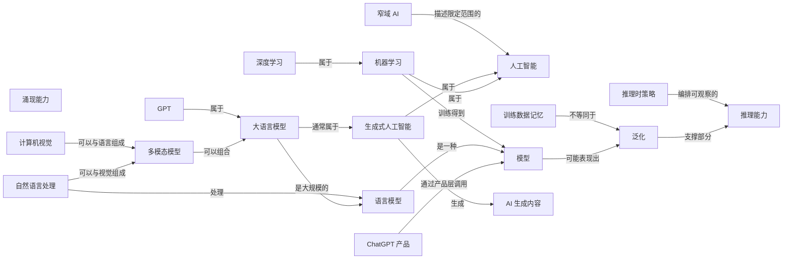
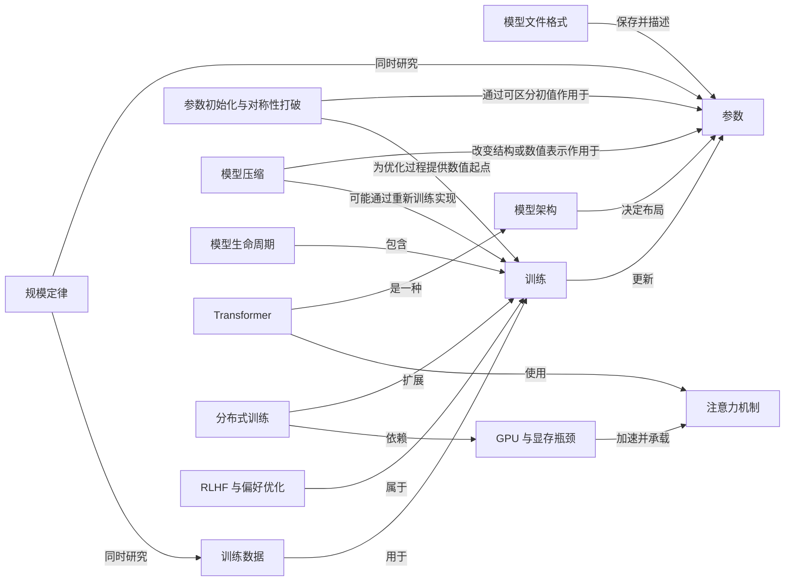
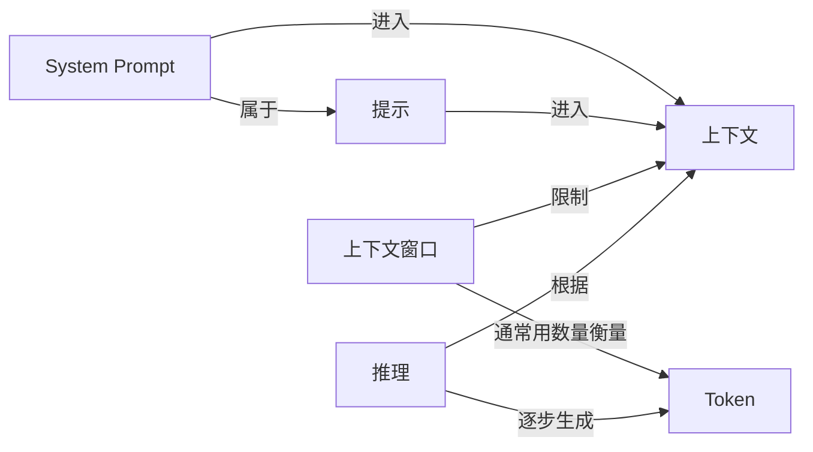
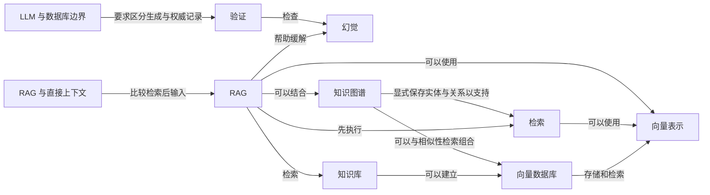
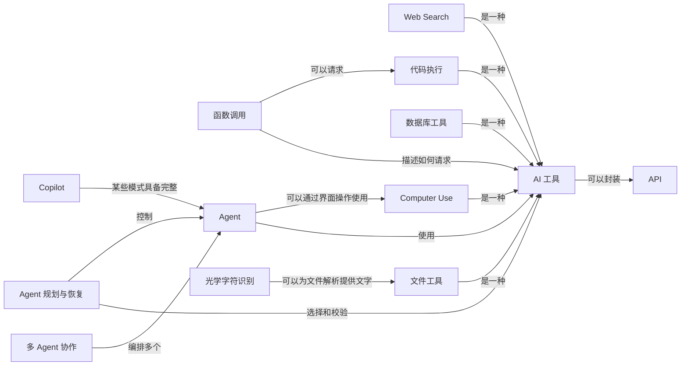
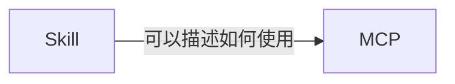
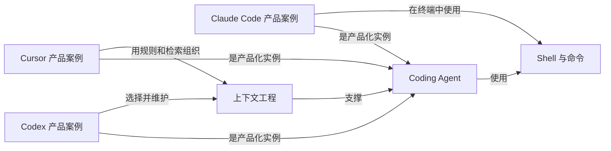
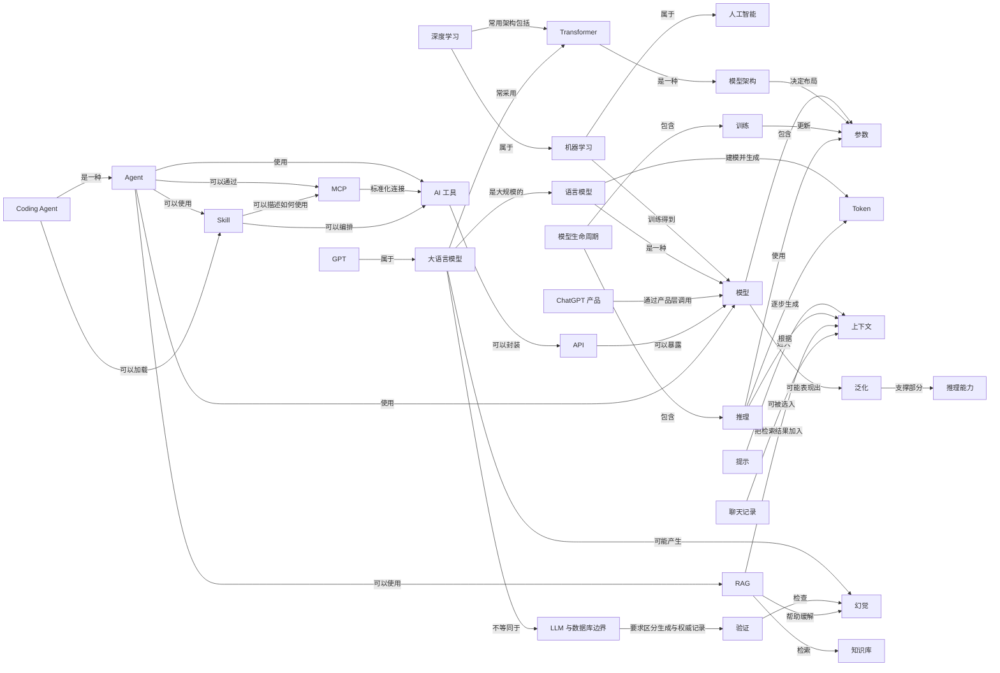

# LLM-101 知识网络

> 本页由 [`知识网络.yml`](./知识网络.yml) 自动生成，请勿手工编辑。
> 重新生成：`python3 scripts/build_knowledge_graph.py`

当前收录 **73** 个概念节点、**130** 条语义关系。

## 主学习路线

适合第一次从头学习。路线只保留会明显影响后续理解的概念。

[人工智能](./docs/01-AI与大模型/01-AI到底是什么.md) → [机器学习](./docs/01-AI与大模型/02-AI机器学习和深度学习是什么关系.md) → [深度学习](./docs/01-AI与大模型/02-AI机器学习和深度学习是什么关系.md) → [模型](./docs/01-AI与大模型/03-模型到底是什么.md) → [语言模型](./docs/01-AI与大模型/04-什么是大语言模型.md) → [大语言模型](./docs/01-AI与大模型/04-什么是大语言模型.md) → [GPT](./docs/01-AI与大模型/05-GPT和ChatGPT有什么区别.md) → [ChatGPT 产品](./docs/01-AI与大模型/05-GPT和ChatGPT有什么区别.md) → [参数](./docs/03-模型原理与训练/06-参数到底是什么.md) → [提示](./docs/02-聊天Token与上下文/01-Prompt到底是什么.md) → [Token](./docs/02-聊天Token与上下文/04-Token到底是什么.md) → [上下文](./docs/02-聊天Token与上下文/07-上下文和上下文窗口是什么.md) → [模型生命周期](./docs/03-模型原理与训练/01-一个大模型到底是怎么诞生的.md) → [模型架构](./docs/03-模型原理与训练/02-模型架构是什么.md) → [Transformer](./docs/03-模型原理与训练/03-Transformer到底是什么.md) → [训练](./docs/03-模型原理与训练/18-训练和推理有什么区别.md) → [推理](./docs/03-模型原理与训练/18-训练和推理有什么区别.md) → [泛化](./docs/04-模型能力/01-泛化是什么.md) → [推理能力](./docs/04-模型能力/03-推理能力是什么.md) → [幻觉](./docs/05-幻觉与模型局限/01-幻觉是什么.md) → [LLM 与数据库边界](./docs/05-幻觉与模型局限/02-为什么LLM不是数据库.md) → [验证](./docs/05-幻觉与模型局限/04-怎么验证AI的回答.md) → [API](./docs/06-工具与Function-Calling/01-API到底是什么.md) → [AI 工具](./docs/06-工具与Function-Calling/02-AI工具到底是什么.md) → [Agent](./docs/07-Agent/01-Agent到底是什么.md) → [RAG](./docs/08-RAG与知识库/01-RAG到底是什么.md) → [知识库](./docs/08-RAG与知识库/02-知识库是什么.md) → [MCP](./docs/09-MCP/01-MCP到底是什么.md) → [Skill](./docs/10-Skill/01-Skill到底是什么.md) → [Coding Agent](./docs/11-Coding-Agent/04-Coding-Agent是什么.md) → [聊天记录](./docs/12-Memory/01-聊天记录是什么.md)

## 扩展学习路线

理解主线后，可以按需要深入这些概念。

[训练数据](./docs/03-模型原理与训练/07-参数量和训练数据有什么区别.md) → [上下文窗口](./docs/02-聊天Token与上下文/07-上下文和上下文窗口是什么.md) → [注意力机制](./docs/03-模型原理与训练/05-Attention到底是什么.md) → [函数调用](./docs/06-工具与Function-Calling/03-Function-Calling是什么.md) → [向量表示](./docs/08-RAG与知识库/03-Embedding是什么.md) → [向量数据库](./docs/08-RAG与知识库/05-向量数据库是什么.md) → [检索](./docs/08-RAG与知识库/08-检索是什么.md)

## 知识网络矩阵

| 概念 | 一句话 | 前置 | 语义关系 | 相关真实问题 | 主文章 |
|---|---|---|---|---|---|
| [人工智能](./docs/01-AI与大模型/01-AI到底是什么.md) | 研究和构建围绕目标处理输入，并产生预测、内容、建议、决策或行动的机器系统的广泛领域。 | — | [窄域 AI](./docs/01-AI与大模型/06-弱AI生成式AI和AIGC有什么区别.md) 描述限定范围的它；[生成式人工智能](./docs/01-AI与大模型/06-弱AI生成式AI和AIGC有什么区别.md) 属于它 | [数据科学、人工智能、机器学习和计算机视觉是什么关系？](./docs/01-AI与大模型/02-AI机器学习和深度学习是什么关系.md) [机器学习里的模型、算法和假设到底有什么区别？这些词为什么经常混着用？](./docs/01-AI与大模型/03-模型到底是什么.md) [强 AI 和弱 AI 有公认定义吗？所谓“弱”是能力差，还是任务范围受限？](./docs/01-AI与大模型/06-弱AI生成式AI和AIGC有什么区别.md) | [人工智能](./docs/01-AI与大模型/01-AI到底是什么.md) |
| [机器学习](./docs/01-AI与大模型/02-AI机器学习和深度学习是什么关系.md) | 让计算系统从数据中调整模型，而不是把每条判断规则都由人逐条写死的方法。 | [人工智能](./docs/01-AI与大模型/01-AI到底是什么.md) | 属于 [人工智能](./docs/01-AI与大模型/01-AI到底是什么.md)；训练得到 [模型](./docs/01-AI与大模型/03-模型到底是什么.md)；[深度学习](./docs/01-AI与大模型/02-AI机器学习和深度学习是什么关系.md) 属于它 | [数据科学、人工智能、机器学习和计算机视觉是什么关系？](./docs/01-AI与大模型/02-AI机器学习和深度学习是什么关系.md) [什么时候使用深度学习反而是小题大做？它会让其他机器学习方法变得没用吗？](./docs/01-AI与大模型/02-AI机器学习和深度学习是什么关系.md) [机器学习里的模型、算法和假设到底有什么区别？这些词为什么经常混着用？](./docs/01-AI与大模型/03-模型到底是什么.md) | [机器学习](./docs/01-AI与大模型/02-AI机器学习和深度学习是什么关系.md) |
| [深度学习](./docs/01-AI与大模型/02-AI机器学习和深度学习是什么关系.md) | 主要使用多层神经网络从数据中学习表示的一类机器学习方法。 | [机器学习](./docs/01-AI与大模型/02-AI机器学习和深度学习是什么关系.md) | 属于 [机器学习](./docs/01-AI与大模型/02-AI机器学习和深度学习是什么关系.md)；常用架构包括 [Transformer](./docs/03-模型原理与训练/03-Transformer到底是什么.md) | [什么时候使用深度学习反而是小题大做？它会让其他机器学习方法变得没用吗？](./docs/01-AI与大模型/02-AI机器学习和深度学习是什么关系.md) | [深度学习](./docs/01-AI与大模型/02-AI机器学习和深度学习是什么关系.md) |
| [模型](./docs/01-AI与大模型/03-模型到底是什么.md) | 经过训练后，用来把输入转换为预测、分数或生成结果的计算关系。 | [机器学习](./docs/01-AI与大模型/02-AI机器学习和深度学习是什么关系.md) | 包含 [参数](./docs/03-模型原理与训练/06-参数到底是什么.md)；可能表现出 [泛化](./docs/04-模型能力/01-泛化是什么.md)；[Copilot](./docs/07-Agent/07-从AI-Embedded和Copilot到Agent.md) 使用它；[机器学习](./docs/01-AI与大模型/02-AI机器学习和深度学习是什么关系.md) 训练得到它 | [参数量就是训练数据吗？](./docs/03-模型原理与训练/07-参数量和训练数据有什么区别.md) [等一下，你说把数据喂给模型，但是这个模型是怎么诞生的？](./docs/03-模型原理与训练/01-一个大模型到底是怎么诞生的.md) [参数最后体现形式是啥？](./docs/03-模型原理与训练/09-safetensors和GGUF是什么.md) | [模型](./docs/01-AI与大模型/03-模型到底是什么.md) |
| [语言模型](./docs/01-AI与大模型/04-什么是大语言模型.md) | 对语言序列及其中 Token 的可能性进行建模的模型。 | [模型](./docs/01-AI与大模型/03-模型到底是什么.md) | 是一种 [模型](./docs/01-AI与大模型/03-模型到底是什么.md)；建模并生成 [Token](./docs/02-聊天Token与上下文/04-Token到底是什么.md)；[自然语言处理](./docs/01-AI与大模型/07-NLP和Computer-Vision是什么关系.md) 处理它；[大语言模型](./docs/01-AI与大模型/04-什么是大语言模型.md) 是大规模的它 | [从根本上说，语言模型到底在对什么建模？](./docs/01-AI与大模型/04-什么是大语言模型.md) [大语言模型和基础模型是一回事吗？](./docs/01-AI与大模型/04-什么是大语言模型.md) | [语言模型](./docs/01-AI与大模型/04-什么是大语言模型.md) |
| [大语言模型](./docs/01-AI与大模型/04-什么是大语言模型.md) | 在大量数据和计算资源上训练、能够处理和生成语言的大规模语言模型。 | [语言模型](./docs/01-AI与大模型/04-什么是大语言模型.md)、[深度学习](./docs/01-AI与大模型/02-AI机器学习和深度学习是什么关系.md) | 通常属于 [生成式人工智能](./docs/01-AI与大模型/06-弱AI生成式AI和AIGC有什么区别.md)；是大规模的 [语言模型](./docs/01-AI与大模型/04-什么是大语言模型.md)；常采用 [Transformer](./docs/03-模型原理与训练/03-Transformer到底是什么.md)；[GPT](./docs/01-AI与大模型/05-GPT和ChatGPT有什么区别.md) 属于它；[多模态模型](./docs/04-模型能力/05-多模态模型是什么.md) 可以组合它 | [幻觉是啥意思？](./docs/05-幻觉与模型局限/01-幻觉是什么.md) [从根本上说，语言模型到底在对什么建模？](./docs/01-AI与大模型/04-什么是大语言模型.md) [大语言模型和基础模型是一回事吗？](./docs/01-AI与大模型/04-什么是大语言模型.md) | [大语言模型](./docs/01-AI与大模型/04-什么是大语言模型.md) |
| [GPT](./docs/01-AI与大模型/05-GPT和ChatGPT有什么区别.md) | OpenAI 使用“生成式预训练 Transformer”路线发展的一组模型家族名称，不等于 ChatGPT 产品。 | [大语言模型](./docs/01-AI与大模型/04-什么是大语言模型.md) | 属于 [大语言模型](./docs/01-AI与大模型/04-什么是大语言模型.md) | [ChatGPT 到底是一个生成模型，还是一个使用生成模型的产品？为什么两种说法都能看到？](./docs/01-AI与大模型/05-GPT和ChatGPT有什么区别.md) [Transformer 和 GPT 到底是什么关系？GPT 是 Transformer 本身，还是基于 Transformer 做出来的一类模型？](./docs/03-模型原理与训练/03-Transformer到底是什么.md) | [GPT](./docs/01-AI与大模型/05-GPT和ChatGPT有什么区别.md) |
| [ChatGPT 产品](./docs/01-AI与大模型/05-GPT和ChatGPT有什么区别.md) | OpenAI 面向用户提供的 AI 产品服务，会在模型之外组织界面、上下文、规则和工具等系统能力。 | [模型](./docs/01-AI与大模型/03-模型到底是什么.md)、[大语言模型](./docs/01-AI与大模型/04-什么是大语言模型.md) | 通过产品层调用 [模型](./docs/01-AI与大模型/03-模型到底是什么.md) | [ChatGPT 到底是一个生成模型，还是一个使用生成模型的产品？为什么两种说法都能看到？](./docs/01-AI与大模型/05-GPT和ChatGPT有什么区别.md) | [ChatGPT 产品](./docs/01-AI与大模型/05-GPT和ChatGPT有什么区别.md) |
| [参数](./docs/03-模型原理与训练/06-参数到底是什么.md) | 训练过程会调整、推理过程会使用的模型内部数值。 | [模型](./docs/01-AI与大模型/03-模型到底是什么.md) | [模型压缩](./docs/03-模型原理与训练/13-剪枝量化和蒸馏有什么区别.md) 改变结构或数值表示作用于它；[参数初始化与对称性打破](./docs/03-模型原理与训练/04-为什么参数不能全部初始化成一样.md) 通过可区分初值作用于它 | [参数量就是训练数据吗？](./docs/03-模型原理与训练/07-参数量和训练数据有什么区别.md) [参数量能决定什么？](./docs/03-模型原理与训练/06-参数到底是什么.md) [等一下，你说把数据喂给模型，但是这个模型是怎么诞生的？](./docs/03-模型原理与训练/01-一个大模型到底是怎么诞生的.md) | [参数](./docs/03-模型原理与训练/06-参数到底是什么.md) |
| [训练数据](./docs/03-模型原理与训练/07-参数量和训练数据有什么区别.md) | 训练时用来计算目标和调整模型参数的数据。 | [机器学习](./docs/01-AI与大模型/02-AI机器学习和深度学习是什么关系.md)、[模型](./docs/01-AI与大模型/03-模型到底是什么.md) | 用于 [训练](./docs/03-模型原理与训练/18-训练和推理有什么区别.md)；[训练数据记忆](./docs/04-模型能力/02-记忆训练数据和泛化有什么区别.md) 可能保留具体片段来自它；[规模定律](./docs/03-模型原理与训练/08-规模定律是什么.md) 同时研究它 | [参数量就是训练数据吗？](./docs/03-模型原理与训练/07-参数量和训练数据有什么区别.md) [喂饱是什么意思，怎么算喂饱呢？](./docs/03-模型原理与训练/07-参数量和训练数据有什么区别.md) [错误程度怎么判断？怎么知道是对还是错？](./docs/03-模型原理与训练/10-为什么预测下一个Token能学到能力.md) | [训练数据](./docs/03-模型原理与训练/07-参数量和训练数据有什么区别.md) |
| [参数初始化与对称性打破](./docs/03-模型原理与训练/04-为什么参数不能全部初始化成一样.md) | 让本应分工的计算单元从可区分的数值状态开始，并控制深层网络中的信号与梯度尺度。 | [参数](./docs/03-模型原理与训练/06-参数到底是什么.md)、[模型架构](./docs/03-模型原理与训练/02-模型架构是什么.md)、[训练](./docs/03-模型原理与训练/18-训练和推理有什么区别.md) | 通过可区分初值作用于 [参数](./docs/03-模型原理与训练/06-参数到底是什么.md)；为优化过程提供数值起点 [训练](./docs/03-模型原理与训练/18-训练和推理有什么区别.md) | [神经网络的权重为什么不能全部初始化成同一个值？只要不是 0 就可以吗？](./docs/03-模型原理与训练/04-为什么参数不能全部初始化成一样.md) | [参数初始化与对称性打破](./docs/03-模型原理与训练/04-为什么参数不能全部初始化成一样.md) |
| [模型文件格式](./docs/03-模型原理与训练/09-safetensors和GGUF是什么.md) | 规定张量、形状、数据类型和元数据怎样写入文件，并与架构、量化和运行时保持兼容。 | [参数](./docs/03-模型原理与训练/06-参数到底是什么.md)、[模型架构](./docs/03-模型原理与训练/02-模型架构是什么.md) | 保存并描述 [参数](./docs/03-模型原理与训练/06-参数到底是什么.md)；[推理](./docs/03-模型原理与训练/18-训练和推理有什么区别.md) 从兼容文件加载它 | [参数最后体现形式是啥？](./docs/03-模型原理与训练/09-safetensors和GGUF是什么.md) [safetensors 模型能不能直接转成 GGUF？转换和量化是不是同一件事？](./docs/03-模型原理与训练/09-safetensors和GGUF是什么.md) | [模型文件格式](./docs/03-模型原理与训练/09-safetensors和GGUF是什么.md) |
| [模型压缩](./docs/03-模型原理与训练/13-剪枝量化和蒸馏有什么区别.md) | 通过改变结构、数值表示或训练较小学生模型，降低部署所需存储、内存或计算的技术集合。 | [参数](./docs/03-模型原理与训练/06-参数到底是什么.md)、[训练](./docs/03-模型原理与训练/18-训练和推理有什么区别.md)、[推理](./docs/03-模型原理与训练/18-训练和推理有什么区别.md) | 改变结构或数值表示作用于 [参数](./docs/03-模型原理与训练/06-参数到底是什么.md)；以降低部署成本优化 [推理](./docs/03-模型原理与训练/18-训练和推理有什么区别.md)；可能通过重新训练实现 [训练](./docs/03-模型原理与训练/18-训练和推理有什么区别.md) | [蒸馏和量化到底有什么区别？一个模型能不能既蒸馏又量化？](./docs/03-模型原理与训练/13-剪枝量化和蒸馏有什么区别.md) [为了优化模型速度，剪枝、量化和蒸馏分别应该什么时候使用？为什么压缩率不等于真实加速？](./docs/03-模型原理与训练/13-剪枝量化和蒸馏有什么区别.md) | [模型压缩](./docs/03-模型原理与训练/13-剪枝量化和蒸馏有什么区别.md) |
| [提示](./docs/02-聊天Token与上下文/01-Prompt到底是什么.md) | 用户或系统提供给模型、用来表达任务和约束的输入内容。 | [大语言模型](./docs/01-AI与大模型/04-什么是大语言模型.md) | 进入 [上下文](./docs/02-聊天Token与上下文/07-上下文和上下文窗口是什么.md)；[Jailbreak](./docs/05-幻觉与模型局限/03-Jailbreak和Red-Team是什么.md) 常通过改写它；[System Prompt](./docs/02-聊天Token与上下文/02-System-Prompt是什么.md) 属于它 | [提示词工程怎么和模型说话效果最好？结构化提示和 few-shot 示例是什么？](./docs/02-聊天Token与上下文/01-Prompt到底是什么.md) [Agent 读取带登录态的浏览器页面时，网页里的 Prompt Injection 为什么会变成真正的安全风险？](./docs/06-工具与Function-Calling/05-代码执行和Computer-Use有什么风险.md) [本地模型一旦接上文件、Shell、浏览器和 API，Prompt Injection 的风险为什么会从“答错”升级成“做错事”？](./docs/06-工具与Function-Calling/05-代码执行和Computer-Use有什么风险.md) | [提示](./docs/02-聊天Token与上下文/01-Prompt到底是什么.md) |
| [Token](./docs/02-聊天Token与上下文/04-Token到底是什么.md) | 模型编码和生成文本时处理的离散单位，不固定等于一个字或一个单词。 | [大语言模型](./docs/01-AI与大模型/04-什么是大语言模型.md) | [语言模型](./docs/01-AI与大模型/04-什么是大语言模型.md) 建模并生成它；[上下文窗口](./docs/02-聊天Token与上下文/07-上下文和上下文窗口是什么.md) 通常用数量衡量它 | [1k、1m、1b、1t 分别是多少 Token？1.5b 又是什么意思？](./docs/02-聊天Token与上下文/04-Token到底是什么.md) [上下文窗口是啥意思？](./docs/02-聊天Token与上下文/07-上下文和上下文窗口是什么.md) [模型怎么部署，最终怎么生成一个 Token？要串起来。](./docs/03-模型原理与训练/18-训练和推理有什么区别.md) | [Token](./docs/02-聊天Token与上下文/04-Token到底是什么.md) |
| [上下文](./docs/02-聊天Token与上下文/07-上下文和上下文窗口是什么.md) | 当前一次计算中，模型实际可以使用的信息。 | [提示](./docs/02-聊天Token与上下文/01-Prompt到底是什么.md)、[Token](./docs/02-聊天Token与上下文/04-Token到底是什么.md) | [RAG 与直接上下文](./docs/08-RAG与知识库/04-RAG和直接把资料放进Prompt有什么区别.md) 比较直接输入它；[Web Search](./docs/06-工具与Function-Calling/04-AI怎样搜索读文件和查数据库.md) 把公开信息加入它 | [上下文窗口是啥意思？](./docs/02-聊天Token与上下文/07-上下文和上下文窗口是什么.md) [缓存是啥？](./docs/02-聊天Token与上下文/07-上下文和上下文窗口是什么.md) [提示词工程怎么和模型说话效果最好？结构化提示和 few-shot 示例是什么？](./docs/02-聊天Token与上下文/01-Prompt到底是什么.md) | [上下文](./docs/02-聊天Token与上下文/07-上下文和上下文窗口是什么.md) |
| [上下文窗口](./docs/02-聊天Token与上下文/07-上下文和上下文窗口是什么.md) | 模型一次处理输入和输出时可容纳内容的容量边界。 | [上下文](./docs/02-聊天Token与上下文/07-上下文和上下文窗口是什么.md)、[Token](./docs/02-聊天Token与上下文/04-Token到底是什么.md) | 限制 [上下文](./docs/02-聊天Token与上下文/07-上下文和上下文窗口是什么.md)；通常用数量衡量 [Token](./docs/02-聊天Token与上下文/04-Token到底是什么.md) | [上下文窗口是啥意思？](./docs/02-聊天Token与上下文/07-上下文和上下文窗口是什么.md) [上下文窗口里明明有历史消息，为什么 LLM API 仍然被称为无状态？](./docs/02-聊天Token与上下文/07-上下文和上下文窗口是什么.md) [上下文窗口已经很长，为什么 LLM 仍会在多步推理中前后不一致？](./docs/04-模型能力/03-推理能力是什么.md) | [上下文窗口](./docs/02-聊天Token与上下文/07-上下文和上下文窗口是什么.md) |
| [模型生命周期](./docs/03-模型原理与训练/01-一个大模型到底是怎么诞生的.md) | 从目标、数据、初始化和训练，到评估、部署和持续改进的完整过程。 | [模型](./docs/01-AI与大模型/03-模型到底是什么.md)、[参数](./docs/03-模型原理与训练/06-参数到底是什么.md) | 包含 [训练](./docs/03-模型原理与训练/18-训练和推理有什么区别.md)；包含 [推理](./docs/03-模型原理与训练/18-训练和推理有什么区别.md) | [等一下，你说把数据喂给模型，但是这个模型是怎么诞生的？](./docs/03-模型原理与训练/01-一个大模型到底是怎么诞生的.md) [设计图纸这一步是咋完成的？写代码吗？多少层、多宽、专家数是框架自带的吗？](./docs/03-模型原理与训练/02-模型架构是什么.md) [训练模型是怎么一个过程？发生在哪个阶段？参数是怎么变的？](./docs/03-模型原理与训练/18-训练和推理有什么区别.md) | [模型生命周期](./docs/03-模型原理与训练/01-一个大模型到底是怎么诞生的.md) |
| [模型架构](./docs/03-模型原理与训练/02-模型架构是什么.md) | 规定模型由哪些计算组件组成、组件怎样连接以及信息如何流动的结构设计。 | [模型](./docs/01-AI与大模型/03-模型到底是什么.md) | 决定布局 [参数](./docs/03-模型原理与训练/06-参数到底是什么.md)；[Transformer](./docs/03-模型原理与训练/03-Transformer到底是什么.md) 是一种它 | [设计图纸这一步是咋完成的？写代码吗？多少层、多宽、专家数是框架自带的吗？](./docs/03-模型原理与训练/02-模型架构是什么.md) [层数越多、宽度越宽、专家数越多，岂不是越好？](./docs/03-模型原理与训练/06-参数到底是什么.md) [Transformer 和 GPT 到底是什么关系？GPT 是 Transformer 本身，还是基于 Transformer 做出来的一类模型？](./docs/03-模型原理与训练/03-Transformer到底是什么.md) | [模型架构](./docs/03-模型原理与训练/02-模型架构是什么.md) |
| [Transformer](./docs/03-模型原理与训练/03-Transformer到底是什么.md) | 以注意力等模块处理序列信息的一类神经网络架构。 | [模型架构](./docs/03-模型原理与训练/02-模型架构是什么.md)、[深度学习](./docs/01-AI与大模型/02-AI机器学习和深度学习是什么关系.md) | 是一种 [模型架构](./docs/03-模型原理与训练/02-模型架构是什么.md)；使用 [注意力机制](./docs/03-模型原理与训练/05-Attention到底是什么.md)；[深度学习](./docs/01-AI与大模型/02-AI机器学习和深度学习是什么关系.md) 常用架构包括它；[大语言模型](./docs/01-AI与大模型/04-什么是大语言模型.md) 常采用它 | [设计图纸这一步是咋完成的？写代码吗？多少层、多宽、专家数是框架自带的吗？](./docs/03-模型原理与训练/02-模型架构是什么.md) [层数越多、宽度越宽、专家数越多，岂不是越好？](./docs/03-模型原理与训练/06-参数到底是什么.md) [模型怎么部署，最终怎么生成一个 Token？要串起来。](./docs/03-模型原理与训练/18-训练和推理有什么区别.md) | [Transformer](./docs/03-模型原理与训练/03-Transformer到底是什么.md) |
| [注意力机制](./docs/03-模型原理与训练/05-Attention到底是什么.md) | 根据当前计算需要，为不同位置的信息分配不同影响权重的机制。 | [Token](./docs/02-聊天Token与上下文/04-Token到底是什么.md)、[Transformer](./docs/03-模型原理与训练/03-Transformer到底是什么.md) | 处理上下文中的 [Token](./docs/02-聊天Token与上下文/04-Token到底是什么.md)；[Transformer](./docs/03-模型原理与训练/03-Transformer到底是什么.md) 使用它；[GPU 与显存瓶颈](./docs/03-模型原理与训练/19-GPU显存和推理瓶颈.md) 加速并承载它 | [设计图纸这一步是咋完成的？写代码吗？多少层、多宽、专家数是框架自带的吗？](./docs/03-模型原理与训练/02-模型架构是什么.md) [层数越多、宽度越宽、专家数越多，岂不是越好？](./docs/03-模型原理与训练/06-参数到底是什么.md) [模型怎么部署，最终怎么生成一个 Token？要串起来。](./docs/03-模型原理与训练/18-训练和推理有什么区别.md) | [注意力机制](./docs/03-模型原理与训练/05-Attention到底是什么.md) |
| [训练](./docs/03-模型原理与训练/18-训练和推理有什么区别.md) | 利用数据和目标函数调整模型参数的过程。 | [模型](./docs/01-AI与大模型/03-模型到底是什么.md)、[参数](./docs/03-模型原理与训练/06-参数到底是什么.md)、[训练数据](./docs/03-模型原理与训练/07-参数量和训练数据有什么区别.md) | 更新 [参数](./docs/03-模型原理与训练/06-参数到底是什么.md)；[模型压缩](./docs/03-模型原理与训练/13-剪枝量化和蒸馏有什么区别.md) 可能通过重新训练实现它；[参数初始化与对称性打破](./docs/03-模型原理与训练/04-为什么参数不能全部初始化成一样.md) 为优化过程提供数值起点它 | [等一下，你说把数据喂给模型，但是这个模型是怎么诞生的？](./docs/03-模型原理与训练/01-一个大模型到底是怎么诞生的.md) [这些东西为啥就有了智能呢？](./docs/03-模型原理与训练/06-参数到底是什么.md) [喂饱是什么意思，怎么算喂饱呢？](./docs/03-模型原理与训练/07-参数量和训练数据有什么区别.md) | [训练](./docs/03-模型原理与训练/18-训练和推理有什么区别.md) |
| [推理](./docs/03-模型原理与训练/18-训练和推理有什么区别.md) | 使用已经训练好的模型参数，根据当前输入计算输出的过程。 | [模型](./docs/01-AI与大模型/03-模型到底是什么.md)、[参数](./docs/03-模型原理与训练/06-参数到底是什么.md) | 从兼容文件加载 [模型文件格式](./docs/03-模型原理与训练/09-safetensors和GGUF是什么.md)；使用 [参数](./docs/03-模型原理与训练/06-参数到底是什么.md)；根据 [上下文](./docs/02-聊天Token与上下文/07-上下文和上下文窗口是什么.md)；[模型压缩](./docs/03-模型原理与训练/13-剪枝量化和蒸馏有什么区别.md) 以降低部署成本优化它；[模型生命周期](./docs/03-模型原理与训练/01-一个大模型到底是怎么诞生的.md) 包含它 | [模型怎么部署，最终怎么生成一个 Token？要串起来。](./docs/03-模型原理与训练/18-训练和推理有什么区别.md) [算力账和显存账到底是啥？算力体现在哪？卡又是什么？](./docs/03-模型原理与训练/18-训练和推理有什么区别.md) [缓存是啥？](./docs/02-聊天Token与上下文/07-上下文和上下文窗口是什么.md) | [推理](./docs/03-模型原理与训练/18-训练和推理有什么区别.md) |
| [泛化](./docs/04-模型能力/01-泛化是什么.md) | 模型把训练中学到的规律用于未见过但相关情形的能力。 | [模型](./docs/01-AI与大模型/03-模型到底是什么.md)、[训练](./docs/03-模型原理与训练/18-训练和推理有什么区别.md) | 支撑部分 [推理能力](./docs/04-模型能力/03-推理能力是什么.md)；[训练数据记忆](./docs/04-模型能力/02-记忆训练数据和泛化有什么区别.md) 不等同于它；[模型](./docs/01-AI与大模型/03-模型到底是什么.md) 可能表现出它 | [参数量能决定什么？](./docs/03-模型原理与训练/06-参数到底是什么.md) [这些东西为啥就有了智能呢？](./docs/03-模型原理与训练/06-参数到底是什么.md) [喂饱是什么意思，怎么算喂饱呢？](./docs/03-模型原理与训练/07-参数量和训练数据有什么区别.md) | [泛化](./docs/04-模型能力/01-泛化是什么.md) |
| [训练数据记忆](./docs/04-模型能力/02-记忆训练数据和泛化有什么区别.md) | 模型对训练样本中的具体片段表现出异常高可预测性，某些情况下还能逐字复现或被外部提取。 | [训练数据](./docs/03-模型原理与训练/07-参数量和训练数据有什么区别.md)、[训练](./docs/03-模型原理与训练/18-训练和推理有什么区别.md) | 可能保留具体片段来自 [训练数据](./docs/03-模型原理与训练/07-参数量和训练数据有什么区别.md)；不等同于 [泛化](./docs/04-模型能力/01-泛化是什么.md)；需要提取与污染检查支持 [验证](./docs/05-幻觉与模型局限/04-怎么验证AI的回答.md) | [LLM Benchmark 为什么可能被训练数据污染？榜单分数为什么不一定等于真实使用效果？](./docs/04-模型能力/02-记忆训练数据和泛化有什么区别.md) [参考资料也出现在原训练数据里时，语言模型能不能逐字生成相同内容？这算记忆还是泛化？](./docs/04-模型能力/02-记忆训练数据和泛化有什么区别.md) | [训练数据记忆](./docs/04-模型能力/02-记忆训练数据和泛化有什么区别.md) |
| [推理能力](./docs/04-模型能力/03-推理能力是什么.md) | 根据给定信息和规则经过中间步骤得到结论的任务能力。 | [模型](./docs/01-AI与大模型/03-模型到底是什么.md)、[泛化](./docs/04-模型能力/01-泛化是什么.md) | [推理时策略](./docs/04-模型能力/06-思维树思维链和ReAct有什么区别.md) 编排可观察的它；[泛化](./docs/04-模型能力/01-泛化是什么.md) 支撑部分它 | [参数量能决定什么？](./docs/03-模型原理与训练/06-参数到底是什么.md) [这些东西为啥就有了智能呢？](./docs/03-模型原理与训练/06-参数到底是什么.md) [只预测下一个 Token，足以解释复杂代码生成等能力吗？](./docs/03-模型原理与训练/10-为什么预测下一个Token能学到能力.md) | [推理能力](./docs/04-模型能力/03-推理能力是什么.md) |
| [推理时策略](./docs/04-模型能力/06-思维树思维链和ReAct有什么区别.md) | 在推理时组织单条轨迹、多路径搜索、评估回退或环境观察的系统编排方法。 | [推理能力](./docs/04-模型能力/03-推理能力是什么.md) | 编排可观察的 [推理能力](./docs/04-模型能力/03-推理能力是什么.md)；可以用于 [Agent 规划与恢复](./docs/07-Agent/04-Agent如何规划和恢复.md)；依赖评估器和外部检查 [验证](./docs/05-幻觉与模型局限/04-怎么验证AI的回答.md) | [ReAct 的“Thought → Action → Observation”比一次性规划好在哪里？它又会带来哪些循环、漂移或成本问题？](./docs/04-模型能力/06-思维树思维链和ReAct有什么区别.md) [已经有思维链，为什么还需要思维树？什么时候多路径搜索真的比单条推理更有价值？](./docs/04-模型能力/06-思维树思维链和ReAct有什么区别.md) | [推理时策略](./docs/04-模型能力/06-思维树思维链和ReAct有什么区别.md) |
| [幻觉](./docs/05-幻觉与模型局限/01-幻觉是什么.md) | 模型生成了看似合理、实际上与事实或给定资料不一致的内容。 | [大语言模型](./docs/01-AI与大模型/04-什么是大语言模型.md)、[推理](./docs/03-模型原理与训练/18-训练和推理有什么区别.md) | [大语言模型](./docs/01-AI与大模型/04-什么是大语言模型.md) 可能产生它；[验证](./docs/05-幻觉与模型局限/04-怎么验证AI的回答.md) 检查它 | [幻觉是啥意思？](./docs/05-幻觉与模型局限/01-幻觉是什么.md) [RAG 检索增强是什么？为什么说它能让模型先查资料再回答？](./docs/08-RAG与知识库/01-RAG到底是什么.md) [RAG 已经给了正确资料，模型为什么仍可能答错或混入没有依据的内容？](./docs/05-幻觉与模型局限/01-幻觉是什么.md) | [幻觉](./docs/05-幻觉与模型局限/01-幻觉是什么.md) |
| [验证](./docs/05-幻觉与模型局限/04-怎么验证AI的回答.md) | 用适合问题类型的证据检查 AI 输出，而不是只看表达是否自信。 | [幻觉](./docs/05-幻觉与模型局限/01-幻觉是什么.md) | 检查 [幻觉](./docs/05-幻觉与模型局限/01-幻觉是什么.md)；[推理时策略](./docs/04-模型能力/06-思维树思维链和ReAct有什么区别.md) 依赖评估器和外部检查它；[训练数据记忆](./docs/04-模型能力/02-记忆训练数据和泛化有什么区别.md) 需要提取与污染检查支持它 | [幻觉是啥意思？](./docs/05-幻觉与模型局限/01-幻觉是什么.md) [RAG 已经给了正确资料，模型为什么仍可能答错或混入没有依据的内容？](./docs/05-幻觉与模型局限/01-幻觉是什么.md) [微调以后怎么判断模型真的变好了？只看训练 Loss 为什么不够？](./docs/08-RAG与知识库/11-RAG和微调有什么区别.md) | [验证](./docs/05-幻觉与模型局限/04-怎么验证AI的回答.md) |
| [LLM 与数据库边界](./docs/05-幻觉与模型局限/02-为什么LLM不是数据库.md) | LLM 用分布式参数生成内容，数据库则保存、查询和更新可定位记录，两者可以组合但保证不同。 | [大语言模型](./docs/01-AI与大模型/04-什么是大语言模型.md)、[参数](./docs/03-模型原理与训练/06-参数到底是什么.md) | 要求区分生成与权威记录 [验证](./docs/05-幻觉与模型局限/04-怎么验证AI的回答.md)；[大语言模型](./docs/01-AI与大模型/04-什么是大语言模型.md) 不等同于它 | [神经网络是不是一种‘软数据库’？它和可查询、可更新的数据库差在哪里？](./docs/05-幻觉与模型局限/02-为什么LLM不是数据库.md) | [LLM 与数据库边界](./docs/05-幻觉与模型局限/02-为什么LLM不是数据库.md) |
| [API](./docs/06-工具与Function-Calling/01-API到底是什么.md) | 软件之间按照约定发送请求和接收结果的接口。 | [模型](./docs/01-AI与大模型/03-模型到底是什么.md) | 可以暴露 [模型](./docs/01-AI与大模型/03-模型到底是什么.md)；[AI 工具](./docs/06-工具与Function-Calling/02-AI工具到底是什么.md) 可以封装它 | [上下文窗口里明明有历史消息，为什么 LLM API 仍然被称为无状态？](./docs/02-聊天Token与上下文/07-上下文和上下文窗口是什么.md) [大语言模型里的 Function Calling 到底是什么意思？是模型自己立即执行函数吗？](./docs/06-工具与Function-Calling/03-Function-Calling是什么.md) [OpenAPI 已经能描述接口并配合权限控制，MCP 到底额外带来了什么？](./docs/09-MCP/01-MCP到底是什么.md) | [API](./docs/06-工具与Function-Calling/01-API到底是什么.md) |
| [AI 工具](./docs/06-工具与Function-Calling/02-AI工具到底是什么.md) | AI 系统可以请求外部程序执行的受控能力。 | [API](./docs/06-工具与Function-Calling/01-API到底是什么.md) | 可以封装 [API](./docs/06-工具与Function-Calling/01-API到底是什么.md)；[红队测试](./docs/05-幻觉与模型局限/03-Jailbreak和Red-Team是什么.md) 验证工具权限边界它；[Web Search](./docs/06-工具与Function-Calling/04-AI怎样搜索读文件和查数据库.md) 是一种它 | [Agent 智能体是什么？模型加上工具和自主规划后，为什么就能连续做事？](./docs/07-Agent/01-Agent到底是什么.md) [大语言模型里的 Function Calling 到底是什么意思？是模型自己立即执行函数吗？](./docs/06-工具与Function-Calling/03-Function-Calling是什么.md) [OpenAPI 已经能描述接口并配合权限控制，MCP 到底额外带来了什么？](./docs/09-MCP/01-MCP到底是什么.md) | [AI 工具](./docs/06-工具与Function-Calling/02-AI工具到底是什么.md) |
| [函数调用](./docs/06-工具与Function-Calling/03-Function-Calling是什么.md) | 模型按结构描述要调用的函数和参数，由外部程序验证并执行。 | [AI 工具](./docs/06-工具与Function-Calling/02-AI工具到底是什么.md) | 可以请求 [代码执行](./docs/06-工具与Function-Calling/05-代码执行和Computer-Use有什么风险.md)；描述如何请求 [AI 工具](./docs/06-工具与Function-Calling/02-AI工具到底是什么.md) | [大语言模型里的 Function Calling 到底是什么意思？是模型自己立即执行函数吗？](./docs/06-工具与Function-Calling/03-Function-Calling是什么.md) [Function Calling、MCP、RAG、记忆、工作流这些概念应该按什么顺序学？](./docs/07-Agent/01-Agent到底是什么.md) [Agent Loop 到底是什么？为什么很多 Agent 最小实现看起来就是不断调用模型、执行工具、再把结果塞回去？](./docs/07-Agent/03-Agent-Loop是什么.md) | [函数调用](./docs/06-工具与Function-Calling/03-Function-Calling是什么.md) |
| [Agent](./docs/07-Agent/01-Agent到底是什么.md) | 围绕目标反复获取信息、选择行动、使用工具并根据结果继续推进的系统。 | [模型](./docs/01-AI与大模型/03-模型到底是什么.md)、[AI 工具](./docs/06-工具与Function-Calling/02-AI工具到底是什么.md) | 可以通过界面操作使用 [Computer Use](./docs/06-工具与Function-Calling/05-代码执行和Computer-Use有什么风险.md)；使用 [模型](./docs/01-AI与大模型/03-模型到底是什么.md)；使用 [AI 工具](./docs/06-工具与Function-Calling/02-AI工具到底是什么.md)；[Copilot](./docs/07-Agent/07-从AI-Embedded和Copilot到Agent.md) 某些模式具备完整它；[Coding Agent](./docs/11-Coding-Agent/04-Coding-Agent是什么.md) 是一种它 | [Agent 智能体是什么？模型加上工具和自主规划后，为什么就能连续做事？](./docs/07-Agent/01-Agent到底是什么.md) [AI 里的 Agent 有没有跨领域都适用的严格定义？](./docs/07-Agent/01-Agent到底是什么.md) [Agent 零基础应该先学原生大模型 API，还是直接学 Agent 框架？](./docs/07-Agent/01-Agent到底是什么.md) | [Agent](./docs/07-Agent/01-Agent到底是什么.md) |
| [RAG](./docs/08-RAG与知识库/01-RAG到底是什么.md) | 在生成前检索外部资料，并把相关内容提供给模型作为上下文的方法。 | [大语言模型](./docs/01-AI与大模型/04-什么是大语言模型.md)、[上下文](./docs/02-聊天Token与上下文/07-上下文和上下文窗口是什么.md) | 可以结合 [知识图谱](./docs/08-RAG与知识库/06-知识图谱和向量数据库有什么区别.md)；帮助缓解 [幻觉](./docs/05-幻觉与模型局限/01-幻觉是什么.md)；把检索结果加入 [上下文](./docs/02-聊天Token与上下文/07-上下文和上下文窗口是什么.md)；[RAG 与直接上下文](./docs/08-RAG与知识库/04-RAG和直接把资料放进Prompt有什么区别.md) 比较检索后输入它；[Agent](./docs/07-Agent/01-Agent到底是什么.md) 可以使用它 | [RAG 检索增强是什么？为什么说它能让模型先查资料再回答？](./docs/08-RAG与知识库/01-RAG到底是什么.md) [RAG 检索最后要把文本交给模型，向量数据库会同时保存切片原文吗？](./docs/08-RAG与知识库/05-向量数据库是什么.md) [RAG 已经给了正确资料，模型为什么仍可能答错或混入没有依据的内容？](./docs/05-幻觉与模型局限/01-幻觉是什么.md) | [RAG](./docs/08-RAG与知识库/01-RAG到底是什么.md) |
| [知识库](./docs/08-RAG与知识库/02-知识库是什么.md) | 为查询和任务组织、治理的一组原文、记录、元数据、权限、版本与检索入口。 | [LLM 与数据库边界](./docs/05-幻觉与模型局限/02-为什么LLM不是数据库.md) | 可以建立 [向量数据库](./docs/08-RAG与知识库/05-向量数据库是什么.md)；[RAG](./docs/08-RAG与知识库/01-RAG到底是什么.md) 检索它 | [RAG 检索增强是什么？为什么说它能让模型先查资料再回答？](./docs/08-RAG与知识库/01-RAG到底是什么.md) [RAG 检索最后要把文本交给模型，向量数据库会同时保存切片原文吗？](./docs/08-RAG与知识库/05-向量数据库是什么.md) [用一组个人文档做问答时，为什么通常先选 RAG，而不是把这些事实微调进模型？微调真的不能学到这些资料吗？](./docs/08-RAG与知识库/11-RAG和微调有什么区别.md) | [知识库](./docs/08-RAG与知识库/02-知识库是什么.md) |
| [向量表示](./docs/08-RAG与知识库/03-Embedding是什么.md) | 把对象转换为一组数值，使系统可以计算某些关系或相似性。 | [模型](./docs/01-AI与大模型/03-模型到底是什么.md) | [RAG](./docs/08-RAG与知识库/01-RAG到底是什么.md) 可以使用它；[检索](./docs/08-RAG与知识库/08-检索是什么.md) 可以使用它 | [RAG 检索增强是什么？为什么说它能让模型先查资料再回答？](./docs/08-RAG与知识库/01-RAG到底是什么.md) [RAG 检索最后要把文本交给模型，向量数据库会同时保存切片原文吗？](./docs/08-RAG与知识库/05-向量数据库是什么.md) [为什么语义相近的内容在 Embedding 空间里往往也更接近？它的边界是什么？](./docs/08-RAG与知识库/03-Embedding是什么.md) | [向量表示](./docs/08-RAG与知识库/03-Embedding是什么.md) |
| [向量数据库](./docs/08-RAG与知识库/05-向量数据库是什么.md) | 存储向量并支持按相似性检索的数据系统。 | [向量表示](./docs/08-RAG与知识库/03-Embedding是什么.md) | 存储和检索 [向量表示](./docs/08-RAG与知识库/03-Embedding是什么.md)；[知识图谱](./docs/08-RAG与知识库/06-知识图谱和向量数据库有什么区别.md) 可以与相似性检索组合它；[知识库](./docs/08-RAG与知识库/02-知识库是什么.md) 可以建立它 | [RAG 检索增强是什么？为什么说它能让模型先查资料再回答？](./docs/08-RAG与知识库/01-RAG到底是什么.md) [RAG 检索最后要把文本交给模型，向量数据库会同时保存切片原文吗？](./docs/08-RAG与知识库/05-向量数据库是什么.md) [为什么语义相近的内容在 Embedding 空间里往往也更接近？它的边界是什么？](./docs/08-RAG与知识库/03-Embedding是什么.md) | [向量数据库](./docs/08-RAG与知识库/05-向量数据库是什么.md) |
| [检索](./docs/08-RAG与知识库/08-检索是什么.md) | 根据查询从候选资料中召回、过滤并排序可能相关的证据。 | [知识库](./docs/08-RAG与知识库/02-知识库是什么.md) | 可以使用 [向量表示](./docs/08-RAG与知识库/03-Embedding是什么.md)；[知识图谱](./docs/08-RAG与知识库/06-知识图谱和向量数据库有什么区别.md) 显式保存实体与关系以支持它；[RAG](./docs/08-RAG与知识库/01-RAG到底是什么.md) 先执行它 | [RAG 检索增强是什么？为什么说它能让模型先查资料再回答？](./docs/08-RAG与知识库/01-RAG到底是什么.md) [RAG 检索最后要把文本交给模型，向量数据库会同时保存切片原文吗？](./docs/08-RAG与知识库/05-向量数据库是什么.md) [模型上下文越来越长以后，传统 RAG 还有必要吗？什么时候直接把资料放进上下文反而更合适？](./docs/08-RAG与知识库/04-RAG和直接把资料放进Prompt有什么区别.md) | [检索](./docs/08-RAG与知识库/08-检索是什么.md) |
| [MCP](./docs/09-MCP/01-MCP到底是什么.md) | 让 AI 应用用统一方式发现和连接外部工具、资源与提示的开放协议。 | [API](./docs/06-工具与Function-Calling/01-API到底是什么.md)、[AI 工具](./docs/06-工具与Function-Calling/02-AI工具到底是什么.md) | 标准化连接 [AI 工具](./docs/06-工具与Function-Calling/02-AI工具到底是什么.md)；[Agent](./docs/07-Agent/01-Agent到底是什么.md) 可以通过它；[Skill](./docs/10-Skill/01-Skill到底是什么.md) 可以描述如何使用它 | [OpenAPI 已经能描述接口并配合权限控制，MCP 到底额外带来了什么？](./docs/09-MCP/01-MCP到底是什么.md) [Skill 可以直接作为 MCP Tool 或 MCP Prompt 暴露吗？三种形式的职责有什么差别？](./docs/10-Skill/03-Tool和Skill有什么区别.md) [Function Calling、MCP、RAG、记忆、工作流这些概念应该按什么顺序学？](./docs/07-Agent/01-Agent到底是什么.md) | [MCP](./docs/09-MCP/01-MCP到底是什么.md) |
| [Skill](./docs/10-Skill/01-Skill到底是什么.md) | 面向 Agent 的可复用能力包，用文件组织说明、流程和所需资源。 | [Agent](./docs/07-Agent/01-Agent到底是什么.md)、[AI 工具](./docs/06-工具与Function-Calling/02-AI工具到底是什么.md) | 可以描述如何使用 [MCP](./docs/09-MCP/01-MCP到底是什么.md)；可以编排 [AI 工具](./docs/06-工具与Function-Calling/02-AI工具到底是什么.md)；[Agent](./docs/07-Agent/01-Agent到底是什么.md) 可以使用它；[Coding Agent](./docs/11-Coding-Agent/04-Coding-Agent是什么.md) 可以加载它 | [Skill 可以直接作为 MCP Tool 或 MCP Prompt 暴露吗？三种形式的职责有什么差别？](./docs/10-Skill/03-Tool和Skill有什么区别.md) | [Skill](./docs/10-Skill/01-Skill到底是什么.md) |
| [Coding Agent](./docs/11-Coding-Agent/04-Coding-Agent是什么.md) | 能读取项目、修改文件、运行命令并验证结果的编程任务 Agent。 | [Agent](./docs/07-Agent/01-Agent到底是什么.md)、[AI 工具](./docs/06-工具与Function-Calling/02-AI工具到底是什么.md) | 可以采用协作定位 [Copilot](./docs/07-Agent/07-从AI-Embedded和Copilot到Agent.md)；使用 [Shell 与命令](./docs/11-Coding-Agent/02-Shell和Command是什么.md)；是一种 [Agent](./docs/07-Agent/01-Agent到底是什么.md)；[Codex 产品案例](./docs/11-Coding-Agent/10-Codex产品案例.md) 是产品化实例它；[Claude Code 产品案例](./docs/11-Coding-Agent/11-Claude-Code产品案例.md) 是产品化实例它 | [编程 Agent 探索大型代码库时，为什么还需要像 IDE 一样的符号导航，而不只读原始文件？](./docs/11-Coding-Agent/08-项目上下文是什么.md) [Coding Agent 的上下文被压缩后，架构决策和调试经验会丢失，怎样设计真正的持久记忆？](./docs/11-Coding-Agent/09-上下文工程是什么.md) [终端里的 Coding Agent 和 IDE 里的 AI Coding Agent 有什么本质区别？真正影响能力的是模型、工具权限、项目上下文还是交互界面？](./docs/11-Coding-Agent/01-AI-Coding是什么.md) | [Coding Agent](./docs/11-Coding-Agent/04-Coding-Agent是什么.md) |
| [Codex 产品案例](./docs/11-Coding-Agent/10-Codex产品案例.md) | 用 OpenAI Codex 的 CLI、IDE、Desktop 与 Web / Cloud 表面理解 Coding Agent 的上下文、工具、权限和验证边界。 | [Coding Agent](./docs/11-Coding-Agent/04-Coding-Agent是什么.md)、[上下文工程](./docs/11-Coding-Agent/09-上下文工程是什么.md) | 是产品化实例 [Coding Agent](./docs/11-Coding-Agent/04-Coding-Agent是什么.md)；选择并维护 [上下文工程](./docs/11-Coding-Agent/09-上下文工程是什么.md)；经批准请求 [代码执行](./docs/06-工具与Function-Calling/05-代码执行和Computer-Use有什么风险.md) | [Codex 任务在远端只显示“等待批准”却没有可操作批准卡时，为什么不能把聊天里的“我同意”当作授权？应该怎样安全恢复？](./docs/11-Coding-Agent/10-Codex产品案例.md) | [Codex 产品案例](./docs/11-Coding-Agent/10-Codex产品案例.md) |
| [Claude Code 产品案例](./docs/11-Coding-Agent/11-Claude-Code产品案例.md) | 用 Claude Code 的终端、IDE 与非交互入口理解项目规则、工具循环、权限模式和结果验收。 | [Coding Agent](./docs/11-Coding-Agent/04-Coding-Agent是什么.md)、[Shell 与命令](./docs/11-Coding-Agent/02-Shell和Command是什么.md)、[上下文工程](./docs/11-Coding-Agent/09-上下文工程是什么.md) | 是产品化实例 [Coding Agent](./docs/11-Coding-Agent/04-Coding-Agent是什么.md)；在终端中使用 [Shell 与命令](./docs/11-Coding-Agent/02-Shell和Command是什么.md)；经权限模式约束 [代码执行](./docs/06-工具与Function-Calling/05-代码执行和Computer-Use有什么风险.md) | [Claude Code 的非交互任务既拒绝命令、又没有可用的授权入口时，为什么在消息里反复说“允许”仍不能解锁？](./docs/11-Coding-Agent/11-Claude-Code产品案例.md) | [Claude Code 产品案例](./docs/11-Coding-Agent/11-Claude-Code产品案例.md) |
| [Cursor 产品案例](./docs/11-Coding-Agent/12-Cursor产品案例.md) | 用 Cursor 的编辑器、Agent、Rules、终端与 Worktree 理解可见上下文和强制权限边界的区别。 | [Coding Agent](./docs/11-Coding-Agent/04-Coding-Agent是什么.md)、[上下文工程](./docs/11-Coding-Agent/09-上下文工程是什么.md) | 是产品化实例 [Coding Agent](./docs/11-Coding-Agent/04-Coding-Agent是什么.md)；用规则和检索组织 [上下文工程](./docs/11-Coding-Agent/09-上下文工程是什么.md)；经运行模式约束 [代码执行](./docs/06-工具与Function-Calling/05-代码执行和Computer-Use有什么风险.md) | [已经在 Cursor Rule 里要求 Agent 只能访问当前仓库，为什么仍不能把它当成强制安全边界？怎样确认和处理越界访问？](./docs/11-Coding-Agent/12-Cursor产品案例.md) | [Cursor 产品案例](./docs/11-Coding-Agent/12-Cursor产品案例.md) |
| [聊天记录](./docs/12-Memory/01-聊天记录是什么.md) | 系统保存的一组历史消息；只有被重新选入上下文时才会影响当前回答。 | [上下文](./docs/02-聊天Token与上下文/07-上下文和上下文窗口是什么.md) | 可被选入 [上下文](./docs/02-聊天Token与上下文/07-上下文和上下文窗口是什么.md) | [上下文窗口里明明有历史消息，为什么 LLM API 仍然被称为无状态？](./docs/02-聊天Token与上下文/07-上下文和上下文窗口是什么.md) [编程 Agent 探索大型代码库时，为什么还需要像 IDE 一样的符号导航，而不只读原始文件？](./docs/11-Coding-Agent/08-项目上下文是什么.md) [同一段对话里，模型被我纠正后能答对，究竟是聊天记录进入了上下文，还是我的输入现场重新训练了模型？](./docs/12-Memory/01-聊天记录是什么.md) | [聊天记录](./docs/12-Memory/01-聊天记录是什么.md) |
| [规模定律](./docs/03-模型原理与训练/08-规模定律是什么.md) | 用受控实验拟合参数、数据、计算与模型表现随规模变化趋势的经验规律。 | [参数](./docs/03-模型原理与训练/06-参数到底是什么.md)、[训练数据](./docs/03-模型原理与训练/07-参数量和训练数据有什么区别.md)、[训练](./docs/03-模型原理与训练/18-训练和推理有什么区别.md) | 同时研究 [参数](./docs/03-模型原理与训练/06-参数到底是什么.md)；同时研究 [训练数据](./docs/03-模型原理与训练/07-参数量和训练数据有什么区别.md)；受部署成本影响 [推理](./docs/03-模型原理与训练/18-训练和推理有什么区别.md)；[涌现能力](./docs/04-模型能力/04-涌现能力是什么.md) 可能随规模呈现它 | [Chinchilla 说训练计算最优时参数量和训练 Token 要按比例扩展，为什么 Llama 3 这类模型会远远超过传统 Chinchilla 的训练 Token 数？](./docs/03-模型原理与训练/08-规模定律是什么.md) [Scaling Laws 里通常只写参数、数据和算力，那“数据质量”怎么进入这个关系？高质量数据能不能抵掉一部分规模？](./docs/03-模型原理与训练/08-规模定律是什么.md) [如果不仅考虑训练成本，还考虑模型上线后会被调用很多次的推理成本，最优模型是不是应该更小、训练得更久？](./docs/03-模型原理与训练/08-规模定律是什么.md) | [规模定律](./docs/03-模型原理与训练/08-规模定律是什么.md) |
| [涌现能力](./docs/04-模型能力/04-涌现能力是什么.md) | 模型能力随规模变化时出现明显非线性提升的观测现象，其结论依赖指标与控制条件。 | [泛化](./docs/04-模型能力/01-泛化是什么.md)、[规模定律](./docs/03-模型原理与训练/08-规模定律是什么.md)、[验证](./docs/05-幻觉与模型局限/04-怎么验证AI的回答.md) | 需要用不同指标验证 [验证](./docs/05-幻觉与模型局限/04-怎么验证AI的回答.md)；可能随规模呈现 [规模定律](./docs/03-模型原理与训练/08-规模定律是什么.md) | [所谓“涌现能力”是真的突然出现，还是因为 Benchmark 的评分方式把平滑增长看成了跳变？](./docs/04-模型能力/04-涌现能力是什么.md) [如果涌现真的存在，我们能不能提前预测“什么能力会在什么规模出现”？为什么这件事这么难？](./docs/04-模型能力/04-涌现能力是什么.md) [很多“能力突然变强”的结果是在指令微调或后训练之后测出来的，那我们看到的到底是规模涌现，还是后训练带来的能力解锁？](./docs/04-模型能力/04-涌现能力是什么.md) | [涌现能力](./docs/04-模型能力/04-涌现能力是什么.md) |
| [多模态模型](./docs/04-模型能力/05-多模态模型是什么.md) | 把文本、图像、音频或其他模态编码并连接起来完成理解或生成任务的模型系统。 | [模型](./docs/01-AI与大模型/03-模型到底是什么.md)、[Token](./docs/02-聊天Token与上下文/04-Token到底是什么.md) | 可以辅助校验 [光学字符识别](./docs/06-工具与Function-Calling/04-AI怎样搜索读文件和查数据库.md)；可以组合 [大语言模型](./docs/01-AI与大模型/04-什么是大语言模型.md)；可能产生 [幻觉](./docs/05-幻觉与模型局限/01-幻觉是什么.md)；[计算机视觉](./docs/01-AI与大模型/07-NLP和Computer-Vision是什么关系.md) 可以与语言组成它；[自然语言处理](./docs/01-AI与大模型/07-NLP和Computer-Vision是什么关系.md) 可以与视觉组成它 | [多模态模型看一张图片时到底“看见”了什么？图片是一直保留在模型里，还是先被变成一串视觉 Token？](./docs/04-模型能力/05-多模态模型是什么.md) [图片切成 Visual Token 以后，这些 Token 和文字 Token 是同一种东西吗？它们怎么进入同一个语言模型？](./docs/04-模型能力/05-多模态模型是什么.md) [视觉模型明明能识别物体，为什么在“左边、右边、遮挡、数量、空间关系”这类问题上仍然经常出错？](./docs/04-模型能力/05-多模态模型是什么.md) | [多模态模型](./docs/04-模型能力/05-多模态模型是什么.md) |
| [GPU 与显存瓶颈](./docs/03-模型原理与训练/19-GPU显存和推理瓶颈.md) | GPU 计算、显存容量与带宽、缓存和设备互联共同形成的训练及推理性能边界。 | [推理](./docs/03-模型原理与训练/18-训练和推理有什么区别.md)、[注意力机制](./docs/03-模型原理与训练/05-Attention到底是什么.md)、[参数](./docs/03-模型原理与训练/06-参数到底是什么.md) | 限制实际 [推理](./docs/03-模型原理与训练/18-训练和推理有什么区别.md)；加速并承载 [注意力机制](./docs/03-模型原理与训练/05-Attention到底是什么.md)；[分布式训练](./docs/03-模型原理与训练/20-分布式训练是什么.md) 依赖它 | [LLM 推理什么时候是算力瓶颈，什么时候是显存带宽瓶颈？为什么 Prefill 和 Decode 的瓶颈可能完全不同？](./docs/03-模型原理与训练/19-GPU显存和推理瓶颈.md) [如果给一张消费级 GPU 无限大的 VRAM，它就能高效运行超大模型吗？除了“装不装得下”，GPU 计算能力和带宽还会卡在哪里？](./docs/03-模型原理与训练/19-GPU显存和推理瓶颈.md) [为什么两张 GPU 跑一个模型通常不会让生成速度直接翻倍？多卡推理里 PCIe、NVLink 和同步开销到底吃掉了什么？](./docs/03-模型原理与训练/19-GPU显存和推理瓶颈.md) | [GPU 与显存瓶颈](./docs/03-模型原理与训练/19-GPU显存和推理瓶颈.md) |
| [分布式训练](./docs/03-模型原理与训练/20-分布式训练是什么.md) | 把数据、模型计算或训练状态切分到多个设备，并通过通信保持训练语义的方法体系。 | [训练](./docs/03-模型原理与训练/18-训练和推理有什么区别.md)、[参数](./docs/03-模型原理与训练/06-参数到底是什么.md)、[GPU 与显存瓶颈](./docs/03-模型原理与训练/19-GPU显存和推理瓶颈.md) | 扩展 [训练](./docs/03-模型原理与训练/18-训练和推理有什么区别.md)；依赖 [GPU 与显存瓶颈](./docs/03-模型原理与训练/19-GPU显存和推理瓶颈.md) | [PyTorch DDP 的核心是不是“每张卡各算一份梯度，然后做 All-Reduce”？这个同步到底发生在什么时候？](./docs/03-模型原理与训练/20-分布式训练是什么.md) [FSDP 和 Pipeline Parallel 到底有什么区别？FSDP “把模型切开”为什么不等于流水线并行？](./docs/03-模型原理与训练/20-分布式训练是什么.md) [TP、PP、DP、EP 分别切的是什么？它们各自最主要的通信发生在哪里？](./docs/03-模型原理与训练/20-分布式训练是什么.md) | [分布式训练](./docs/03-模型原理与训练/20-分布式训练是什么.md) |
| [RLHF 与偏好优化](./docs/03-模型原理与训练/11-RLHF和DPO是什么.md) | 用人类或规则产生的相对偏好信号调整模型行为，并管理奖励代理偏差的方法体系。 | [训练](./docs/03-模型原理与训练/18-训练和推理有什么区别.md)、[模型生命周期](./docs/03-模型原理与训练/01-一个大模型到底是怎么诞生的.md) | 属于 [训练](./docs/03-模型原理与训练/18-训练和推理有什么区别.md)；需要独立 [验证](./docs/05-幻觉与模型局限/04-怎么验证AI的回答.md) | [如果我们已经有人类偏好的好答案，为什么不直接把这些答案拿去做 SFT？RLHF 里的“强化学习”到底额外解决了什么？](./docs/03-模型原理与训练/11-RLHF和DPO是什么.md) [RLHF 的人类反馈应该用二选一偏好、排序、打分还是点赞/点踩？不同标注形式会怎样影响 Reward Model？](./docs/03-模型原理与训练/11-RLHF和DPO是什么.md) [Reward Model 的结构通常长什么样？它为什么能把“回答 A 比回答 B 更好”变成一个标量 Reward？](./docs/03-模型原理与训练/11-RLHF和DPO是什么.md) | [RLHF 与偏好优化](./docs/03-模型原理与训练/11-RLHF和DPO是什么.md) |
| [Agent 规划与恢复](./docs/07-Agent/04-Agent如何规划和恢复.md) | 把目标拆为可验证行动，并依据工具结果调整、恢复或安全停止的 Agent 控制能力。 | [Agent](./docs/07-Agent/01-Agent到底是什么.md)、[AI 工具](./docs/06-工具与Function-Calling/02-AI工具到底是什么.md) | 控制 [Agent](./docs/07-Agent/01-Agent到底是什么.md)；选择和校验 [AI 工具](./docs/06-工具与Function-Calling/02-AI工具到底是什么.md)；[推理时策略](./docs/04-模型能力/06-思维树思维链和ReAct有什么区别.md) 可以用于它 | [一个系统只是“LLM 调一次工具再回答”，算 Agent 吗？Planning、状态、恢复和权限控制为什么会改变这个判断？](./docs/07-Agent/04-Agent如何规划和恢复.md) [复杂任务交给 Agent 时，任务应该怎么拆？什么时候先做完整 Plan，什么时候边做边规划更合适？](./docs/07-Agent/04-Agent如何规划和恢复.md) [ReAct 的“Thought → Action → Observation”比一次性规划好在哪里？它又会带来哪些循环、漂移或成本问题？](./docs/04-模型能力/06-思维树思维链和ReAct有什么区别.md) | [Agent 规划与恢复](./docs/07-Agent/04-Agent如何规划和恢复.md) |
| [多 Agent 协作](./docs/07-Agent/06-多Agent协作是什么.md) | 多个具有独立角色、上下文或权限的 Agent 通过任务依赖、共享状态和仲裁协同完成目标。 | [Agent](./docs/07-Agent/01-Agent到底是什么.md)、[Agent 规划与恢复](./docs/07-Agent/04-Agent如何规划和恢复.md)、[上下文](./docs/02-聊天Token与上下文/07-上下文和上下文窗口是什么.md) | 编排多个 [Agent](./docs/07-Agent/01-Agent到底是什么.md)；需要共享或传递 [上下文](./docs/02-聊天Token与上下文/07-上下文和上下文窗口是什么.md) | [复杂系统应该做一个“超级 Agent”，还是拆成多个专门 Agent？Router、Handoff 和共享状态分别会增加什么成本？](./docs/07-Agent/06-多Agent协作是什么.md) [多 Agent 在生产环境里是真的提升效果，还是只是把 Token、延迟和调试难度乘了几倍？什么时候它值得用？](./docs/07-Agent/06-多Agent协作是什么.md) [多个小模型 Agent 互相讨论，真的可能超过一个更强的大模型吗？提升来自模型能力还是搜索/投票/分工？](./docs/07-Agent/06-多Agent协作是什么.md) | [多 Agent 协作](./docs/07-Agent/06-多Agent协作是什么.md) |
| [上下文工程](./docs/11-Coding-Agent/09-上下文工程是什么.md) | 按任务阶段选择、组织、压缩和更新模型运行时信息，并保留权威性与可追溯边界的工程方法。 | [上下文](./docs/02-聊天Token与上下文/07-上下文和上下文窗口是什么.md)、[上下文窗口](./docs/02-聊天Token与上下文/07-上下文和上下文窗口是什么.md)、[Coding Agent](./docs/11-Coding-Agent/04-Coding-Agent是什么.md) | 选择和组织 [上下文](./docs/02-聊天Token与上下文/07-上下文和上下文窗口是什么.md)；支撑 [Coding Agent](./docs/11-Coding-Agent/04-Coding-Agent是什么.md)；可以使用 [RAG](./docs/08-RAG与知识库/01-RAG到底是什么.md)；[Codex 产品案例](./docs/11-Coding-Agent/10-Codex产品案例.md) 选择并维护它；[Cursor 产品案例](./docs/11-Coding-Agent/12-Cursor产品案例.md) 用规则和检索组织它 | [当 Agent 的上下文越来越长时，真正重要的是继续优化 Prompt，还是开始做 Context Compression、检索、状态管理和信息分层？](./docs/11-Coding-Agent/09-上下文工程是什么.md) [Coding Agent 为什么常常要先花很多 Tool Call 才搞清楚代码库？如何减少“每次开工都重新认识项目”的上下文浪费？](./docs/11-Coding-Agent/08-项目上下文是什么.md) [工具一次返回几万行日志或代码时，为什么会直接污染 Agent 上下文？应该在 Tool 层截断、摘要还是按需展开？](./docs/11-Coding-Agent/09-上下文工程是什么.md) | [上下文工程](./docs/11-Coding-Agent/09-上下文工程是什么.md) |
| [窄域 AI](./docs/01-AI与大模型/06-弱AI生成式AI和AIGC有什么区别.md) | 面向限定任务或任务范围设计和评估、不能由单项高性能直接外推为广泛通用能力的 AI 系统类别。 | [人工智能](./docs/01-AI与大模型/01-AI到底是什么.md) | 描述限定范围的 [人工智能](./docs/01-AI与大模型/01-AI到底是什么.md) | [强 AI 和弱 AI 有公认定义吗？所谓“弱”是能力差，还是任务范围受限？](./docs/01-AI与大模型/06-弱AI生成式AI和AIGC有什么区别.md) | [窄域 AI](./docs/01-AI与大模型/06-弱AI生成式AI和AIGC有什么区别.md) |
| [生成式人工智能](./docs/01-AI与大模型/06-弱AI生成式AI和AIGC有什么区别.md) | 根据输入生成文本、图像、音频、视频、代码等内容的模型及相关技术。 | [人工智能](./docs/01-AI与大模型/01-AI到底是什么.md)、[模型](./docs/01-AI与大模型/03-模型到底是什么.md) | 属于 [人工智能](./docs/01-AI与大模型/01-AI到底是什么.md)；生成 [AI 生成内容](./docs/01-AI与大模型/06-弱AI生成式AI和AIGC有什么区别.md)；[大语言模型](./docs/01-AI与大模型/04-什么是大语言模型.md) 通常属于它 | [ChatGPT 为什么叫生成式模型？只是因为它会生成文字，还是因为它学习了数据分布？](./docs/01-AI与大模型/06-弱AI生成式AI和AIGC有什么区别.md) | [生成式人工智能](./docs/01-AI与大模型/06-弱AI生成式AI和AIGC有什么区别.md) |
| [AI 生成内容](./docs/01-AI与大模型/06-弱AI生成式AI和AIGC有什么区别.md) | 由 AI 生成或深度参与生成的内容及相关生产应用，不等于生成模型本身。 | [生成式人工智能](./docs/01-AI与大模型/06-弱AI生成式AI和AIGC有什么区别.md) | [生成式人工智能](./docs/01-AI与大模型/06-弱AI生成式AI和AIGC有什么区别.md) 生成它 | [ChatGPT 为什么叫生成式模型？只是因为它会生成文字，还是因为它学习了数据分布？](./docs/01-AI与大模型/06-弱AI生成式AI和AIGC有什么区别.md) | [AI 生成内容](./docs/01-AI与大模型/06-弱AI生成式AI和AIGC有什么区别.md) |
| [自然语言处理](./docs/01-AI与大模型/07-NLP和Computer-Vision是什么关系.md) | 研究和构建处理、分析或生成人类语言的计算方法与系统的任务领域。 | [人工智能](./docs/01-AI与大模型/01-AI到底是什么.md) | 处理 [语言模型](./docs/01-AI与大模型/04-什么是大语言模型.md)；可以与视觉组成 [多模态模型](./docs/04-模型能力/05-多模态模型是什么.md) | [NLP 和 Computer Vision 是两个独立系统吗？语言、表情和动作怎样在一个多模态任务里结合？](./docs/01-AI与大模型/07-NLP和Computer-Vision是什么关系.md) | [自然语言处理](./docs/01-AI与大模型/07-NLP和Computer-Vision是什么关系.md) |
| [计算机视觉](./docs/01-AI与大模型/07-NLP和Computer-Vision是什么关系.md) | 从图像、视频和其他视觉信号中提取、组织或生成有用信息的任务领域。 | [人工智能](./docs/01-AI与大模型/01-AI到底是什么.md) | 可以与语言组成 [多模态模型](./docs/04-模型能力/05-多模态模型是什么.md) | [计算机视觉和数字图像处理都算人工智能吗？是不是只要处理图片就是 AI？](./docs/01-AI与大模型/07-NLP和Computer-Vision是什么关系.md) [NLP 和 Computer Vision 是两个独立系统吗？语言、表情和动作怎样在一个多模态任务里结合？](./docs/01-AI与大模型/07-NLP和Computer-Vision是什么关系.md) | [计算机视觉](./docs/01-AI与大模型/07-NLP和Computer-Vision是什么关系.md) |
| [System Prompt](./docs/02-聊天Token与上下文/02-System-Prompt是什么.md) | 平台或应用在运行时提供、用于说明任务、行为和边界的一类高优先级输入，具体角色与优先规则由平台定义。 | [提示](./docs/02-聊天Token与上下文/01-Prompt到底是什么.md)、[上下文](./docs/02-聊天Token与上下文/07-上下文和上下文窗口是什么.md) | 属于 [提示](./docs/02-聊天Token与上下文/01-Prompt到底是什么.md)；进入 [上下文](./docs/02-聊天Token与上下文/07-上下文和上下文窗口是什么.md) | [有没有一份可靠、可以直接复用到应用里的通用 System Prompt？](./docs/02-聊天Token与上下文/02-System-Prompt是什么.md) [为什么不把很长的 System Prompt 直接微调进模型，省掉每次输入的成本？](./docs/02-聊天Token与上下文/02-System-Prompt是什么.md) | [System Prompt](./docs/02-聊天Token与上下文/02-System-Prompt是什么.md) |
| [Jailbreak](./docs/05-幻觉与模型局限/03-Jailbreak和Red-Team是什么.md) | 通过改写角色、情境、表示或交互方式，尝试绕过模型或产品行为限制的攻击目标与方法集合。 | [提示](./docs/02-聊天Token与上下文/01-Prompt到底是什么.md)、[System Prompt](./docs/02-聊天Token与上下文/02-System-Prompt是什么.md) | 常通过改写 [提示](./docs/02-聊天Token与上下文/01-Prompt到底是什么.md)；[红队测试](./docs/05-幻觉与模型局限/03-Jailbreak和Red-Team是什么.md) 测试包括它 | [把恶意要求改成十六进制或其他编码，为什么有时能绕过 LLM 防护？这属于 Prompt Injection 还是 Jailbreak？](./docs/05-幻觉与模型局限/03-Jailbreak和Red-Team是什么.md) | [Jailbreak](./docs/05-幻觉与模型局限/03-Jailbreak和Red-Team是什么.md) |
| [红队测试](./docs/05-幻觉与模型局限/03-Jailbreak和Red-Team是什么.md) | 在明确授权和范围内模拟对手，主动发现模型、应用、工具与运行流程失效方式的安全评估活动。 | [模型](./docs/01-AI与大模型/03-模型到底是什么.md)、[AI 工具](./docs/06-工具与Function-Calling/02-AI工具到底是什么.md) | 测试包括 [Jailbreak](./docs/05-幻觉与模型局限/03-Jailbreak和Red-Team是什么.md)；验证工具权限边界 [AI 工具](./docs/06-工具与Function-Calling/02-AI工具到底是什么.md) | [Red Team 和渗透测试有什么区别？谁的范围更大、权限更高？](./docs/05-幻觉与模型局限/03-Jailbreak和Red-Team是什么.md) | [红队测试](./docs/05-幻觉与模型局限/03-Jailbreak和Red-Team是什么.md) |
| [Web Search](./docs/06-工具与Function-Calling/04-AI怎样搜索读文件和查数据库.md) | 由外部搜索服务查找公开网页候选来源，并把网址、摘要或抓取内容提供给 AI 系统的工具能力。 | [AI 工具](./docs/06-工具与Function-Calling/02-AI工具到底是什么.md) | 是一种 [AI 工具](./docs/06-工具与Function-Calling/02-AI工具到底是什么.md)；把公开信息加入 [上下文](./docs/02-聊天Token与上下文/07-上下文和上下文窗口是什么.md) | [给聊天机器人接上 Web Search 后，怎样追踪回答到底使用了哪个 URL、哪段文字和哪些元数据？](./docs/06-工具与Function-Calling/04-AI怎样搜索读文件和查数据库.md) | [Web Search](./docs/06-工具与Function-Calling/04-AI怎样搜索读文件和查数据库.md) |
| [文件工具](./docs/06-工具与Function-Calling/04-AI怎样搜索读文件和查数据库.md) | 由宿主在受控路径与权限内读取、解析或写入文件，并把内容或结果交给模型的工具能力。 | [AI 工具](./docs/06-工具与Function-Calling/02-AI工具到底是什么.md) | 是一种 [AI 工具](./docs/06-工具与Function-Calling/02-AI工具到底是什么.md)；把文件内容加入 [上下文](./docs/02-聊天Token与上下文/07-上下文和上下文窗口是什么.md)；[光学字符识别](./docs/06-工具与Function-Calling/04-AI怎样搜索读文件和查数据库.md) 可以为文件解析提供文字它 | [聊天模型能直接读取和写入我电脑上的文件夹吗？要怎样把本地文件能力安全地接给它？](./docs/06-工具与Function-Calling/04-AI怎样搜索读文件和查数据库.md) [本地模型一旦接上文件、Shell、浏览器和 API，Prompt Injection 的风险为什么会从“答错”升级成“做错事”？](./docs/06-工具与Function-Calling/05-代码执行和Computer-Use有什么风险.md) [读取文件和发送邮件单独看都很正常，为什么串在一起就可能变成数据外泄？](./docs/06-工具与Function-Calling/05-代码执行和Computer-Use有什么风险.md) | [文件工具](./docs/06-工具与Function-Calling/04-AI怎样搜索读文件和查数据库.md) |
| [数据库工具](./docs/06-工具与Function-Calling/04-AI怎样搜索读文件和查数据库.md) | 通过参数化接口或受限查询访问结构化记录，并由数据库和业务系统继续强制权限与资源边界的工具能力。 | [AI 工具](./docs/06-工具与Function-Calling/02-AI工具到底是什么.md)、[LLM 与数据库边界](./docs/05-幻觉与模型局限/02-为什么LLM不是数据库.md) | 是一种 [AI 工具](./docs/06-工具与Function-Calling/02-AI工具到底是什么.md)；通过受控接口补充 [验证](./docs/05-幻觉与模型局限/04-怎么验证AI的回答.md) | [想让大模型准确查数据库，应该用 RAG、Function Calling、MCP，还是 Text-to-SQL？它们分别解决什么问题？](./docs/06-工具与Function-Calling/04-AI怎样搜索读文件和查数据库.md) | [数据库工具](./docs/06-工具与Function-Calling/04-AI怎样搜索读文件和查数据库.md) |
| [光学字符识别](./docs/06-工具与Function-Calling/04-AI怎样搜索读文件和查数据库.md) | 从扫描件、截图或照片的像素中识别候选字符及位置，为后续检索和理解提供文本输入。 | [计算机视觉](./docs/01-AI与大模型/07-NLP和Computer-Vision是什么关系.md) | 可以为文件解析提供文字 [文件工具](./docs/06-工具与Function-Calling/04-AI怎样搜索读文件和查数据库.md)；[多模态模型](./docs/04-模型能力/05-多模态模型是什么.md) 可以辅助校验它 | [OCR 怎样给出单词或字符的置信度？为什么有置信度仍不能保证关键文字识别正确？](./docs/06-工具与Function-Calling/04-AI怎样搜索读文件和查数据库.md) | [光学字符识别](./docs/06-工具与Function-Calling/04-AI怎样搜索读文件和查数据库.md) |
| [代码执行](./docs/06-工具与Function-Calling/05-代码执行和Computer-Use有什么风险.md) | 在受控运行环境中真正启动代码和进程、访问获准资源并返回输出或产物的工具能力。 | [AI 工具](./docs/06-工具与Function-Calling/02-AI工具到底是什么.md) | 常通过命令解释器使用 [Shell 与命令](./docs/11-Coding-Agent/02-Shell和Command是什么.md)；是一种 [AI 工具](./docs/06-工具与Function-Calling/02-AI工具到底是什么.md)；[Codex 产品案例](./docs/11-Coding-Agent/10-Codex产品案例.md) 经批准请求它；[Claude Code 产品案例](./docs/11-Coding-Agent/11-Claude-Code产品案例.md) 经权限模式约束它 | [Code Interpreter 不能联网时怎样安装新的 Python 库？代码到底运行在什么环境里？](./docs/06-工具与Function-Calling/05-代码执行和Computer-Use有什么风险.md) [本地模型一旦接上文件、Shell、浏览器和 API，Prompt Injection 的风险为什么会从“答错”升级成“做错事”？](./docs/06-工具与Function-Calling/05-代码执行和Computer-Use有什么风险.md) [Shell、Terminal、Console 和 Command Line 到底有什么区别？在终端输入一条命令后是谁真正执行？](./docs/11-Coding-Agent/02-Shell和Command是什么.md) | [代码执行](./docs/06-工具与Function-Calling/05-代码执行和Computer-Use有什么风险.md) |
| [Computer Use](./docs/06-工具与Function-Calling/05-代码执行和Computer-Use有什么风险.md) | 通过浏览器结构、截图、鼠标和键盘等接口操作网页或桌面环境的工具能力。 | [AI 工具](./docs/06-工具与Function-Calling/02-AI工具到底是什么.md)、[多模态模型](./docs/04-模型能力/05-多模态模型是什么.md) | 是一种 [AI 工具](./docs/06-工具与Function-Calling/02-AI工具到底是什么.md)；需要独立校验 [验证](./docs/05-幻觉与模型局限/04-怎么验证AI的回答.md)；[Agent](./docs/07-Agent/01-Agent到底是什么.md) 可以通过界面操作使用它 | [浏览器 Agent 怎样保存每一步截图和整段会话录像，才能复盘它看见了什么、做过什么？](./docs/06-工具与Function-Calling/05-代码执行和Computer-Use有什么风险.md) [Agent 读取带登录态的浏览器页面时，网页里的 Prompt Injection 为什么会变成真正的安全风险？](./docs/06-工具与Function-Calling/05-代码执行和Computer-Use有什么风险.md) [本地模型一旦接上文件、Shell、浏览器和 API，Prompt Injection 的风险为什么会从“答错”升级成“做错事”？](./docs/06-工具与Function-Calling/05-代码执行和Computer-Use有什么风险.md) | [Computer Use](./docs/06-工具与Function-Calling/05-代码执行和Computer-Use有什么风险.md) |
| [Copilot](./docs/07-Agent/07-从AI-Embedded和Copilot到Agent.md) | 强调用户持续掌舵、由 AI 提供上下文相关建议或局部行动的产品协作定位，某些模式也可具备完整 Agent 结构。 | [模型](./docs/01-AI与大模型/03-模型到底是什么.md)、[AI 工具](./docs/06-工具与Function-Calling/02-AI工具到底是什么.md) | 使用 [模型](./docs/01-AI与大模型/03-模型到底是什么.md)；某些模式具备完整 [Agent](./docs/07-Agent/01-Agent到底是什么.md)；[Coding Agent](./docs/11-Coding-Agent/04-Coding-Agent是什么.md) 可以采用协作定位它 | [IDE 里的 Agent Mode 默认绑定 Copilot 时，能不能换成另一个模型或 Agent？Copilot、模型和 Agent Mode 各是哪一层？](./docs/07-Agent/07-从AI-Embedded和Copilot到Agent.md) [Coding Copilot 为什么不应该随意读取或修改 `.env`？这种边界应靠 Prompt 还是文件权限强制？](./docs/07-Agent/07-从AI-Embedded和Copilot到Agent.md) | [Copilot](./docs/07-Agent/07-从AI-Embedded和Copilot到Agent.md) |
| [Shell 与命令](./docs/11-Coding-Agent/02-Shell和Command是什么.md) | Shell 解析命令语言并组织程序、管道和重定向，命令经宿主授权后才由操作系统中的进程真正执行。 | [代码执行](./docs/06-工具与Function-Calling/05-代码执行和Computer-Use有什么风险.md) | [Claude Code 产品案例](./docs/11-Coding-Agent/11-Claude-Code产品案例.md) 在终端中使用它；[代码执行](./docs/06-工具与Function-Calling/05-代码执行和Computer-Use有什么风险.md) 常通过命令解释器使用它 | [Shell、Terminal、Console 和 Command Line 到底有什么区别？在终端输入一条命令后是谁真正执行？](./docs/11-Coding-Agent/02-Shell和Command是什么.md) | [Shell 与命令](./docs/11-Coding-Agent/02-Shell和Command是什么.md) |
| [RAG 与直接上下文](./docs/08-RAG与知识库/04-RAG和直接把资料放进Prompt有什么区别.md) | 比较直接把明确资料整体放入上下文，与先从大集合检索再放入相关片段的两种输入策略。 | [上下文](./docs/02-聊天Token与上下文/07-上下文和上下文窗口是什么.md)、[RAG](./docs/08-RAG与知识库/01-RAG到底是什么.md) | 比较检索后输入 [RAG](./docs/08-RAG与知识库/01-RAG到底是什么.md)；比较直接输入 [上下文](./docs/02-聊天Token与上下文/07-上下文和上下文窗口是什么.md) | [模型上下文越来越长以后，传统 RAG 还有必要吗？什么时候直接把资料放进上下文反而更合适？](./docs/08-RAG与知识库/04-RAG和直接把资料放进Prompt有什么区别.md) | [RAG 与直接上下文](./docs/08-RAG与知识库/04-RAG和直接把资料放进Prompt有什么区别.md) |
| [知识图谱](./docs/08-RAG与知识库/06-知识图谱和向量数据库有什么区别.md) | 用实体、带类型的关系和属性组织可查询事实，并保留来源、时间和业务语义的知识表示。 | [知识库](./docs/08-RAG与知识库/02-知识库是什么.md) | 显式保存实体与关系以支持 [检索](./docs/08-RAG与知识库/08-检索是什么.md)；可以与相似性检索组合 [向量数据库](./docs/08-RAG与知识库/05-向量数据库是什么.md)；[RAG](./docs/08-RAG与知识库/01-RAG到底是什么.md) 可以结合它 | [知识图谱和向量数据库谁更适合缓解 LLM 幻觉？两者为什么经常需要组合？](./docs/08-RAG与知识库/06-知识图谱和向量数据库有什么区别.md) | [知识图谱](./docs/08-RAG与知识库/06-知识图谱和向量数据库有什么区别.md) |

## 子网络

### 01 AI与模型网络

### 02 模型训练网络

### 03 推理与Token网络

### 04 RAG与知识网络

### 05 Tool与Agent网络

### 06 MCP与Skill网络

### 07 Coding Agent网络

### 08 Memory网络

### 09 硬件网络

本专题暂不进入当前 V3 发布范围；新增节点需要真实问题与主页面支撑。

## 全景图

全景图只展示主路线节点和它们之间已有的关键关系。

## 如何自由探索

- 从任意概念进入正文。
- 正文第一次重要出现的概念会链接到唯一主页面。
- V3 正文通过课程导航和知识网络出口连接前置、后续、相关概念与真实问题。
