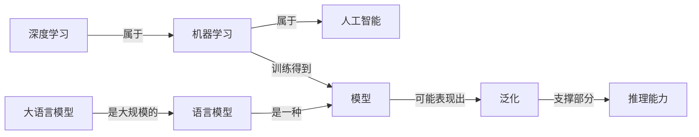
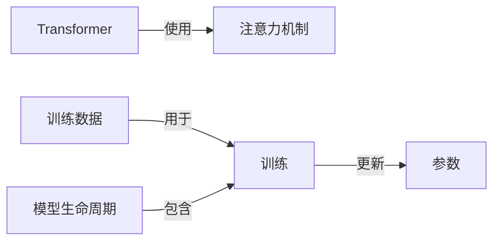
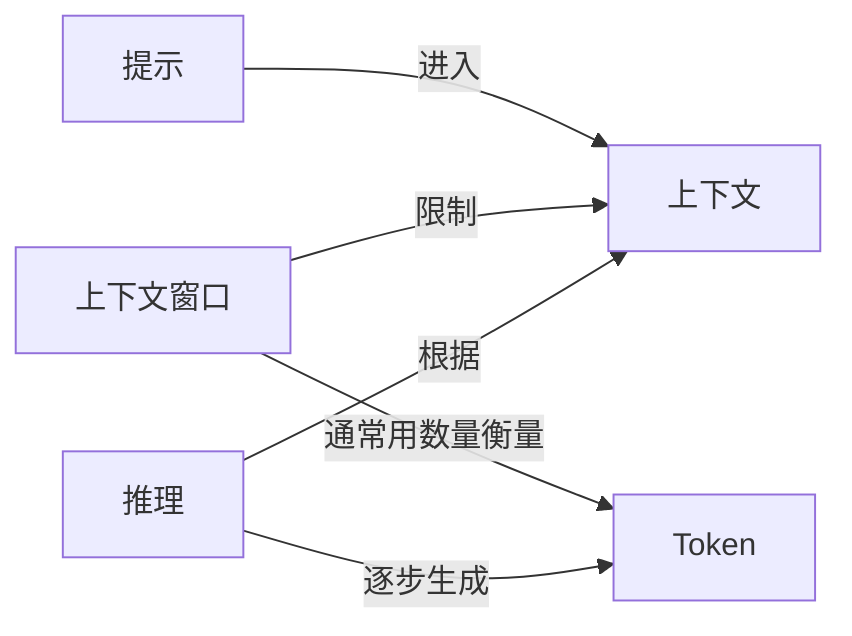
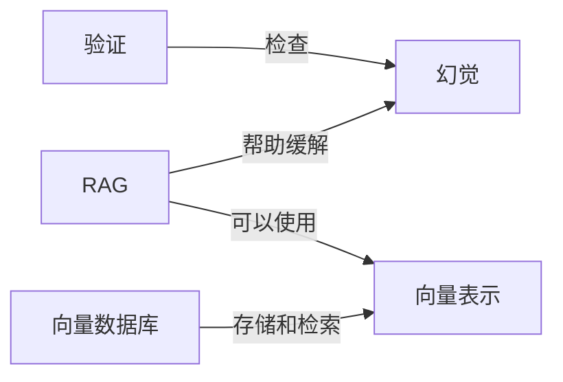
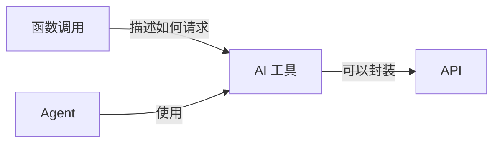
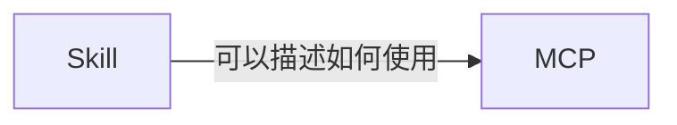
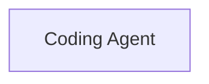
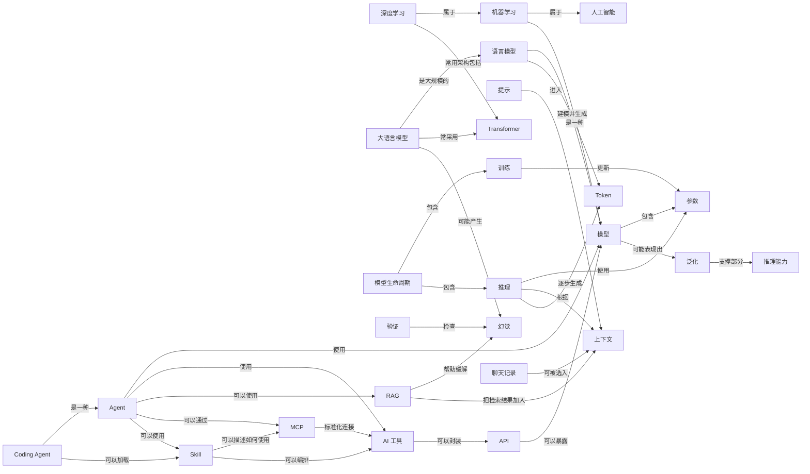

# LLM-101 知识网络

> 本页由 [`知识网络.yml`](./知识网络.yml) 自动生成，请勿手工编辑。
> 重新生成：`python3 scripts/build_knowledge_graph.py`

当前收录 **32** 个概念节点、**43** 条语义关系。

## 主学习路线

适合第一次从头学习。路线只保留会明显影响后续理解的概念。

[人工智能](./docs/01-AI与大模型/01-AI到底是什么.md) → [机器学习](./docs/01-AI与大模型/02-AI机器学习和深度学习是什么关系.md) → [深度学习](./docs/01-AI与大模型/02-AI机器学习和深度学习是什么关系.md) → [模型](./docs/01-AI与大模型/03-模型到底是什么.md) → [语言模型](./docs/01-AI与大模型/04-什么是大语言模型.md) → [大语言模型](./docs/01-AI与大模型/04-什么是大语言模型.md) → [参数](./docs/03-模型原理与训练/06-参数到底是什么.md) → [提示](./docs/02-聊天Token与上下文/01-Prompt到底是什么.md) → [Token](./docs/02-聊天Token与上下文/04-Token到底是什么.md) → [上下文](./docs/02-聊天Token与上下文/07-上下文和上下文窗口是什么.md) → [模型生命周期](./docs/03-模型原理与训练/01-一个大模型到底是怎么诞生的.md) → [训练](./docs/03-模型原理与训练/18-训练和推理有什么区别.md) → [推理](./docs/03-模型原理与训练/18-训练和推理有什么区别.md) → [Transformer](./docs/03-模型原理与训练/03-Transformer到底是什么.md) → [泛化](./docs/04-模型能力/01-泛化是什么.md) → [推理能力](./docs/04-模型能力/03-推理能力是什么.md) → [幻觉](./docs/05-幻觉与模型局限/01-幻觉是什么.md) → [验证](./docs/05-幻觉与模型局限/04-怎么验证AI的回答.md) → [API](./docs/06-工具与Function-Calling/01-API到底是什么.md) → [AI 工具](./docs/06-工具与Function-Calling/02-AI工具到底是什么.md) → [Agent](./docs/07-Agent/01-Agent到底是什么.md) → [RAG](./docs/08-RAG与知识库/01-RAG到底是什么.md) → [MCP](./docs/09-MCP/01-MCP到底是什么.md) → [Skill](./docs/10-Skill/01-Skill到底是什么.md) → [Coding Agent](./docs/11-Coding-Agent/04-Coding-Agent是什么.md) → [聊天记录](./docs/12-Memory/01-聊天记录是什么.md)

## 扩展学习路线

理解主线后，可以按需要深入这些概念。

[训练数据](./docs/03-模型原理与训练/07-参数量和训练数据有什么区别.md) → [上下文窗口](./docs/02-聊天Token与上下文/07-上下文和上下文窗口是什么.md) → [注意力机制](./docs/03-模型原理与训练/05-Attention到底是什么.md) → [函数调用](./docs/06-工具与Function-Calling/03-Function-Calling是什么.md) → [向量表示](./docs/08-RAG与知识库/03-Embedding是什么.md) → [向量数据库](./docs/08-RAG与知识库/05-向量数据库是什么.md)

## 知识网络矩阵

| 概念 | 一句话 | 前置 | 谁会指向它 | 它会指向什么 | 容易一起比较 |
|---|---|---|---|---|---|
| [人工智能](./docs/01-AI与大模型/01-AI到底是什么.md) | 研究和构建围绕目标处理输入，并产生预测、内容、建议、决策或行动的机器系统的广泛领域。 | — | [机器学习](./docs/01-AI与大模型/02-AI机器学习和深度学习是什么关系.md) | — | [机器学习](./docs/01-AI与大模型/02-AI机器学习和深度学习是什么关系.md)、[模型](./docs/01-AI与大模型/03-模型到底是什么.md)、[Agent](./docs/07-Agent/01-Agent到底是什么.md) |
| [机器学习](./docs/01-AI与大模型/02-AI机器学习和深度学习是什么关系.md) | 让计算系统从数据中调整模型，而不是把每条判断规则都由人逐条写死的方法。 | [人工智能](./docs/01-AI与大模型/01-AI到底是什么.md) | [深度学习](./docs/01-AI与大模型/02-AI机器学习和深度学习是什么关系.md) | [人工智能](./docs/01-AI与大模型/01-AI到底是什么.md)、[模型](./docs/01-AI与大模型/03-模型到底是什么.md) | [深度学习](./docs/01-AI与大模型/02-AI机器学习和深度学习是什么关系.md)、[模型](./docs/01-AI与大模型/03-模型到底是什么.md)、[训练数据](./docs/03-模型原理与训练/07-参数量和训练数据有什么区别.md) |
| [深度学习](./docs/01-AI与大模型/02-AI机器学习和深度学习是什么关系.md) | 主要使用多层神经网络从数据中学习表示的一类机器学习方法。 | [机器学习](./docs/01-AI与大模型/02-AI机器学习和深度学习是什么关系.md) | — | [机器学习](./docs/01-AI与大模型/02-AI机器学习和深度学习是什么关系.md)、[Transformer](./docs/03-模型原理与训练/03-Transformer到底是什么.md) | [模型](./docs/01-AI与大模型/03-模型到底是什么.md)、[Transformer](./docs/03-模型原理与训练/03-Transformer到底是什么.md)、[大语言模型](./docs/01-AI与大模型/04-什么是大语言模型.md) |
| [模型](./docs/01-AI与大模型/03-模型到底是什么.md) | 经过训练后，用来把输入转换为预测、分数或生成结果的计算关系。 | [机器学习](./docs/01-AI与大模型/02-AI机器学习和深度学习是什么关系.md) | [机器学习](./docs/01-AI与大模型/02-AI机器学习和深度学习是什么关系.md)、[语言模型](./docs/01-AI与大模型/04-什么是大语言模型.md)、[API](./docs/06-工具与Function-Calling/01-API到底是什么.md)、[Agent](./docs/07-Agent/01-Agent到底是什么.md) | [参数](./docs/03-模型原理与训练/06-参数到底是什么.md)、[泛化](./docs/04-模型能力/01-泛化是什么.md) | [参数](./docs/03-模型原理与训练/06-参数到底是什么.md)、[训练](./docs/03-模型原理与训练/18-训练和推理有什么区别.md)、[推理](./docs/03-模型原理与训练/18-训练和推理有什么区别.md)、[大语言模型](./docs/01-AI与大模型/04-什么是大语言模型.md) |
| [语言模型](./docs/01-AI与大模型/04-什么是大语言模型.md) | 对语言序列及其中 Token 的可能性进行建模的模型。 | [模型](./docs/01-AI与大模型/03-模型到底是什么.md) | [大语言模型](./docs/01-AI与大模型/04-什么是大语言模型.md) | [模型](./docs/01-AI与大模型/03-模型到底是什么.md)、[Token](./docs/02-聊天Token与上下文/04-Token到底是什么.md) | [大语言模型](./docs/01-AI与大模型/04-什么是大语言模型.md)、[Token](./docs/02-聊天Token与上下文/04-Token到底是什么.md)、[推理](./docs/03-模型原理与训练/18-训练和推理有什么区别.md) |
| [大语言模型](./docs/01-AI与大模型/04-什么是大语言模型.md) | 在大量数据和计算资源上训练、能够处理和生成语言的大规模语言模型。 | [语言模型](./docs/01-AI与大模型/04-什么是大语言模型.md)、[深度学习](./docs/01-AI与大模型/02-AI机器学习和深度学习是什么关系.md) | — | [语言模型](./docs/01-AI与大模型/04-什么是大语言模型.md)、[Transformer](./docs/03-模型原理与训练/03-Transformer到底是什么.md)、[幻觉](./docs/05-幻觉与模型局限/01-幻觉是什么.md) | [Transformer](./docs/03-模型原理与训练/03-Transformer到底是什么.md)、[提示](./docs/02-聊天Token与上下文/01-Prompt到底是什么.md)、[上下文](./docs/02-聊天Token与上下文/07-上下文和上下文窗口是什么.md)、[幻觉](./docs/05-幻觉与模型局限/01-幻觉是什么.md) |
| [参数](./docs/03-模型原理与训练/06-参数到底是什么.md) | 训练过程会调整、推理过程会使用的模型内部数值。 | [模型](./docs/01-AI与大模型/03-模型到底是什么.md) | [模型](./docs/01-AI与大模型/03-模型到底是什么.md)、[训练](./docs/03-模型原理与训练/18-训练和推理有什么区别.md)、[推理](./docs/03-模型原理与训练/18-训练和推理有什么区别.md) | — | [训练](./docs/03-模型原理与训练/18-训练和推理有什么区别.md)、[训练数据](./docs/03-模型原理与训练/07-参数量和训练数据有什么区别.md)、[推理](./docs/03-模型原理与训练/18-训练和推理有什么区别.md) |
| [训练数据](./docs/03-模型原理与训练/07-参数量和训练数据有什么区别.md) | 训练时用来计算目标和调整模型参数的数据。 | [机器学习](./docs/01-AI与大模型/02-AI机器学习和深度学习是什么关系.md)、[模型](./docs/01-AI与大模型/03-模型到底是什么.md) | — | [训练](./docs/03-模型原理与训练/18-训练和推理有什么区别.md) | [参数](./docs/03-模型原理与训练/06-参数到底是什么.md)、[训练](./docs/03-模型原理与训练/18-训练和推理有什么区别.md) |
| [提示](./docs/02-聊天Token与上下文/01-Prompt到底是什么.md) | 用户或系统提供给模型、用来表达任务和约束的输入内容。 | [大语言模型](./docs/01-AI与大模型/04-什么是大语言模型.md) | — | [上下文](./docs/02-聊天Token与上下文/07-上下文和上下文窗口是什么.md) | [上下文](./docs/02-聊天Token与上下文/07-上下文和上下文窗口是什么.md)、[Token](./docs/02-聊天Token与上下文/04-Token到底是什么.md)、[推理](./docs/03-模型原理与训练/18-训练和推理有什么区别.md) |
| [Token](./docs/02-聊天Token与上下文/04-Token到底是什么.md) | 模型编码和生成文本时处理的离散单位，不固定等于一个字或一个单词。 | [大语言模型](./docs/01-AI与大模型/04-什么是大语言模型.md) | [语言模型](./docs/01-AI与大模型/04-什么是大语言模型.md)、[上下文窗口](./docs/02-聊天Token与上下文/07-上下文和上下文窗口是什么.md)、[推理](./docs/03-模型原理与训练/18-训练和推理有什么区别.md)、[注意力机制](./docs/03-模型原理与训练/05-Attention到底是什么.md) | — | [上下文](./docs/02-聊天Token与上下文/07-上下文和上下文窗口是什么.md)、[上下文窗口](./docs/02-聊天Token与上下文/07-上下文和上下文窗口是什么.md)、[推理](./docs/03-模型原理与训练/18-训练和推理有什么区别.md) |
| [上下文](./docs/02-聊天Token与上下文/07-上下文和上下文窗口是什么.md) | 当前一次计算中，模型实际可以使用的信息。 | [提示](./docs/02-聊天Token与上下文/01-Prompt到底是什么.md)、[Token](./docs/02-聊天Token与上下文/04-Token到底是什么.md) | [提示](./docs/02-聊天Token与上下文/01-Prompt到底是什么.md)、[上下文窗口](./docs/02-聊天Token与上下文/07-上下文和上下文窗口是什么.md)、[推理](./docs/03-模型原理与训练/18-训练和推理有什么区别.md)、[RAG](./docs/08-RAG与知识库/01-RAG到底是什么.md) | — | [上下文窗口](./docs/02-聊天Token与上下文/07-上下文和上下文窗口是什么.md)、[推理](./docs/03-模型原理与训练/18-训练和推理有什么区别.md)、[RAG](./docs/08-RAG与知识库/01-RAG到底是什么.md)、[聊天记录](./docs/12-Memory/01-聊天记录是什么.md) |
| [上下文窗口](./docs/02-聊天Token与上下文/07-上下文和上下文窗口是什么.md) | 模型一次处理输入和输出时可容纳内容的容量边界。 | [上下文](./docs/02-聊天Token与上下文/07-上下文和上下文窗口是什么.md)、[Token](./docs/02-聊天Token与上下文/04-Token到底是什么.md) | — | [上下文](./docs/02-聊天Token与上下文/07-上下文和上下文窗口是什么.md)、[Token](./docs/02-聊天Token与上下文/04-Token到底是什么.md) | [推理](./docs/03-模型原理与训练/18-训练和推理有什么区别.md)、[聊天记录](./docs/12-Memory/01-聊天记录是什么.md) |
| [模型生命周期](./docs/03-模型原理与训练/01-一个大模型到底是怎么诞生的.md) | 从目标、数据、初始化和训练，到评估、部署和持续改进的完整过程。 | [模型](./docs/01-AI与大模型/03-模型到底是什么.md)、[参数](./docs/03-模型原理与训练/06-参数到底是什么.md) | — | [训练](./docs/03-模型原理与训练/18-训练和推理有什么区别.md)、[推理](./docs/03-模型原理与训练/18-训练和推理有什么区别.md) | [训练](./docs/03-模型原理与训练/18-训练和推理有什么区别.md)、[推理](./docs/03-模型原理与训练/18-训练和推理有什么区别.md)、[训练数据](./docs/03-模型原理与训练/07-参数量和训练数据有什么区别.md) |
| [Transformer](./docs/03-模型原理与训练/03-Transformer到底是什么.md) | 以注意力等模块处理序列信息的一类神经网络架构。 | [模型](./docs/01-AI与大模型/03-模型到底是什么.md)、[深度学习](./docs/01-AI与大模型/02-AI机器学习和深度学习是什么关系.md) | [深度学习](./docs/01-AI与大模型/02-AI机器学习和深度学习是什么关系.md)、[大语言模型](./docs/01-AI与大模型/04-什么是大语言模型.md) | [注意力机制](./docs/03-模型原理与训练/05-Attention到底是什么.md) | [注意力机制](./docs/03-模型原理与训练/05-Attention到底是什么.md)、[大语言模型](./docs/01-AI与大模型/04-什么是大语言模型.md)、[Token](./docs/02-聊天Token与上下文/04-Token到底是什么.md) |
| [注意力机制](./docs/03-模型原理与训练/05-Attention到底是什么.md) | 根据当前计算需要，为不同位置的信息分配不同影响权重的机制。 | [Token](./docs/02-聊天Token与上下文/04-Token到底是什么.md)、[Transformer](./docs/03-模型原理与训练/03-Transformer到底是什么.md) | [Transformer](./docs/03-模型原理与训练/03-Transformer到底是什么.md) | [Token](./docs/02-聊天Token与上下文/04-Token到底是什么.md) | [上下文](./docs/02-聊天Token与上下文/07-上下文和上下文窗口是什么.md)、[大语言模型](./docs/01-AI与大模型/04-什么是大语言模型.md) |
| [训练](./docs/03-模型原理与训练/18-训练和推理有什么区别.md) | 利用数据和目标函数调整模型参数的过程。 | [模型](./docs/01-AI与大模型/03-模型到底是什么.md)、[参数](./docs/03-模型原理与训练/06-参数到底是什么.md)、[训练数据](./docs/03-模型原理与训练/07-参数量和训练数据有什么区别.md) | [训练数据](./docs/03-模型原理与训练/07-参数量和训练数据有什么区别.md)、[模型生命周期](./docs/03-模型原理与训练/01-一个大模型到底是怎么诞生的.md) | [参数](./docs/03-模型原理与训练/06-参数到底是什么.md) | [推理](./docs/03-模型原理与训练/18-训练和推理有什么区别.md)、[模型生命周期](./docs/03-模型原理与训练/01-一个大模型到底是怎么诞生的.md) |
| [推理](./docs/03-模型原理与训练/18-训练和推理有什么区别.md) | 使用已经训练好的模型参数，根据当前输入计算输出的过程。 | [模型](./docs/01-AI与大模型/03-模型到底是什么.md)、[参数](./docs/03-模型原理与训练/06-参数到底是什么.md) | [模型生命周期](./docs/03-模型原理与训练/01-一个大模型到底是怎么诞生的.md) | [参数](./docs/03-模型原理与训练/06-参数到底是什么.md)、[上下文](./docs/02-聊天Token与上下文/07-上下文和上下文窗口是什么.md)、[Token](./docs/02-聊天Token与上下文/04-Token到底是什么.md) | [训练](./docs/03-模型原理与训练/18-训练和推理有什么区别.md)、[上下文](./docs/02-聊天Token与上下文/07-上下文和上下文窗口是什么.md)、[Token](./docs/02-聊天Token与上下文/04-Token到底是什么.md) |
| [泛化](./docs/04-模型能力/01-泛化是什么.md) | 模型把训练中学到的规律用于未见过但相关情形的能力。 | [模型](./docs/01-AI与大模型/03-模型到底是什么.md)、[训练](./docs/03-模型原理与训练/18-训练和推理有什么区别.md) | [模型](./docs/01-AI与大模型/03-模型到底是什么.md) | [推理能力](./docs/04-模型能力/03-推理能力是什么.md) | [推理能力](./docs/04-模型能力/03-推理能力是什么.md)、[幻觉](./docs/05-幻觉与模型局限/01-幻觉是什么.md) |
| [推理能力](./docs/04-模型能力/03-推理能力是什么.md) | 根据给定信息和规则经过中间步骤得到结论的任务能力。 | [模型](./docs/01-AI与大模型/03-模型到底是什么.md)、[泛化](./docs/04-模型能力/01-泛化是什么.md) | [泛化](./docs/04-模型能力/01-泛化是什么.md) | — | [推理](./docs/03-模型原理与训练/18-训练和推理有什么区别.md)、[幻觉](./docs/05-幻觉与模型局限/01-幻觉是什么.md) |
| [幻觉](./docs/05-幻觉与模型局限/01-幻觉是什么.md) | 模型生成了看似合理、实际上与事实或给定资料不一致的内容。 | [大语言模型](./docs/01-AI与大模型/04-什么是大语言模型.md)、[推理](./docs/03-模型原理与训练/18-训练和推理有什么区别.md) | [大语言模型](./docs/01-AI与大模型/04-什么是大语言模型.md)、[验证](./docs/05-幻觉与模型局限/04-怎么验证AI的回答.md)、[RAG](./docs/08-RAG与知识库/01-RAG到底是什么.md) | — | [验证](./docs/05-幻觉与模型局限/04-怎么验证AI的回答.md)、[RAG](./docs/08-RAG与知识库/01-RAG到底是什么.md) |
| [验证](./docs/05-幻觉与模型局限/04-怎么验证AI的回答.md) | 用适合问题类型的证据检查 AI 输出，而不是只看表达是否自信。 | [幻觉](./docs/05-幻觉与模型局限/01-幻觉是什么.md) | — | [幻觉](./docs/05-幻觉与模型局限/01-幻觉是什么.md) | [RAG](./docs/08-RAG与知识库/01-RAG到底是什么.md)、[AI 工具](./docs/06-工具与Function-Calling/02-AI工具到底是什么.md) |
| [API](./docs/06-工具与Function-Calling/01-API到底是什么.md) | 软件之间按照约定发送请求和接收结果的接口。 | [模型](./docs/01-AI与大模型/03-模型到底是什么.md) | [AI 工具](./docs/06-工具与Function-Calling/02-AI工具到底是什么.md) | [模型](./docs/01-AI与大模型/03-模型到底是什么.md) | [AI 工具](./docs/06-工具与Function-Calling/02-AI工具到底是什么.md)、[函数调用](./docs/06-工具与Function-Calling/03-Function-Calling是什么.md)、[MCP](./docs/09-MCP/01-MCP到底是什么.md) |
| [AI 工具](./docs/06-工具与Function-Calling/02-AI工具到底是什么.md) | AI 系统可以请求外部程序执行的受控能力。 | [API](./docs/06-工具与Function-Calling/01-API到底是什么.md) | [函数调用](./docs/06-工具与Function-Calling/03-Function-Calling是什么.md)、[Agent](./docs/07-Agent/01-Agent到底是什么.md)、[MCP](./docs/09-MCP/01-MCP到底是什么.md)、[Skill](./docs/10-Skill/01-Skill到底是什么.md) | [API](./docs/06-工具与Function-Calling/01-API到底是什么.md) | [函数调用](./docs/06-工具与Function-Calling/03-Function-Calling是什么.md)、[Agent](./docs/07-Agent/01-Agent到底是什么.md)、[MCP](./docs/09-MCP/01-MCP到底是什么.md)、[Skill](./docs/10-Skill/01-Skill到底是什么.md) |
| [函数调用](./docs/06-工具与Function-Calling/03-Function-Calling是什么.md) | 模型按结构描述要调用的函数和参数，由外部程序验证并执行。 | [AI 工具](./docs/06-工具与Function-Calling/02-AI工具到底是什么.md) | — | [AI 工具](./docs/06-工具与Function-Calling/02-AI工具到底是什么.md) | [API](./docs/06-工具与Function-Calling/01-API到底是什么.md)、[Agent](./docs/07-Agent/01-Agent到底是什么.md)、[MCP](./docs/09-MCP/01-MCP到底是什么.md) |
| [Agent](./docs/07-Agent/01-Agent到底是什么.md) | 围绕目标反复获取信息、选择行动、使用工具并根据结果继续推进的系统。 | [模型](./docs/01-AI与大模型/03-模型到底是什么.md)、[AI 工具](./docs/06-工具与Function-Calling/02-AI工具到底是什么.md) | [Coding Agent](./docs/11-Coding-Agent/04-Coding-Agent是什么.md) | [模型](./docs/01-AI与大模型/03-模型到底是什么.md)、[AI 工具](./docs/06-工具与Function-Calling/02-AI工具到底是什么.md)、[RAG](./docs/08-RAG与知识库/01-RAG到底是什么.md)、[MCP](./docs/09-MCP/01-MCP到底是什么.md) | [RAG](./docs/08-RAG与知识库/01-RAG到底是什么.md)、[MCP](./docs/09-MCP/01-MCP到底是什么.md)、[Skill](./docs/10-Skill/01-Skill到底是什么.md)、[Coding Agent](./docs/11-Coding-Agent/04-Coding-Agent是什么.md) |
| [RAG](./docs/08-RAG与知识库/01-RAG到底是什么.md) | 在生成前检索外部资料，并把相关内容提供给模型作为上下文的方法。 | [大语言模型](./docs/01-AI与大模型/04-什么是大语言模型.md)、[上下文](./docs/02-聊天Token与上下文/07-上下文和上下文窗口是什么.md) | [Agent](./docs/07-Agent/01-Agent到底是什么.md) | [幻觉](./docs/05-幻觉与模型局限/01-幻觉是什么.md)、[上下文](./docs/02-聊天Token与上下文/07-上下文和上下文窗口是什么.md)、[向量表示](./docs/08-RAG与知识库/03-Embedding是什么.md) | [向量表示](./docs/08-RAG与知识库/03-Embedding是什么.md)、[向量数据库](./docs/08-RAG与知识库/05-向量数据库是什么.md)、[幻觉](./docs/05-幻觉与模型局限/01-幻觉是什么.md) |
| [向量表示](./docs/08-RAG与知识库/03-Embedding是什么.md) | 把对象转换为一组数值，使系统可以计算某些关系或相似性。 | [模型](./docs/01-AI与大模型/03-模型到底是什么.md) | [RAG](./docs/08-RAG与知识库/01-RAG到底是什么.md)、[向量数据库](./docs/08-RAG与知识库/05-向量数据库是什么.md) | — | [向量数据库](./docs/08-RAG与知识库/05-向量数据库是什么.md)、[RAG](./docs/08-RAG与知识库/01-RAG到底是什么.md) |
| [向量数据库](./docs/08-RAG与知识库/05-向量数据库是什么.md) | 存储向量并支持按相似性检索的数据系统。 | [向量表示](./docs/08-RAG与知识库/03-Embedding是什么.md) | — | [向量表示](./docs/08-RAG与知识库/03-Embedding是什么.md) | [RAG](./docs/08-RAG与知识库/01-RAG到底是什么.md) |
| [MCP](./docs/09-MCP/01-MCP到底是什么.md) | 让 AI 应用用统一方式发现和连接外部工具、资源与提示的开放协议。 | [API](./docs/06-工具与Function-Calling/01-API到底是什么.md)、[AI 工具](./docs/06-工具与Function-Calling/02-AI工具到底是什么.md) | [Agent](./docs/07-Agent/01-Agent到底是什么.md)、[Skill](./docs/10-Skill/01-Skill到底是什么.md) | [AI 工具](./docs/06-工具与Function-Calling/02-AI工具到底是什么.md) | [Agent](./docs/07-Agent/01-Agent到底是什么.md)、[Skill](./docs/10-Skill/01-Skill到底是什么.md) |
| [Skill](./docs/10-Skill/01-Skill到底是什么.md) | 面向 Agent 的可复用能力包，用文件组织说明、流程和所需资源。 | [Agent](./docs/07-Agent/01-Agent到底是什么.md)、[AI 工具](./docs/06-工具与Function-Calling/02-AI工具到底是什么.md) | [Agent](./docs/07-Agent/01-Agent到底是什么.md)、[Coding Agent](./docs/11-Coding-Agent/04-Coding-Agent是什么.md) | [MCP](./docs/09-MCP/01-MCP到底是什么.md)、[AI 工具](./docs/06-工具与Function-Calling/02-AI工具到底是什么.md) | [MCP](./docs/09-MCP/01-MCP到底是什么.md)、[Coding Agent](./docs/11-Coding-Agent/04-Coding-Agent是什么.md) |
| [Coding Agent](./docs/11-Coding-Agent/04-Coding-Agent是什么.md) | 能读取项目、修改文件、运行命令并验证结果的编程任务 Agent。 | [Agent](./docs/07-Agent/01-Agent到底是什么.md)、[AI 工具](./docs/06-工具与Function-Calling/02-AI工具到底是什么.md) | — | [Agent](./docs/07-Agent/01-Agent到底是什么.md)、[Skill](./docs/10-Skill/01-Skill到底是什么.md) | [Skill](./docs/10-Skill/01-Skill到底是什么.md)、[聊天记录](./docs/12-Memory/01-聊天记录是什么.md) |
| [聊天记录](./docs/12-Memory/01-聊天记录是什么.md) | 系统保存的一组历史消息；只有被重新选入上下文时才会影响当前回答。 | [上下文](./docs/02-聊天Token与上下文/07-上下文和上下文窗口是什么.md) | — | [上下文](./docs/02-聊天Token与上下文/07-上下文和上下文窗口是什么.md) | [上下文窗口](./docs/02-聊天Token与上下文/07-上下文和上下文窗口是什么.md)、[Agent](./docs/07-Agent/01-Agent到底是什么.md) |

## 子网络

### 01 AI与模型网络

### 02 模型训练网络

### 03 推理与Token网络

### 04 RAG与知识网络

### 05 Tool与Agent网络

### 06 MCP与Skill网络

### 07 Coding Agent网络

### 08 Memory网络

### 09 硬件网络

本专题节点将在对应的 v2 Rewrite Batch 中补入。

## 全景图

全景图只展示主路线节点和它们之间已有的关键关系。

## 如何自由探索

- 从任意概念进入正文。
- 正文第一次重要出现的概念会链接到唯一主页面。
- 每篇 v2 文章底部都有前置、后续、相关和易混概念导航。
