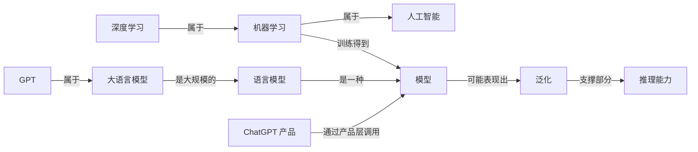
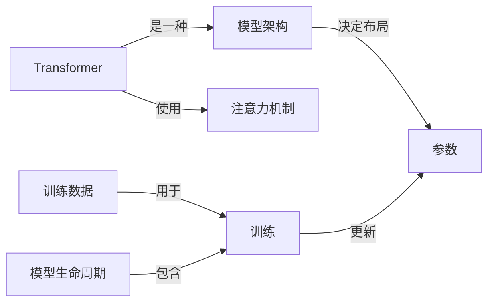
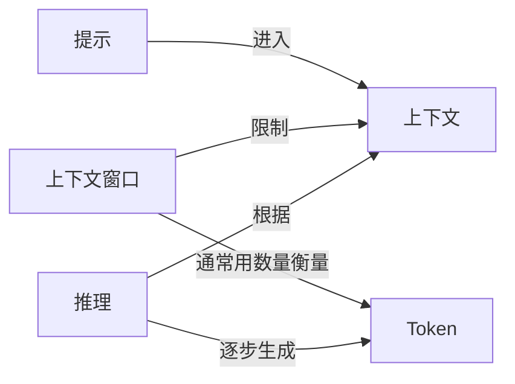
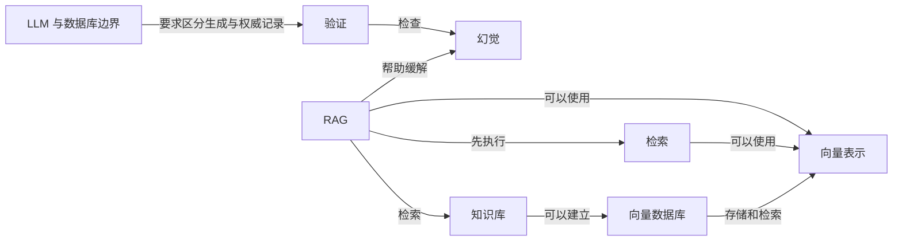
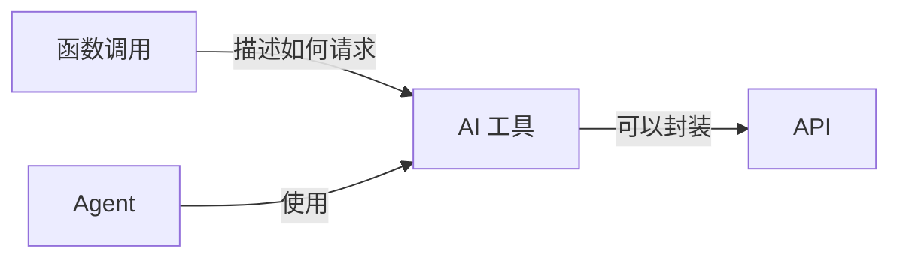
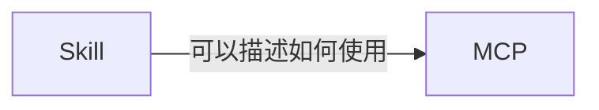
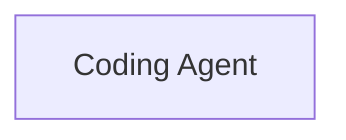
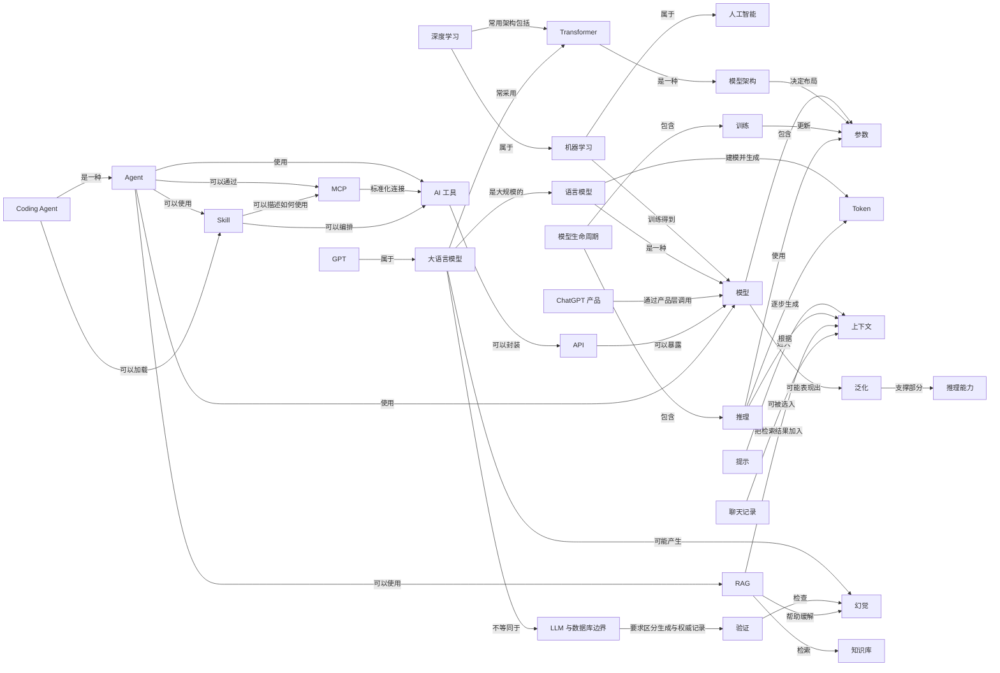

# LLM-101 知识网络

> 本页由 [`知识网络.yml`](./知识网络.yml) 自动生成，请勿手工编辑。
> 重新生成：`python3 scripts/build_knowledge_graph.py`

当前收录 **38** 个概念节点、**53** 条语义关系。

## 主学习路线

适合第一次从头学习。路线只保留会明显影响后续理解的概念。

[人工智能](./docs/01-AI与大模型/01-AI到底是什么.md) → [机器学习](./docs/01-AI与大模型/02-AI机器学习和深度学习是什么关系.md) → [深度学习](./docs/01-AI与大模型/02-AI机器学习和深度学习是什么关系.md) → [模型](./docs/01-AI与大模型/03-模型到底是什么.md) → [语言模型](./docs/01-AI与大模型/04-什么是大语言模型.md) → [大语言模型](./docs/01-AI与大模型/04-什么是大语言模型.md) → [GPT](./docs/01-AI与大模型/05-GPT和ChatGPT有什么区别.md) → [ChatGPT 产品](./docs/01-AI与大模型/05-GPT和ChatGPT有什么区别.md) → [参数](./docs/03-模型原理与训练/06-参数到底是什么.md) → [提示](./docs/02-聊天Token与上下文/01-Prompt到底是什么.md) → [Token](./docs/02-聊天Token与上下文/04-Token到底是什么.md) → [上下文](./docs/02-聊天Token与上下文/07-上下文和上下文窗口是什么.md) → [模型生命周期](./docs/03-模型原理与训练/01-一个大模型到底是怎么诞生的.md) → [模型架构](./docs/03-模型原理与训练/02-模型架构是什么.md) → [Transformer](./docs/03-模型原理与训练/03-Transformer到底是什么.md) → [训练](./docs/03-模型原理与训练/18-训练和推理有什么区别.md) → [推理](./docs/03-模型原理与训练/18-训练和推理有什么区别.md) → [泛化](./docs/04-模型能力/01-泛化是什么.md) → [推理能力](./docs/04-模型能力/03-推理能力是什么.md) → [幻觉](./docs/05-幻觉与模型局限/01-幻觉是什么.md) → [LLM 与数据库边界](./docs/05-幻觉与模型局限/02-为什么LLM不是数据库.md) → [验证](./docs/05-幻觉与模型局限/04-怎么验证AI的回答.md) → [API](./docs/06-工具与Function-Calling/01-API到底是什么.md) → [AI 工具](./docs/06-工具与Function-Calling/02-AI工具到底是什么.md) → [Agent](./docs/07-Agent/01-Agent到底是什么.md) → [RAG](./docs/08-RAG与知识库/01-RAG到底是什么.md) → [知识库](./docs/08-RAG与知识库/02-知识库是什么.md) → [MCP](./docs/09-MCP/01-MCP到底是什么.md) → [Skill](./docs/10-Skill/01-Skill到底是什么.md) → [Coding Agent](./docs/11-Coding-Agent/04-Coding-Agent是什么.md) → [聊天记录](./docs/12-Memory/01-聊天记录是什么.md)

## 扩展学习路线

理解主线后，可以按需要深入这些概念。

[训练数据](./docs/03-模型原理与训练/07-参数量和训练数据有什么区别.md) → [上下文窗口](./docs/02-聊天Token与上下文/07-上下文和上下文窗口是什么.md) → [注意力机制](./docs/03-模型原理与训练/05-Attention到底是什么.md) → [函数调用](./docs/06-工具与Function-Calling/03-Function-Calling是什么.md) → [向量表示](./docs/08-RAG与知识库/03-Embedding是什么.md) → [向量数据库](./docs/08-RAG与知识库/05-向量数据库是什么.md) → [检索](./docs/08-RAG与知识库/08-检索是什么.md)

## 知识网络矩阵

| 概念 | 一句话 | 前置 | 语义关系 | 相关真实问题 | 主文章 |
|---|---|---|---|---|---|
| [人工智能](./docs/01-AI与大模型/01-AI到底是什么.md) | 研究和构建围绕目标处理输入，并产生预测、内容、建议、决策或行动的机器系统的广泛领域。 | — | [机器学习](./docs/01-AI与大模型/02-AI机器学习和深度学习是什么关系.md) 属于它 | [数据科学、人工智能、机器学习和计算机视觉是什么关系？](./docs/01-AI与大模型/02-AI机器学习和深度学习是什么关系.md) [机器学习里的模型、算法和假设到底有什么区别？这些词为什么经常混着用？](./docs/01-AI与大模型/03-模型到底是什么.md) | [人工智能](./docs/01-AI与大模型/01-AI到底是什么.md) |
| [机器学习](./docs/01-AI与大模型/02-AI机器学习和深度学习是什么关系.md) | 让计算系统从数据中调整模型，而不是把每条判断规则都由人逐条写死的方法。 | [人工智能](./docs/01-AI与大模型/01-AI到底是什么.md) | 属于 [人工智能](./docs/01-AI与大模型/01-AI到底是什么.md)；训练得到 [模型](./docs/01-AI与大模型/03-模型到底是什么.md)；[深度学习](./docs/01-AI与大模型/02-AI机器学习和深度学习是什么关系.md) 属于它 | [数据科学、人工智能、机器学习和计算机视觉是什么关系？](./docs/01-AI与大模型/02-AI机器学习和深度学习是什么关系.md) [什么时候使用深度学习反而是小题大做？它会让其他机器学习方法变得没用吗？](./docs/01-AI与大模型/02-AI机器学习和深度学习是什么关系.md) [机器学习里的模型、算法和假设到底有什么区别？这些词为什么经常混着用？](./docs/01-AI与大模型/03-模型到底是什么.md) | [机器学习](./docs/01-AI与大模型/02-AI机器学习和深度学习是什么关系.md) |
| [深度学习](./docs/01-AI与大模型/02-AI机器学习和深度学习是什么关系.md) | 主要使用多层神经网络从数据中学习表示的一类机器学习方法。 | [机器学习](./docs/01-AI与大模型/02-AI机器学习和深度学习是什么关系.md) | 属于 [机器学习](./docs/01-AI与大模型/02-AI机器学习和深度学习是什么关系.md)；常用架构包括 [Transformer](./docs/03-模型原理与训练/03-Transformer到底是什么.md) | [什么时候使用深度学习反而是小题大做？它会让其他机器学习方法变得没用吗？](./docs/01-AI与大模型/02-AI机器学习和深度学习是什么关系.md) | [深度学习](./docs/01-AI与大模型/02-AI机器学习和深度学习是什么关系.md) |
| [模型](./docs/01-AI与大模型/03-模型到底是什么.md) | 经过训练后，用来把输入转换为预测、分数或生成结果的计算关系。 | [机器学习](./docs/01-AI与大模型/02-AI机器学习和深度学习是什么关系.md) | 包含 [参数](./docs/03-模型原理与训练/06-参数到底是什么.md)；可能表现出 [泛化](./docs/04-模型能力/01-泛化是什么.md)；[机器学习](./docs/01-AI与大模型/02-AI机器学习和深度学习是什么关系.md) 训练得到它；[语言模型](./docs/01-AI与大模型/04-什么是大语言模型.md) 是一种它 | [参数量就是训练数据吗？](./docs/03-模型原理与训练/07-参数量和训练数据有什么区别.md) [等一下，你说把数据喂给模型，但是这个模型是怎么诞生的？](./docs/03-模型原理与训练/01-一个大模型到底是怎么诞生的.md) [参数最后体现形式是啥？](./docs/03-模型原理与训练/06-参数到底是什么.md) | [模型](./docs/01-AI与大模型/03-模型到底是什么.md) |
| [语言模型](./docs/01-AI与大模型/04-什么是大语言模型.md) | 对语言序列及其中 Token 的可能性进行建模的模型。 | [模型](./docs/01-AI与大模型/03-模型到底是什么.md) | 是一种 [模型](./docs/01-AI与大模型/03-模型到底是什么.md)；建模并生成 [Token](./docs/02-聊天Token与上下文/04-Token到底是什么.md)；[大语言模型](./docs/01-AI与大模型/04-什么是大语言模型.md) 是大规模的它 | [从根本上说，语言模型到底在对什么建模？](./docs/01-AI与大模型/04-什么是大语言模型.md) [大语言模型和基础模型是一回事吗？](./docs/01-AI与大模型/04-什么是大语言模型.md) | [语言模型](./docs/01-AI与大模型/04-什么是大语言模型.md) |
| [大语言模型](./docs/01-AI与大模型/04-什么是大语言模型.md) | 在大量数据和计算资源上训练、能够处理和生成语言的大规模语言模型。 | [语言模型](./docs/01-AI与大模型/04-什么是大语言模型.md)、[深度学习](./docs/01-AI与大模型/02-AI机器学习和深度学习是什么关系.md) | 是大规模的 [语言模型](./docs/01-AI与大模型/04-什么是大语言模型.md)；常采用 [Transformer](./docs/03-模型原理与训练/03-Transformer到底是什么.md)；可能产生 [幻觉](./docs/05-幻觉与模型局限/01-幻觉是什么.md)；[GPT](./docs/01-AI与大模型/05-GPT和ChatGPT有什么区别.md) 属于它 | [幻觉是啥意思？](./docs/05-幻觉与模型局限/01-幻觉是什么.md) [从根本上说，语言模型到底在对什么建模？](./docs/01-AI与大模型/04-什么是大语言模型.md) [大语言模型和基础模型是一回事吗？](./docs/01-AI与大模型/04-什么是大语言模型.md) | [大语言模型](./docs/01-AI与大模型/04-什么是大语言模型.md) |
| [GPT](./docs/01-AI与大模型/05-GPT和ChatGPT有什么区别.md) | OpenAI 使用“生成式预训练 Transformer”路线发展的一组模型家族名称，不等于 ChatGPT 产品。 | [大语言模型](./docs/01-AI与大模型/04-什么是大语言模型.md) | 属于 [大语言模型](./docs/01-AI与大模型/04-什么是大语言模型.md) | [ChatGPT 到底是一个生成模型，还是一个使用生成模型的产品？为什么两种说法都能看到？](./docs/01-AI与大模型/05-GPT和ChatGPT有什么区别.md) [Transformer 和 GPT 到底是什么关系？GPT 是 Transformer 本身，还是基于 Transformer 做出来的一类模型？](./docs/03-模型原理与训练/03-Transformer到底是什么.md) | [GPT](./docs/01-AI与大模型/05-GPT和ChatGPT有什么区别.md) |
| [ChatGPT 产品](./docs/01-AI与大模型/05-GPT和ChatGPT有什么区别.md) | OpenAI 面向用户提供的 AI 产品服务，会在模型之外组织界面、上下文、规则和工具等系统能力。 | [模型](./docs/01-AI与大模型/03-模型到底是什么.md)、[大语言模型](./docs/01-AI与大模型/04-什么是大语言模型.md) | 通过产品层调用 [模型](./docs/01-AI与大模型/03-模型到底是什么.md) | [ChatGPT 到底是一个生成模型，还是一个使用生成模型的产品？为什么两种说法都能看到？](./docs/01-AI与大模型/05-GPT和ChatGPT有什么区别.md) | [ChatGPT 产品](./docs/01-AI与大模型/05-GPT和ChatGPT有什么区别.md) |
| [参数](./docs/03-模型原理与训练/06-参数到底是什么.md) | 训练过程会调整、推理过程会使用的模型内部数值。 | [模型](./docs/01-AI与大模型/03-模型到底是什么.md) | [模型](./docs/01-AI与大模型/03-模型到底是什么.md) 包含它；[模型架构](./docs/03-模型原理与训练/02-模型架构是什么.md) 决定布局它 | [参数量就是训练数据吗？](./docs/03-模型原理与训练/07-参数量和训练数据有什么区别.md) [参数量能决定什么？](./docs/03-模型原理与训练/06-参数到底是什么.md) [等一下，你说把数据喂给模型，但是这个模型是怎么诞生的？](./docs/03-模型原理与训练/01-一个大模型到底是怎么诞生的.md) | [参数](./docs/03-模型原理与训练/06-参数到底是什么.md) |
| [训练数据](./docs/03-模型原理与训练/07-参数量和训练数据有什么区别.md) | 训练时用来计算目标和调整模型参数的数据。 | [机器学习](./docs/01-AI与大模型/02-AI机器学习和深度学习是什么关系.md)、[模型](./docs/01-AI与大模型/03-模型到底是什么.md) | 用于 [训练](./docs/03-模型原理与训练/18-训练和推理有什么区别.md) | [参数量就是训练数据吗？](./docs/03-模型原理与训练/07-参数量和训练数据有什么区别.md) [喂饱是什么意思，怎么算喂饱呢？](./docs/03-模型原理与训练/07-参数量和训练数据有什么区别.md) [错误程度怎么判断？怎么知道是对还是错？](./docs/03-模型原理与训练/10-为什么预测下一个Token能学到能力.md) | [训练数据](./docs/03-模型原理与训练/07-参数量和训练数据有什么区别.md) |
| [提示](./docs/02-聊天Token与上下文/01-Prompt到底是什么.md) | 用户或系统提供给模型、用来表达任务和约束的输入内容。 | [大语言模型](./docs/01-AI与大模型/04-什么是大语言模型.md) | 进入 [上下文](./docs/02-聊天Token与上下文/07-上下文和上下文窗口是什么.md) | [提示词工程怎么和模型说话效果最好？结构化提示和 few-shot 示例是什么？](./docs/02-聊天Token与上下文/01-Prompt到底是什么.md) [Agent 读取带登录态的浏览器页面时，网页里的 Prompt Injection 为什么会变成真正的安全风险？](./docs/07-Agent/03-Agent-Loop是什么.md) [本地模型一旦接上文件、Shell、浏览器和 API，Prompt Injection 的风险为什么会从“答错”升级成“做错事”？](./docs/07-Agent/03-Agent-Loop是什么.md) | [提示](./docs/02-聊天Token与上下文/01-Prompt到底是什么.md) |
| [Token](./docs/02-聊天Token与上下文/04-Token到底是什么.md) | 模型编码和生成文本时处理的离散单位，不固定等于一个字或一个单词。 | [大语言模型](./docs/01-AI与大模型/04-什么是大语言模型.md) | [语言模型](./docs/01-AI与大模型/04-什么是大语言模型.md) 建模并生成它；[上下文窗口](./docs/02-聊天Token与上下文/07-上下文和上下文窗口是什么.md) 通常用数量衡量它 | [1k、1m、1b、1t 分别是多少 Token？1.5b 又是什么意思？](./docs/02-聊天Token与上下文/04-Token到底是什么.md) [上下文窗口是啥意思？](./docs/02-聊天Token与上下文/07-上下文和上下文窗口是什么.md) [模型怎么部署，最终怎么生成一个 Token？要串起来。](./docs/03-模型原理与训练/18-训练和推理有什么区别.md) | [Token](./docs/02-聊天Token与上下文/04-Token到底是什么.md) |
| [上下文](./docs/02-聊天Token与上下文/07-上下文和上下文窗口是什么.md) | 当前一次计算中，模型实际可以使用的信息。 | [提示](./docs/02-聊天Token与上下文/01-Prompt到底是什么.md)、[Token](./docs/02-聊天Token与上下文/04-Token到底是什么.md) | [提示](./docs/02-聊天Token与上下文/01-Prompt到底是什么.md) 进入它；[上下文窗口](./docs/02-聊天Token与上下文/07-上下文和上下文窗口是什么.md) 限制它 | [上下文窗口是啥意思？](./docs/02-聊天Token与上下文/07-上下文和上下文窗口是什么.md) [缓存是啥？](./docs/02-聊天Token与上下文/07-上下文和上下文窗口是什么.md) [提示词工程怎么和模型说话效果最好？结构化提示和 few-shot 示例是什么？](./docs/02-聊天Token与上下文/01-Prompt到底是什么.md) | [上下文](./docs/02-聊天Token与上下文/07-上下文和上下文窗口是什么.md) |
| [上下文窗口](./docs/02-聊天Token与上下文/07-上下文和上下文窗口是什么.md) | 模型一次处理输入和输出时可容纳内容的容量边界。 | [上下文](./docs/02-聊天Token与上下文/07-上下文和上下文窗口是什么.md)、[Token](./docs/02-聊天Token与上下文/04-Token到底是什么.md) | 限制 [上下文](./docs/02-聊天Token与上下文/07-上下文和上下文窗口是什么.md)；通常用数量衡量 [Token](./docs/02-聊天Token与上下文/04-Token到底是什么.md) | [上下文窗口是啥意思？](./docs/02-聊天Token与上下文/07-上下文和上下文窗口是什么.md) [上下文窗口里明明有历史消息，为什么 LLM API 仍然被称为无状态？](./docs/02-聊天Token与上下文/07-上下文和上下文窗口是什么.md) [上下文窗口已经很长，为什么 LLM 仍会在多步推理中前后不一致？](./docs/04-模型能力/03-推理能力是什么.md) | [上下文窗口](./docs/02-聊天Token与上下文/07-上下文和上下文窗口是什么.md) |
| [模型生命周期](./docs/03-模型原理与训练/01-一个大模型到底是怎么诞生的.md) | 从目标、数据、初始化和训练，到评估、部署和持续改进的完整过程。 | [模型](./docs/01-AI与大模型/03-模型到底是什么.md)、[参数](./docs/03-模型原理与训练/06-参数到底是什么.md) | 包含 [训练](./docs/03-模型原理与训练/18-训练和推理有什么区别.md)；包含 [推理](./docs/03-模型原理与训练/18-训练和推理有什么区别.md) | [等一下，你说把数据喂给模型，但是这个模型是怎么诞生的？](./docs/03-模型原理与训练/01-一个大模型到底是怎么诞生的.md) [设计图纸这一步是咋完成的？写代码吗？多少层、多宽、专家数是框架自带的吗？](./docs/03-模型原理与训练/02-模型架构是什么.md) [训练模型是怎么一个过程？发生在哪个阶段？参数是怎么变的？](./docs/03-模型原理与训练/18-训练和推理有什么区别.md) | [模型生命周期](./docs/03-模型原理与训练/01-一个大模型到底是怎么诞生的.md) |
| [模型架构](./docs/03-模型原理与训练/02-模型架构是什么.md) | 规定模型由哪些计算组件组成、组件怎样连接以及信息如何流动的结构设计。 | [模型](./docs/01-AI与大模型/03-模型到底是什么.md) | 决定布局 [参数](./docs/03-模型原理与训练/06-参数到底是什么.md)；[Transformer](./docs/03-模型原理与训练/03-Transformer到底是什么.md) 是一种它 | [设计图纸这一步是咋完成的？写代码吗？多少层、多宽、专家数是框架自带的吗？](./docs/03-模型原理与训练/02-模型架构是什么.md) [层数越多、宽度越宽、专家数越多，岂不是越好？](./docs/03-模型原理与训练/06-参数到底是什么.md) [Transformer 和 GPT 到底是什么关系？GPT 是 Transformer 本身，还是基于 Transformer 做出来的一类模型？](./docs/03-模型原理与训练/03-Transformer到底是什么.md) | [模型架构](./docs/03-模型原理与训练/02-模型架构是什么.md) |
| [Transformer](./docs/03-模型原理与训练/03-Transformer到底是什么.md) | 以注意力等模块处理序列信息的一类神经网络架构。 | [模型架构](./docs/03-模型原理与训练/02-模型架构是什么.md)、[深度学习](./docs/01-AI与大模型/02-AI机器学习和深度学习是什么关系.md) | 是一种 [模型架构](./docs/03-模型原理与训练/02-模型架构是什么.md)；使用 [注意力机制](./docs/03-模型原理与训练/05-Attention到底是什么.md)；[深度学习](./docs/01-AI与大模型/02-AI机器学习和深度学习是什么关系.md) 常用架构包括它；[大语言模型](./docs/01-AI与大模型/04-什么是大语言模型.md) 常采用它 | [设计图纸这一步是咋完成的？写代码吗？多少层、多宽、专家数是框架自带的吗？](./docs/03-模型原理与训练/02-模型架构是什么.md) [层数越多、宽度越宽、专家数越多，岂不是越好？](./docs/03-模型原理与训练/06-参数到底是什么.md) [模型怎么部署，最终怎么生成一个 Token？要串起来。](./docs/03-模型原理与训练/18-训练和推理有什么区别.md) | [Transformer](./docs/03-模型原理与训练/03-Transformer到底是什么.md) |
| [注意力机制](./docs/03-模型原理与训练/05-Attention到底是什么.md) | 根据当前计算需要，为不同位置的信息分配不同影响权重的机制。 | [Token](./docs/02-聊天Token与上下文/04-Token到底是什么.md)、[Transformer](./docs/03-模型原理与训练/03-Transformer到底是什么.md) | 处理上下文中的 [Token](./docs/02-聊天Token与上下文/04-Token到底是什么.md)；[Transformer](./docs/03-模型原理与训练/03-Transformer到底是什么.md) 使用它 | [设计图纸这一步是咋完成的？写代码吗？多少层、多宽、专家数是框架自带的吗？](./docs/03-模型原理与训练/02-模型架构是什么.md) [层数越多、宽度越宽、专家数越多，岂不是越好？](./docs/03-模型原理与训练/06-参数到底是什么.md) [模型怎么部署，最终怎么生成一个 Token？要串起来。](./docs/03-模型原理与训练/18-训练和推理有什么区别.md) | [注意力机制](./docs/03-模型原理与训练/05-Attention到底是什么.md) |
| [训练](./docs/03-模型原理与训练/18-训练和推理有什么区别.md) | 利用数据和目标函数调整模型参数的过程。 | [模型](./docs/01-AI与大模型/03-模型到底是什么.md)、[参数](./docs/03-模型原理与训练/06-参数到底是什么.md)、[训练数据](./docs/03-模型原理与训练/07-参数量和训练数据有什么区别.md) | 更新 [参数](./docs/03-模型原理与训练/06-参数到底是什么.md)；[训练数据](./docs/03-模型原理与训练/07-参数量和训练数据有什么区别.md) 用于它；[模型生命周期](./docs/03-模型原理与训练/01-一个大模型到底是怎么诞生的.md) 包含它 | [等一下，你说把数据喂给模型，但是这个模型是怎么诞生的？](./docs/03-模型原理与训练/01-一个大模型到底是怎么诞生的.md) [这些东西为啥就有了智能呢？](./docs/03-模型原理与训练/06-参数到底是什么.md) [喂饱是什么意思，怎么算喂饱呢？](./docs/03-模型原理与训练/07-参数量和训练数据有什么区别.md) | [训练](./docs/03-模型原理与训练/18-训练和推理有什么区别.md) |
| [推理](./docs/03-模型原理与训练/18-训练和推理有什么区别.md) | 使用已经训练好的模型参数，根据当前输入计算输出的过程。 | [模型](./docs/01-AI与大模型/03-模型到底是什么.md)、[参数](./docs/03-模型原理与训练/06-参数到底是什么.md) | 使用 [参数](./docs/03-模型原理与训练/06-参数到底是什么.md)；根据 [上下文](./docs/02-聊天Token与上下文/07-上下文和上下文窗口是什么.md)；逐步生成 [Token](./docs/02-聊天Token与上下文/04-Token到底是什么.md)；[模型生命周期](./docs/03-模型原理与训练/01-一个大模型到底是怎么诞生的.md) 包含它 | [模型怎么部署，最终怎么生成一个 Token？要串起来。](./docs/03-模型原理与训练/18-训练和推理有什么区别.md) [算力账和显存账到底是啥？算力体现在哪？卡又是什么？](./docs/03-模型原理与训练/18-训练和推理有什么区别.md) [缓存是啥？](./docs/02-聊天Token与上下文/07-上下文和上下文窗口是什么.md) | [推理](./docs/03-模型原理与训练/18-训练和推理有什么区别.md) |
| [泛化](./docs/04-模型能力/01-泛化是什么.md) | 模型把训练中学到的规律用于未见过但相关情形的能力。 | [模型](./docs/01-AI与大模型/03-模型到底是什么.md)、[训练](./docs/03-模型原理与训练/18-训练和推理有什么区别.md) | 支撑部分 [推理能力](./docs/04-模型能力/03-推理能力是什么.md)；[模型](./docs/01-AI与大模型/03-模型到底是什么.md) 可能表现出它 | [参数量能决定什么？](./docs/03-模型原理与训练/06-参数到底是什么.md) [这些东西为啥就有了智能呢？](./docs/03-模型原理与训练/06-参数到底是什么.md) [喂饱是什么意思，怎么算喂饱呢？](./docs/03-模型原理与训练/07-参数量和训练数据有什么区别.md) | [泛化](./docs/04-模型能力/01-泛化是什么.md) |
| [推理能力](./docs/04-模型能力/03-推理能力是什么.md) | 根据给定信息和规则经过中间步骤得到结论的任务能力。 | [模型](./docs/01-AI与大模型/03-模型到底是什么.md)、[泛化](./docs/04-模型能力/01-泛化是什么.md) | [泛化](./docs/04-模型能力/01-泛化是什么.md) 支撑部分它 | [参数量能决定什么？](./docs/03-模型原理与训练/06-参数到底是什么.md) [这些东西为啥就有了智能呢？](./docs/03-模型原理与训练/06-参数到底是什么.md) [只预测下一个 Token，足以解释复杂代码生成等能力吗？](./docs/03-模型原理与训练/10-为什么预测下一个Token能学到能力.md) | [推理能力](./docs/04-模型能力/03-推理能力是什么.md) |
| [幻觉](./docs/05-幻觉与模型局限/01-幻觉是什么.md) | 模型生成了看似合理、实际上与事实或给定资料不一致的内容。 | [大语言模型](./docs/01-AI与大模型/04-什么是大语言模型.md)、[推理](./docs/03-模型原理与训练/18-训练和推理有什么区别.md) | [大语言模型](./docs/01-AI与大模型/04-什么是大语言模型.md) 可能产生它；[验证](./docs/05-幻觉与模型局限/04-怎么验证AI的回答.md) 检查它 | [幻觉是啥意思？](./docs/05-幻觉与模型局限/01-幻觉是什么.md) [RAG 检索增强是什么？为什么说它能让模型先查资料再回答？](./docs/08-RAG与知识库/01-RAG到底是什么.md) [RAG 已经给了正确资料，模型为什么仍可能答错或混入没有依据的内容？](./docs/05-幻觉与模型局限/01-幻觉是什么.md) | [幻觉](./docs/05-幻觉与模型局限/01-幻觉是什么.md) |
| [验证](./docs/05-幻觉与模型局限/04-怎么验证AI的回答.md) | 用适合问题类型的证据检查 AI 输出，而不是只看表达是否自信。 | [幻觉](./docs/05-幻觉与模型局限/01-幻觉是什么.md) | 检查 [幻觉](./docs/05-幻觉与模型局限/01-幻觉是什么.md)；[LLM 与数据库边界](./docs/05-幻觉与模型局限/02-为什么LLM不是数据库.md) 要求区分生成与权威记录它 | [幻觉是啥意思？](./docs/05-幻觉与模型局限/01-幻觉是什么.md) [RAG 已经给了正确资料，模型为什么仍可能答错或混入没有依据的内容？](./docs/05-幻觉与模型局限/01-幻觉是什么.md) [微调以后怎么判断模型真的变好了？只看训练 Loss 为什么不够？](./docs/08-RAG与知识库/11-RAG和微调有什么区别.md) | [验证](./docs/05-幻觉与模型局限/04-怎么验证AI的回答.md) |
| [LLM 与数据库边界](./docs/05-幻觉与模型局限/02-为什么LLM不是数据库.md) | LLM 用分布式参数生成内容，数据库则保存、查询和更新可定位记录，两者可以组合但保证不同。 | [大语言模型](./docs/01-AI与大模型/04-什么是大语言模型.md)、[参数](./docs/03-模型原理与训练/06-参数到底是什么.md) | 要求区分生成与权威记录 [验证](./docs/05-幻觉与模型局限/04-怎么验证AI的回答.md)；[大语言模型](./docs/01-AI与大模型/04-什么是大语言模型.md) 不等同于它 | [神经网络是不是一种‘软数据库’？它和可查询、可更新的数据库差在哪里？](./docs/05-幻觉与模型局限/02-为什么LLM不是数据库.md) | [LLM 与数据库边界](./docs/05-幻觉与模型局限/02-为什么LLM不是数据库.md) |
| [API](./docs/06-工具与Function-Calling/01-API到底是什么.md) | 软件之间按照约定发送请求和接收结果的接口。 | [模型](./docs/01-AI与大模型/03-模型到底是什么.md) | 可以暴露 [模型](./docs/01-AI与大模型/03-模型到底是什么.md)；[AI 工具](./docs/06-工具与Function-Calling/02-AI工具到底是什么.md) 可以封装它 | [上下文窗口里明明有历史消息，为什么 LLM API 仍然被称为无状态？](./docs/02-聊天Token与上下文/07-上下文和上下文窗口是什么.md) [大语言模型里的 Function Calling 到底是什么意思？是模型自己立即执行函数吗？](./docs/06-工具与Function-Calling/03-Function-Calling是什么.md) [OpenAPI 已经能描述接口并配合权限控制，MCP 到底额外带来了什么？](./docs/09-MCP/01-MCP到底是什么.md) | [API](./docs/06-工具与Function-Calling/01-API到底是什么.md) |
| [AI 工具](./docs/06-工具与Function-Calling/02-AI工具到底是什么.md) | AI 系统可以请求外部程序执行的受控能力。 | [API](./docs/06-工具与Function-Calling/01-API到底是什么.md) | 可以封装 [API](./docs/06-工具与Function-Calling/01-API到底是什么.md)；[函数调用](./docs/06-工具与Function-Calling/03-Function-Calling是什么.md) 描述如何请求它；[Agent](./docs/07-Agent/01-Agent到底是什么.md) 使用它 | [Agent 智能体是什么？模型加上工具和自主规划后，为什么就能连续做事？](./docs/07-Agent/01-Agent到底是什么.md) [大语言模型里的 Function Calling 到底是什么意思？是模型自己立即执行函数吗？](./docs/06-工具与Function-Calling/03-Function-Calling是什么.md) [OpenAPI 已经能描述接口并配合权限控制，MCP 到底额外带来了什么？](./docs/09-MCP/01-MCP到底是什么.md) | [AI 工具](./docs/06-工具与Function-Calling/02-AI工具到底是什么.md) |
| [函数调用](./docs/06-工具与Function-Calling/03-Function-Calling是什么.md) | 模型按结构描述要调用的函数和参数，由外部程序验证并执行。 | [AI 工具](./docs/06-工具与Function-Calling/02-AI工具到底是什么.md) | 描述如何请求 [AI 工具](./docs/06-工具与Function-Calling/02-AI工具到底是什么.md) | [大语言模型里的 Function Calling 到底是什么意思？是模型自己立即执行函数吗？](./docs/06-工具与Function-Calling/03-Function-Calling是什么.md) [Function Calling、MCP、RAG、记忆、工作流这些概念应该按什么顺序学？](./docs/07-Agent/01-Agent到底是什么.md) [Agent Loop 到底是什么？为什么很多 Agent 最小实现看起来就是不断调用模型、执行工具、再把结果塞回去？](./docs/07-Agent/03-Agent-Loop是什么.md) | [函数调用](./docs/06-工具与Function-Calling/03-Function-Calling是什么.md) |
| [Agent](./docs/07-Agent/01-Agent到底是什么.md) | 围绕目标反复获取信息、选择行动、使用工具并根据结果继续推进的系统。 | [模型](./docs/01-AI与大模型/03-模型到底是什么.md)、[AI 工具](./docs/06-工具与Function-Calling/02-AI工具到底是什么.md) | 使用 [模型](./docs/01-AI与大模型/03-模型到底是什么.md)；使用 [AI 工具](./docs/06-工具与Function-Calling/02-AI工具到底是什么.md)；可以使用 [RAG](./docs/08-RAG与知识库/01-RAG到底是什么.md)；[Coding Agent](./docs/11-Coding-Agent/04-Coding-Agent是什么.md) 是一种它 | [Agent 智能体是什么？模型加上工具和自主规划后，为什么就能连续做事？](./docs/07-Agent/01-Agent到底是什么.md) [AI 里的 Agent 有没有跨领域都适用的严格定义？](./docs/07-Agent/01-Agent到底是什么.md) [Agent 零基础应该先学原生大模型 API，还是直接学 Agent 框架？](./docs/07-Agent/01-Agent到底是什么.md) | [Agent](./docs/07-Agent/01-Agent到底是什么.md) |
| [RAG](./docs/08-RAG与知识库/01-RAG到底是什么.md) | 在生成前检索外部资料，并把相关内容提供给模型作为上下文的方法。 | [大语言模型](./docs/01-AI与大模型/04-什么是大语言模型.md)、[上下文](./docs/02-聊天Token与上下文/07-上下文和上下文窗口是什么.md) | 帮助缓解 [幻觉](./docs/05-幻觉与模型局限/01-幻觉是什么.md)；把检索结果加入 [上下文](./docs/02-聊天Token与上下文/07-上下文和上下文窗口是什么.md)；可以使用 [向量表示](./docs/08-RAG与知识库/03-Embedding是什么.md)；[Agent](./docs/07-Agent/01-Agent到底是什么.md) 可以使用它 | [RAG 检索增强是什么？为什么说它能让模型先查资料再回答？](./docs/08-RAG与知识库/01-RAG到底是什么.md) [RAG 检索最后要把文本交给模型，向量数据库会同时保存切片原文吗？](./docs/08-RAG与知识库/05-向量数据库是什么.md) [RAG 已经给了正确资料，模型为什么仍可能答错或混入没有依据的内容？](./docs/05-幻觉与模型局限/01-幻觉是什么.md) | [RAG](./docs/08-RAG与知识库/01-RAG到底是什么.md) |
| [知识库](./docs/08-RAG与知识库/02-知识库是什么.md) | 为查询和任务组织、治理的一组原文、记录、元数据、权限、版本与检索入口。 | [LLM 与数据库边界](./docs/05-幻觉与模型局限/02-为什么LLM不是数据库.md) | 可以建立 [向量数据库](./docs/08-RAG与知识库/05-向量数据库是什么.md)；[RAG](./docs/08-RAG与知识库/01-RAG到底是什么.md) 检索它 | [RAG 检索增强是什么？为什么说它能让模型先查资料再回答？](./docs/08-RAG与知识库/01-RAG到底是什么.md) [RAG 检索最后要把文本交给模型，向量数据库会同时保存切片原文吗？](./docs/08-RAG与知识库/05-向量数据库是什么.md) [用一组个人文档做问答时，为什么通常先选 RAG，而不是把这些事实微调进模型？微调真的不能学到这些资料吗？](./docs/08-RAG与知识库/11-RAG和微调有什么区别.md) | [知识库](./docs/08-RAG与知识库/02-知识库是什么.md) |
| [向量表示](./docs/08-RAG与知识库/03-Embedding是什么.md) | 把对象转换为一组数值，使系统可以计算某些关系或相似性。 | [模型](./docs/01-AI与大模型/03-模型到底是什么.md) | [RAG](./docs/08-RAG与知识库/01-RAG到底是什么.md) 可以使用它；[检索](./docs/08-RAG与知识库/08-检索是什么.md) 可以使用它 | [RAG 检索增强是什么？为什么说它能让模型先查资料再回答？](./docs/08-RAG与知识库/01-RAG到底是什么.md) [RAG 检索最后要把文本交给模型，向量数据库会同时保存切片原文吗？](./docs/08-RAG与知识库/05-向量数据库是什么.md) [为什么语义相近的内容在 Embedding 空间里往往也更接近？它的边界是什么？](./docs/08-RAG与知识库/03-Embedding是什么.md) | [向量表示](./docs/08-RAG与知识库/03-Embedding是什么.md) |
| [向量数据库](./docs/08-RAG与知识库/05-向量数据库是什么.md) | 存储向量并支持按相似性检索的数据系统。 | [向量表示](./docs/08-RAG与知识库/03-Embedding是什么.md) | 存储和检索 [向量表示](./docs/08-RAG与知识库/03-Embedding是什么.md)；[知识库](./docs/08-RAG与知识库/02-知识库是什么.md) 可以建立它 | [RAG 检索增强是什么？为什么说它能让模型先查资料再回答？](./docs/08-RAG与知识库/01-RAG到底是什么.md) [RAG 检索最后要把文本交给模型，向量数据库会同时保存切片原文吗？](./docs/08-RAG与知识库/05-向量数据库是什么.md) [为什么语义相近的内容在 Embedding 空间里往往也更接近？它的边界是什么？](./docs/08-RAG与知识库/03-Embedding是什么.md) | [向量数据库](./docs/08-RAG与知识库/05-向量数据库是什么.md) |
| [检索](./docs/08-RAG与知识库/08-检索是什么.md) | 根据查询从候选资料中召回、过滤并排序可能相关的证据。 | [知识库](./docs/08-RAG与知识库/02-知识库是什么.md) | 可以使用 [向量表示](./docs/08-RAG与知识库/03-Embedding是什么.md)；[RAG](./docs/08-RAG与知识库/01-RAG到底是什么.md) 先执行它 | [RAG 检索增强是什么？为什么说它能让模型先查资料再回答？](./docs/08-RAG与知识库/01-RAG到底是什么.md) [RAG 检索最后要把文本交给模型，向量数据库会同时保存切片原文吗？](./docs/08-RAG与知识库/05-向量数据库是什么.md) [模型上下文越来越长以后，传统 RAG 还有必要吗？什么时候直接把资料放进上下文反而更合适？](./docs/08-RAG与知识库/12-RAG有哪些局限.md) | [检索](./docs/08-RAG与知识库/08-检索是什么.md) |
| [MCP](./docs/09-MCP/01-MCP到底是什么.md) | 让 AI 应用用统一方式发现和连接外部工具、资源与提示的开放协议。 | [API](./docs/06-工具与Function-Calling/01-API到底是什么.md)、[AI 工具](./docs/06-工具与Function-Calling/02-AI工具到底是什么.md) | 标准化连接 [AI 工具](./docs/06-工具与Function-Calling/02-AI工具到底是什么.md)；[Agent](./docs/07-Agent/01-Agent到底是什么.md) 可以通过它；[Skill](./docs/10-Skill/01-Skill到底是什么.md) 可以描述如何使用它 | [OpenAPI 已经能描述接口并配合权限控制，MCP 到底额外带来了什么？](./docs/09-MCP/01-MCP到底是什么.md) [Skill 可以直接作为 MCP Tool 或 MCP Prompt 暴露吗？三种形式的职责有什么差别？](./docs/10-Skill/03-Tool和Skill有什么区别.md) [Function Calling、MCP、RAG、记忆、工作流这些概念应该按什么顺序学？](./docs/07-Agent/01-Agent到底是什么.md) | [MCP](./docs/09-MCP/01-MCP到底是什么.md) |
| [Skill](./docs/10-Skill/01-Skill到底是什么.md) | 面向 Agent 的可复用能力包，用文件组织说明、流程和所需资源。 | [Agent](./docs/07-Agent/01-Agent到底是什么.md)、[AI 工具](./docs/06-工具与Function-Calling/02-AI工具到底是什么.md) | 可以描述如何使用 [MCP](./docs/09-MCP/01-MCP到底是什么.md)；可以编排 [AI 工具](./docs/06-工具与Function-Calling/02-AI工具到底是什么.md)；[Agent](./docs/07-Agent/01-Agent到底是什么.md) 可以使用它；[Coding Agent](./docs/11-Coding-Agent/04-Coding-Agent是什么.md) 可以加载它 | [Skill 可以直接作为 MCP Tool 或 MCP Prompt 暴露吗？三种形式的职责有什么差别？](./docs/10-Skill/03-Tool和Skill有什么区别.md) | [Skill](./docs/10-Skill/01-Skill到底是什么.md) |
| [Coding Agent](./docs/11-Coding-Agent/04-Coding-Agent是什么.md) | 能读取项目、修改文件、运行命令并验证结果的编程任务 Agent。 | [Agent](./docs/07-Agent/01-Agent到底是什么.md)、[AI 工具](./docs/06-工具与Function-Calling/02-AI工具到底是什么.md) | 是一种 [Agent](./docs/07-Agent/01-Agent到底是什么.md)；可以加载 [Skill](./docs/10-Skill/01-Skill到底是什么.md) | [编程 Agent 探索大型代码库时，为什么还需要像 IDE 一样的符号导航，而不只读原始文件？](./docs/11-Coding-Agent/08-项目上下文是什么.md) [Coding Agent 的上下文被压缩后，架构决策和调试经验会丢失，怎样设计真正的持久记忆？](./docs/11-Coding-Agent/09-上下文工程是什么.md) | [Coding Agent](./docs/11-Coding-Agent/04-Coding-Agent是什么.md) |
| [聊天记录](./docs/12-Memory/01-聊天记录是什么.md) | 系统保存的一组历史消息；只有被重新选入上下文时才会影响当前回答。 | [上下文](./docs/02-聊天Token与上下文/07-上下文和上下文窗口是什么.md) | 可被选入 [上下文](./docs/02-聊天Token与上下文/07-上下文和上下文窗口是什么.md) | [上下文窗口里明明有历史消息，为什么 LLM API 仍然被称为无状态？](./docs/02-聊天Token与上下文/07-上下文和上下文窗口是什么.md) [编程 Agent 探索大型代码库时，为什么还需要像 IDE 一样的符号导航，而不只读原始文件？](./docs/11-Coding-Agent/08-项目上下文是什么.md) [同一段对话里，模型被我纠正后能答对，究竟是聊天记录进入了上下文，还是我的输入现场重新训练了模型？](./docs/12-Memory/01-聊天记录是什么.md) | [聊天记录](./docs/12-Memory/01-聊天记录是什么.md) |

## 子网络

### 01 AI与模型网络

### 02 模型训练网络

### 03 推理与Token网络

### 04 RAG与知识网络

### 05 Tool与Agent网络

### 06 MCP与Skill网络

### 07 Coding Agent网络

### 08 Memory网络

### 09 硬件网络

本专题暂不进入当前 V3 发布范围；新增节点需要真实问题与主页面支撑。

## 全景图

全景图只展示主路线节点和它们之间已有的关键关系。

## 如何自由探索

- 从任意概念进入正文。
- 正文第一次重要出现的概念会链接到唯一主页面。
- V3 正文通过课程导航和知识网络出口连接前置、后续、相关概念与真实问题。
