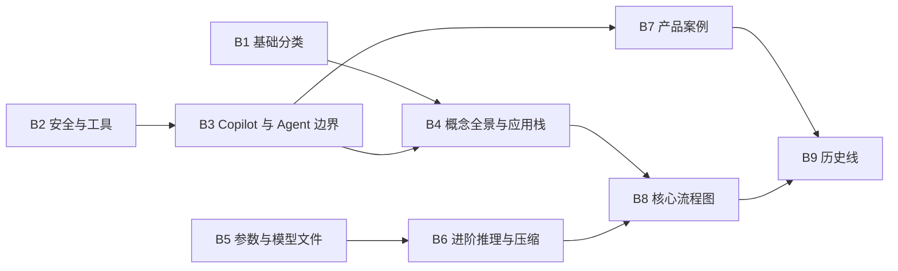

# LLM-101 长期内容路线图

> 规划版本：2026-08-21
>
> 范围：解释并关闭 [`内容地图.md`](./内容地图.md) 中的 44 个 `Deferred` 状态行与 3 个 `Verify` 状态行。

## 执行进度

| 批次 | 状态 | 已关闭状态行 | 交付物 |
|---|---|---:|---:|
| B1 基础分类与系统指令 | **Done** | 6 | 3 篇正文 |
| B2 安全边界与工具类型 | **Done** | 8 | 3 篇正文 |
| B3 Copilot、Agent 与运行环境 | **Done** | 5 | 3 篇正文 |
| B4 知识系统与第一组全景资产 | **Done** | 3 | 3 个交付物 |
| B5 参数、文件与泛化细节 | **Done** | 3 | 3 篇正文 |
| B6～B9 | Pending | 0 | 12 个计划交付物 |

当前剩余：19 个 `Deferred`、3 个 `Verify`。B1～B5 共完成 15 个交付物，主路线仍保持 28 篇。

## 先把“还剩 47 项”说清楚

它们不是 47 篇写坏了的文章，也不等于必须新增 47 篇正文。

| 类型 | 状态行 | 实际含义 | 建议交付物 |
|---|---:|---|---:|
| 内容专题 | 25 | 仍缺专项解释；`Copilot` 在 Agent 与 Coding Agent 两处重复出现 | 15 篇正文 |
| 全景图与速查资产 | 6 | 用于建立整体结构、复习和比较 | 6 个 Markdown 图谱/速查页 |
| 历史时间线节点 | 13 | 是 13 个里程碑，不适合机械拆成 13 篇 | 3 篇历史专题 |
| 易变产品案例 | 3 | Codex、Claude Code、Cursor；发布前必须查最新官方资料 | 3 篇带核验日期的案例页 |
| **合计** | **47** | **44 Deferred + 3 Verify** | **约 27 个交付物** |

`Deferred` 的意思是“有价值，但不在上一轮发布承诺内”；`Verify` 的意思是“可以写，但产品能力会变化，不能凭旧资料直接发布”。它们都不是质量故障，也不会影响现在 28 篇主路线的完整阅读。

## 规划目标

这轮长期建设不追求文章数量，追求四个结果：

1. 把最常阻塞小白理解的分类、工具、安全和系统边界先讲清；
2. 让新增内容继续由真实问题驱动，并接入问题库和知识网络；
3. 把容易过时的产品事实与稳定概念分开维护；
4. 最终让 44 个 Deferred 和 3 个 Verify 都有可审计结论：完成、合并进现有页面，或因缺少真实需求而明确移出规划，不能长期悬空。

## 优先级原则

按以下顺序决定先后：

1. **是否阻塞主线理解**：System Prompt、AI 分类等优先；
2. **是否涉及行动风险**：越狱、红队、代码执行、浏览器操作等优先；
3. **真实问题是否高频**：Copilot 与 Agent、RAG 与直接贴资料等优先；
4. **是否依赖前置内容**：全景图和产品比较必须等稳定概念完成后再做；
5. **维护成本是否可控**：产品规格页靠后，并设置失效机制；
6. **是否只是历史补充**：不阻塞当前理解的历史专题最后处理。

## Now / Next / Later

| 阶段 | 目标 | 批次 | 状态行 | 交付物 |
|---|---|---:|---:|---:|
| **Now** | 补基础分类、工具安全和高频系统边界 | B1～B4 | 22 基线 / 0 剩余 | 12 基线 / 0 剩余 |
| **Next** | 补模型进阶、产品案例和复习资产 | B5～B8 | 12 基线 / 9 剩余 | 12 基线 / 9 剩余 |
| **Later** | 完成经过核验的 AI / LLM 历史线 | B9 | 13 | 3 |

每个批次最多 3 个交付物。这里的阶段代表依赖和优先级，不是不可调整的发布日期；出现新的高价值真实问题时，可以在不破坏前置关系的情况下调整同一阶段内顺序。

## 九个执行批次

### B1：基础分类与系统指令（已完成）

**要解决的问题**：读者容易把 AI、生成式 AI、AIGC、NLP、CV 和系统指令混成一层。

已交付：

1. 《弱 AI、生成式 AI 和 AIGC 有什么区别》：覆盖 Narrow AI / Weak AI、Generative AI、AIGC；
2. 《NLP 和 Computer Vision 是什么关系》：覆盖 NLP、Computer Vision；
3. 《System Prompt 是什么》：解释消息角色、优先级、可见性、能力边界和安全边界。

已关闭 6 个 Deferred 状态行，并完成问题库、知识网络、术语表和正文内链更新。

### B2：安全边界与工具类型（已完成）

**要解决的问题**：模型建议一个动作、宿主真正执行动作、攻击者诱导动作，是三件不同的事。

已交付：

1. 《Jailbreak 和 Red Team 是什么》：覆盖 Jailbreak、Red Team，并与已有 Prompt Injection 内容交叉链接；
2. 《AI 怎样搜索、读文件和查数据库》：覆盖 Web Search、File Tool、Database Tool、OCR；
3. 《代码执行和 Computer Use 有什么风险》：覆盖 Code Execution、Browser / Computer Use。

已关闭 8 个 Deferred 状态行。三篇分别说明权限、确认、数据外泄、间接注入、失败恢复和审计日志，并建立 8 个独立知识节点。

### B3：Copilot、Agent 与运行环境（已完成）

**要解决的问题**：用户真正困惑的是“辅助建议”和“自主执行”之间的连续谱，而不是产品营销名称。

已交付：

1. 《从 AI Embedded、Copilot 到 Agent》：同时关闭 Agent 与 Coding Agent 两处 Copilot 状态行；
2. 《Shell 和 Command 是什么》：解释终端、Shell、命令、进程、退出码与权限边界；
3. 《RAG 和直接把资料放进 Prompt 有什么区别》：比较选择、成本、更新、引用、权限和失败方式。

已关闭 5 个 Deferred 状态行，并建立 Copilot、Shell、RAG 与直接上下文 3 个知识节点。

### B4：知识系统与第一组全景资产（已完成）

**要解决的问题**：建立从概念到系统的整体位置感，并补上知识图谱与向量检索的边界。

已交付：

1. 《知识图谱和向量数据库有什么区别》；
2. 《AI 概念全景图》；
3. 《AI 应用栈》：从模型、上下文、检索、工具、Agent 到产品与权限。

已关闭 1 个内容专题与 2 个全景资产状态行。两张图分别回答概念定位与应用责任边界，并链接到唯一概念主页面。

### B5：参数、文件与泛化细节（已完成）

**要解决的问题**：把模型“出生”、保存和记忆训练样本三个容易误解的环节拆开。

已交付：

1. 《为什么参数不能全部初始化成一样》：覆盖 Symmetry Breaking；
2. 《safetensors 和 GGUF 是什么》：区分权重、容器格式、量化、配置和运行时；
3. 《记忆训练数据和泛化有什么区别》：覆盖 Memorization，并连接隐私、评测和数据污染。

已关闭 3 个 Deferred 状态行，并新增参数初始化与对称性、模型文件格式、训练数据记忆 3 个知识节点。三篇分别纠正了“随机起点不重要”“GGUF 等于量化”“新输出等于泛化”三类过度简化说法。

### B6：进阶推理、压缩与速查

**要解决的问题**：补齐不阻塞主线、但容易被营销词和论文名误导的进阶主题。

计划交付：

1. 《Tree of Thought 和 Chain of Thought、ReAct 有什么区别》；
2. 《剪枝、量化和蒸馏有什么区别》：覆盖 Pruning；
3. 《AI 概念速查表》：只做定位与跳转，不复制整篇定义。

完成后关闭 2 个内容专题与 1 个速查资产状态行。

### B7：三个待核验产品案例

**要解决的问题**：用统一框架理解产品，而不是写一份很快过时的功能清单。

计划交付：

1. 《Codex 产品案例》；
2. 《Claude Code 产品案例》；
3. 《Cursor 产品案例》。

三篇统一回答：交互表面、项目上下文、工具与权限、Agent Loop、人工确认、可验证工作流。每一条易变能力必须来自官方文档或发布说明，并写明“最后核验日期”。

产品页发布规则：

- 不把价格、模型版本、上下文长度或功能开关写成永久事实；
- 发布时官方来源必须可访问；
- 超过 90 天未复核，或官方发生重大版本变化时，状态自动退回 `Verify`；
- 如果无法承担持续维护，改为一篇不比较具体规格的稳定案例框架，不保留失真的产品页。

完成后关闭 3 个 Verify 状态行。

### B8：三张核心流程图

**要解决的问题**：读者学完正文后，仍需要可回看的流程入口。

计划交付：

1. 《模型生命周期图》；
2. 《训练与推理对照图》；
3. 《Agent 架构图》。

完成后关闭剩余 3 个全景资产状态行。图中节点必须链接正文，不能只输出不可检索的图片。

### B9：三段经过核验的历史线

**要解决的问题**：给概念提供历史位置，但不把“首次”“第一个”这类争议说法写成绝对结论。

计划交付：

1. 《从规则系统到深度学习》：Rule-based AI、Expert Systems、Machine Learning Era、Deep Learning Era、GPU + Deep Learning；
2. 《从 Transformer 到 Chat 模型》：Transformer、GPT / Foundation Model、Chat / Instruction Models；
3. 《从 RAG、Tool Calling 到 Coding Agent》：RAG、Tool Calling、Agent、MCP、Coding Agent / Computer Use。

完成后关闭 13 个历史状态行。年份、论文、产品发布和“首次”主张必须逐条使用原始论文、官方档案或官方发布记录核验；存在争议时写成范围与证据，而不是抢“第一”。

## 依赖关系



可并行研究的主题仍按批次提交：B1 与 B2、B5 与产品资料收集可以同时调研，但正式写作、问题映射和 Review 仍遵守“每批最多 3 个交付物”。

## 每个选题怎样从 Deferred 进入 Done

### 准入门槛

一个选题从 `Deferred` 提升为 `Todo` 前，至少满足：

- 找到一个可追溯的真实用户问题；
- 能说明它解决的认知卡点，不只是“这个词也存在”；
- 找到足够的论文、官方文档或权威资料支持技术答案；
- 确认是新增独立页面，还是合并进现有主页面更合理；
- 明确前置概念、目标读者和不进入本篇的边界。

### 单批执行合同

```text
真实问题与 Primary Source 研究
  ↓
去重、分级、确认页面归属
  ↓
写作或重写（每批最多 3 个交付物）
  ↓
更新真实问题库、知识网络、术语表、内容地图和内链
  ↓
15 项 Review + AI Writing Smell Review
  ↓
全量自动检查
  ↓
一个清晰 Commit + Push
```

### 单批验收门槛

- 该批所有 High 问题均为 `answered`；
- 新核心节点至少绑定一个真实问题，没有孤立节点；
- 技术结论不依赖社区评论，易变事实带官方来源和核验日期；
- 主路线不因扩展内容膨胀，新增页面默认进入 Extended / Optional；
- 中文、排版、术语、重复解释和 AI 写作味审查全部通过；
- `build_knowledge_graph.py`、`build_question_matrix.py`、链接、概念、问题严格检查和 `git diff --check` 全部通过。

## 并行证据债务

110 条 B 级候选来源的正文复核不属于这 47 个状态行，但会影响问题 provenance 的证据强度。它作为贯穿 B1～B9 的独立轨道处理：

- 每批优先复核与本批主题相关的 B 级来源；
- 能通过官方 API 或真实页面读取正文的，升级为 A；
- 发现错链、标题不符或页面失效的，补真实来源、降级或移除；
- 不能访问时保留 B 标记，不伪装成已实时复核；
- 最终单独汇总 A / B / 失效 / 补源数量。

## 预计节奏与调整规则

建议以“一个完整批次”为最小承诺单位，而不是同时打开 27 个交付物。若由单个 Agent 按当前质量门槛持续执行，可把 9 个批次规划为约 9～12 个工作周期；来源受限、产品重大更新或历史事实争议会延长对应批次。

每完成 3 个批次做一次路线图复盘：检查真实问题新增量、读者入口、来源等级和维护负担。如果一个选题缺少真实问题，或已有正文已足够完整，应合并或移出，而不是为了清零数字强行写文。

## 整体完成定义

长期路线图只有在以下条件同时满足时才算完成：

- 44 个 Deferred 状态行全部变为 Done、被有证据地合并，或明确移出规划；
- Codex、Claude Code、Cursor 三个 Verify 项完成最新官方核验，或按维护规则缩减为稳定案例；
- 约 27 个计划交付物全部经过批次 Review；
- 问题库、知识网络、术语表、内容地图与正文导航同步；
- High 问题未回答数保持为 0；
- Final Project Review 与全部自动检查通过；
- README 和项目进度不再把“当前发布范围完成”误写成“整个长期地图完成”。
